# Stock Sentiment Analysis Dashboard - Technical Architecture Documentation

**Version:** 1.0  
**Last Updated:** November 2025  
**Author:** Anand Mohan Singh  
**Repository:** [https://github.com/anandDev77/stock-sentiment-analysis](https://github.com/anandDev77/stock-sentiment-analysis)  
**Target Audience:** Software Architects, Senior Developers, System Designers, DevOps Engineers

---

## Table of Contents

1. [Executive Summary](#executive-summary)
2. [System Architecture](#system-architecture)
3. [Component Architecture](#component-architecture)
4. [Data Flow Architecture](#data-flow-architecture)
5. [RAG Architecture Deep Dive](#rag-architecture-deep-dive)
6. [Vector Database Architecture](#vector-database-architecture)
7. [Caching Architecture](#caching-architecture)
8. [Mathematical Models & Algorithms](#mathematical-models--algorithms)
9. [API Architecture](#api-architecture)
10. [Security Architecture](#security-architecture)
11. [Performance Architecture](#performance-architecture)
12. [Deployment Architecture](#deployment-architecture)

---

## Executive Summary

### Architecture Overview

The Stock Sentiment Analysis Dashboard is built on a **modern, API-driven microservices architecture** that emphasizes:

- **Separation of Concerns**: Clear boundaries between presentation, API, service, and infrastructure layers
- **API-First Design**: Frontend communicates exclusively through REST API, enabling independent deployment and scaling
- **Modular Service Layer**: Business logic encapsulated in independent, testable services
- **Production-Ready Patterns**: Circuit breakers, retry logic, comprehensive error handling, and observability
- **Scalable Data Architecture**: Multi-tier caching, vector database for semantic search, and parallel processing

### Design Principles

1. **API-Driven Architecture**
   - Frontend (Streamlit) → API (FastAPI) → Services
   - No direct service calls from frontend
   - Enables independent scaling and deployment
   - Facilitates multiple client types (web, mobile, CLI)

2. **Layered Separation**
   - **Presentation Layer**: UI components, user interaction
   - **API Layer**: Request routing, validation, response formatting
   - **Service Layer**: Business logic, orchestration
   - **Infrastructure Layer**: External APIs, databases, caching

3. **Dependency Injection**
   - Services injected via FastAPI dependencies
   - Enables testing and mocking
   - Reduces coupling between components

4. **Fail-Safe Design**
   - Circuit breakers prevent cascading failures
   - Retry logic with exponential backoff
   - Graceful degradation (Redis fallback, TextBlob fallback)
   - Comprehensive error handling and logging

5. **Performance Optimization**
   - Multi-tier caching (Redis for all caching)
   - Batch processing (embeddings, sentiment analysis)
   - Parallel processing (concurrent sentiment analysis)
   - Vector database for 10-100× faster semantic search

6. **Cost Efficiency**
   - Intelligent caching reduces API calls by 50-90%
   - Batch embedding generation (100 articles = 1 API call)
   - Configurable TTLs for different data types
   - Optional services (Azure AI Search) with fallbacks

### Technology Choices Rationale

| Technology | Choice | Rationale |
|------------|--------|-----------|
| **FastAPI** | REST API Framework | High performance, automatic OpenAPI docs, async support, type safety |
| **Streamlit** | Frontend Framework | Rapid development, Python-native, good for data apps |
| **Azure OpenAI** | LLM Provider | Enterprise-grade, GPT-4 for accuracy, embedding models |
| **Azure AI Search** | Vector Database | 10-100× faster than Redis SCAN, HNSW algorithm, hybrid search |
| **Redis** | Cache Layer | High-speed in-memory cache, persistent across app reloads |
| **Pydantic** | Configuration | Type validation, environment variable management, settings hierarchy |
| **ThreadPoolExecutor** | Parallel Processing | Simple, effective for I/O-bound sentiment analysis |

### Architecture Patterns

1. **API Gateway Pattern**: FastAPI acts as single entry point
2. **Service Layer Pattern**: Business logic encapsulated in services
3. **Repository Pattern**: Data access abstracted (cache, vector DB)
4. **Dependency Injection**: Services injected, not instantiated
5. **Circuit Breaker Pattern**: Prevents cascading failures
6. **Retry Pattern**: Exponential backoff for transient failures
7. **Caching Pattern**: Multi-tier with TTL-based expiration
8. **RAG Pattern**: Retrieval Augmented Generation for context-aware LLM calls

---

## System Architecture

This section provides detailed system architecture diagrams and explanations of how all components interact.

### Complete System Architecture

The following diagram shows the complete system architecture with all components, data flows, and external dependencies:

<div align="center">
  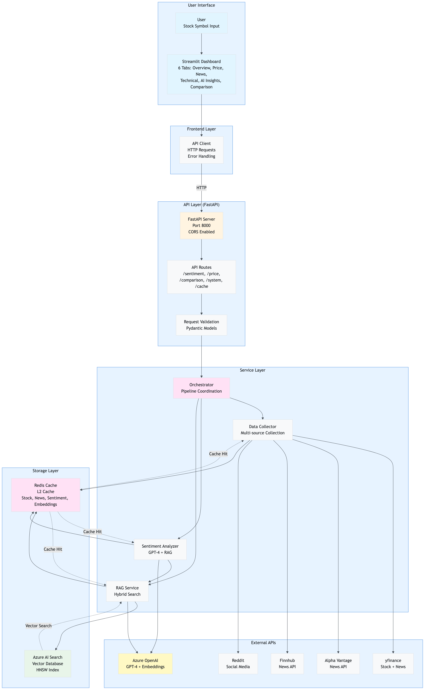
</div>

**Architecture Layers**:

1. **User Interface Layer**
   - Streamlit dashboard with 6 tabs
   - User input and visualization
   - API client for backend communication

2. **API Layer (FastAPI)**
   - RESTful endpoints
   - Request validation (Pydantic)
   - Dependency injection
   - CORS middleware
   - Error handling

3. **Service Layer**
   - **Orchestrator**: Coordinates pipeline execution
   - **Collector**: Multi-source data collection
   - **Sentiment Analyzer**: AI-powered analysis with RAG
   - **RAG Service**: Context retrieval with hybrid search
   - **Cache Service**: Redis caching operations

4. **Storage Layer**
   - **Redis**: L2 cache (stock, news, sentiment, embeddings)
   - **Azure AI Search**: Vector database (optional, with Redis fallback)

5. **External Services**
   - Azure OpenAI (GPT-4 + embeddings)
   - Data sources (yfinance, Alpha Vantage, Finnhub, Reddit)

### API-Driven Architecture Pattern

The application strictly follows an API-driven architecture where the frontend never directly calls services:

<div align="center">
  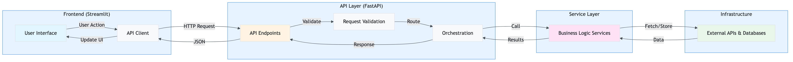
</div>

**Key Benefits**:
- **Decoupling**: Frontend and backend can evolve independently
- **Scalability**: API layer can be scaled separately
- **Testing**: Services can be tested independently
- **Multiple Clients**: Same API can serve web, mobile, CLI clients
- **Security**: Centralized authentication/authorization point

### Service Layer Architecture

The service layer encapsulates all business logic and is independent of the presentation layer:

<div align="center">
  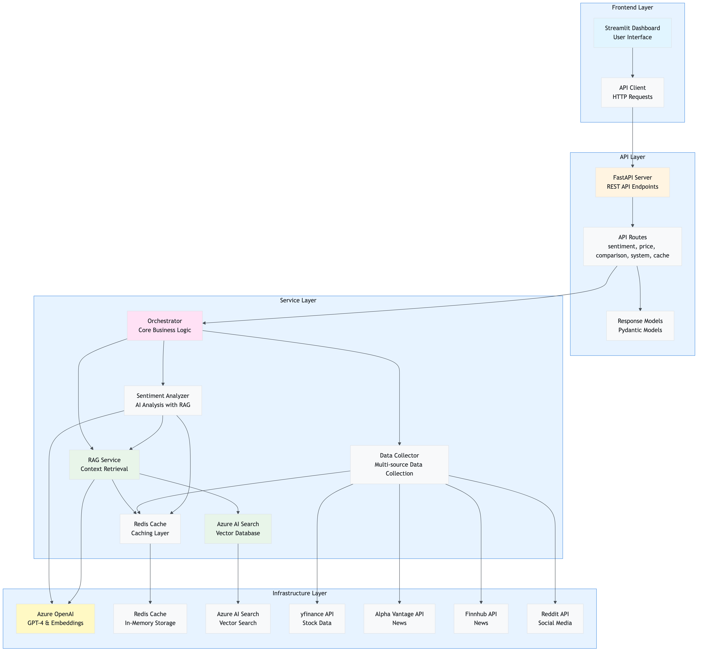
</div>

**Service Responsibilities**:

- **Orchestrator Service**: Coordinates the complete sentiment analysis pipeline
- **Collector Service**: Handles multi-source data collection with deduplication
- **Sentiment Analyzer**: AI-powered analysis with RAG context and caching
- **RAG Service**: Manages article storage and retrieval with hybrid search
- **Cache Service**: Provides Redis caching abstraction
- **Vector DB Service**: Azure AI Search integration with Redis fallback

### Component Interaction Architecture

This diagram shows how components interact during a typical request:

<div align="center">
  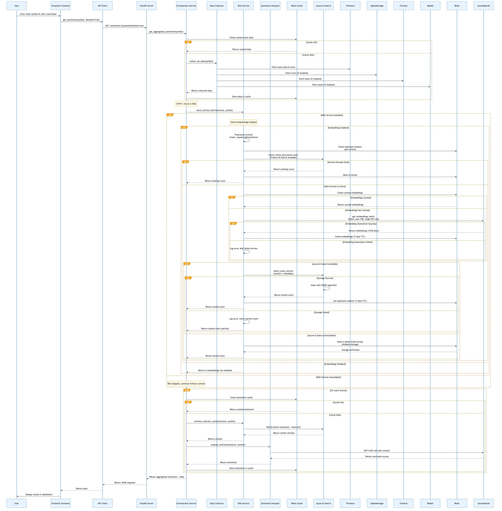
</div>

**Interaction Patterns**:

1. **Request Flow**: User → Streamlit → API Client → FastAPI → Orchestrator → Services
2. **Data Flow**: Services → Cache/Vector DB → External APIs
3. **Response Flow**: Services → Orchestrator → FastAPI → API Client → Streamlit → User
4. **Caching**: Services check cache before external calls
5. **Error Handling**: Errors propagate through layers with appropriate handling

### Deployment Architecture

The application can be deployed as separate, independently scalable services:

<div align="center">
  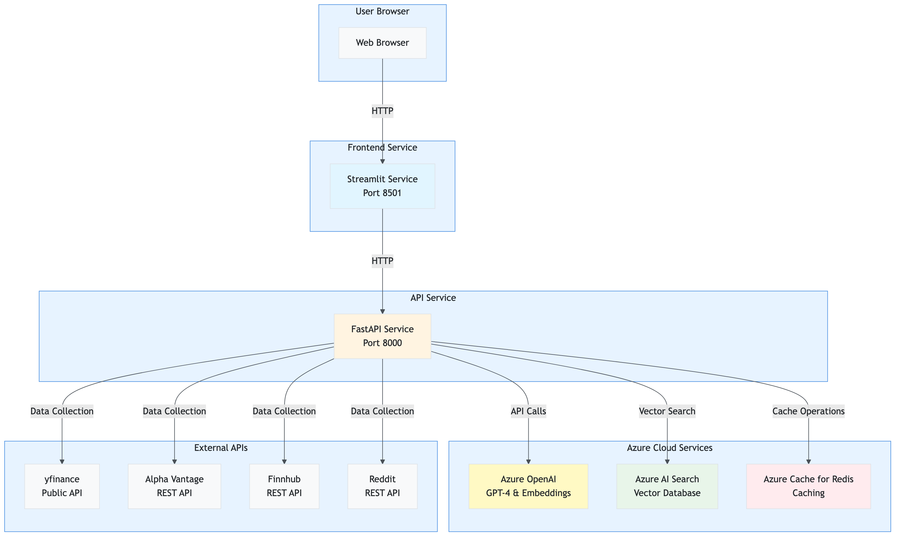
</div>

**Deployment Options**:

1. **Monolithic**: Single container with Streamlit + FastAPI (development)
2. **Microservices**: Separate containers for frontend and API (production)
3. **Kubernetes**: Orchestrated deployment with auto-scaling
4. **Serverless**: API as serverless functions (future)

**Service Dependencies**:
- Frontend Service → API Service (HTTP)
- API Service → Azure OpenAI (HTTPS)
- API Service → Azure AI Search (HTTPS)
- API Service → Redis (TCP/TLS)
- API Service → Data Sources (HTTPS)

---

## Component Architecture

This section provides detailed documentation of each component in the system, including purpose, responsibilities, key methods, dependencies, and interaction patterns.

### Component Relationship Diagram

This diagram shows how different components interact and depend on each other:

<div align="center">
  
</div>

**Dependency Hierarchy**:
- **Presentation Layer** → **API Layer** → **Service Layer** → **Infrastructure Layer**
- **Services** → **Config** (all services depend on settings)
- **Services** → **Utils** (retry, circuit breaker, logger)
- **Services** → **Models** (data structures)

### 3.1 Presentation Layer

The presentation layer handles all user interface concerns and communicates exclusively with the API layer.

#### File: `app.py`

**Purpose**: Thin orchestrator that coordinates the Streamlit application flow. This is the entry point when running `streamlit run app.py`.

**Key Responsibilities**:
- Imports and initializes presentation layer modules
- Coordinates between different UI components
- Manages tab rendering based on data availability
- Handles session state management

**Key Code**:
```python
# Setup application
setup_app()
apply_custom_styles()

# Initialize settings and services
settings = initialize_settings()
api_client, redis_cache, rag_service, collector, analyzer = initialize_services(settings)
initialize_session_state()

# Render sidebar and get selected symbol
symbol = render_sidebar(redis_cache, rag_service, analyzer, settings, api_client)

# Load data if button clicked
if st.session_state.load_data and symbol:
    if api_client and settings.app.api_enabled:
        load_stock_data(symbol, api_client, settings)

# Render tabs based on data availability
if data is None:
    render_empty_state()
else:
    with tab1:
        render_overview_tab(data, news_sentiments, social_sentiments, current_symbol)
    # ... other tabs ...
```

**Dependencies**: 
- All presentation layer modules
- Streamlit framework

**Used By**: Streamlit runtime (entry point)

**Architecture Pattern**: Orchestrator pattern - coordinates UI components without containing business logic

---

#### File: `presentation/initialization.py`

**Purpose**: Centralized initialization of all application components, including settings, services, and session state.

**Key Responsibilities**:
- Initialize and validate application settings
- Create service instances (Redis, RAG, Collector, Analyzer) with caching
- Initialize Streamlit session state
- Configure Streamlit page settings
- Initialize API client if API mode is enabled

**Key Functions/Methods**:

##### `initialize_settings()`
**Purpose**: Load and validate application settings from environment variables

**Code**:
```python
def initialize_settings():
    """Initialize and validate application settings."""
    try:
        settings = get_settings()
        return settings
    except ValueError as e:
        st.error(f"Configuration Error: {e}")
        st.stop()
        return None
```

**Returns**: `Settings` instance or None if validation fails

**Architecture Pattern**: Singleton pattern for settings (global configuration)

---

##### `initialize_services(settings)`
**Purpose**: Initialize all application services with proper dependency injection

**Code**:
```python
def initialize_services(settings) -> Tuple[
    Optional[SentimentAPIClient],
    Optional[RedisCache],
    Optional[RAGService],
    Optional[StockDataCollector],
    Optional[SentimentAnalyzer]
]:
    """
    Initialize all application services.
    
    If API mode is enabled, returns API client. Otherwise returns direct services.
    """
    # Initialize API client if API mode is enabled
    api_client = None
    if settings.app.api_enabled:
        api_client = get_api_client(settings)
    
    # Initialize services for fallback or status display
    redis_cache = get_redis_cache(settings)
    rag_service = get_rag_service(settings, redis_cache)
    collector = get_collector(settings, redis_cache)
    analyzer = get_analyzer(settings, redis_cache, rag_service)
    
    return api_client, redis_cache, rag_service, collector, analyzer
```

**Architecture Pattern**: Dependency Injection - services are created and injected, not instantiated directly

**Dependencies**: 
- `config.settings`
- `services.*` (for service initialization)
- `presentation.api_client`

---

#### File: `presentation/api_client.py`

**Purpose**: HTTP client for communicating with the FastAPI backend. Ensures all frontend interactions go through the API.

**Key Responsibilities**:
- Make HTTP requests to FastAPI endpoints
- Handle errors and timeouts gracefully
- Parse JSON responses
- Provide type-safe method interfaces

**Key Classes**:

##### `SentimentAPIClient`
**Purpose**: HTTP client wrapper for FastAPI communication

**Key Methods**:

##### `get_sentiment(symbol, detailed=False, sources=None, cache_enabled=True)`
**Purpose**: Get sentiment analysis for a stock symbol

**Code**:
```python
def get_sentiment(
    self,
    symbol: str,
    detailed: bool = False,
    sources: Optional[str] = None,
    cache_enabled: bool = True
) -> Dict[str, Any]:
    """
    Get sentiment analysis for a stock symbol.
    
    Args:
        symbol: Stock symbol to analyze
        detailed: If True, returns detailed response with individual article sentiments
        sources: Comma-separated list of data sources (yfinance,alpha_vantage,finnhub,reddit)
        cache_enabled: Whether to use sentiment caching
        
    Returns:
        Dictionary with sentiment scores and optional detailed data
    """
    endpoint = f"/sentiment/{symbol}"
    params = {}
    if detailed:
        params['detailed'] = 'true'
    if sources:
        params['sources'] = sources
    if not cache_enabled:
        params['cache_enabled'] = 'false'
    
    try:
        response = self.client.get(endpoint, params=params, timeout=self.timeout)
        response.raise_for_status()
        return response.json()
    except httpx.TimeoutException:
        logger.error(f"API request timeout for {symbol}")
        raise
    except httpx.RequestError as e:
        logger.error(f"API request error: {e}")
        raise
```

**Error Handling**:
- Timeout exceptions: Logged with user-friendly messages
- Request errors: Logged with troubleshooting tips
- HTTP errors: Raised for upstream handling

**Architecture Pattern**: Adapter pattern - adapts HTTP client to application interface

**Dependencies**: `httpx`, `config.settings`, `utils.logger`

---

### 3.2 Service Layer

The service layer contains all business logic and is independent of the presentation layer. Services are called by the API layer.

#### File: `services/orchestrator.py`

**Purpose**: Core orchestration service that coordinates the complete sentiment analysis pipeline. This is the main entry point for business logic, used by both the API and can be used by the dashboard.

**Key Responsibilities**:
- Orchestrate data collection
- Coordinate RAG storage
- Manage sentiment analysis with parallel processing
- Aggregate sentiment scores
- Track operation summary for logging

**Key Functions/Methods**:

##### `get_aggregated_sentiment(symbol, collector, analyzer, rag_service, redis_cache, settings, data_source_filters, return_detailed)`
**Purpose**: Main orchestration function that runs the complete sentiment analysis pipeline

**Code**:
```python
def get_aggregated_sentiment(
    symbol: str,
    collector: StockDataCollector,
    analyzer: SentimentAnalyzer,
    rag_service: Optional[RAGService] = None,
    redis_cache: Optional[RedisCache] = None,
    settings: Optional[Settings] = None,
    data_source_filters: Optional[Dict[str, bool]] = None,
    return_detailed: bool = False
) -> Dict[str, Any]:
    """
    Get aggregated sentiment analysis for a stock symbol.
    
    This function orchestrates the complete sentiment analysis pipeline:
    1. Collect stock data and news from multiple sources
    2. Store articles in RAG for context retrieval
    3. Analyze sentiment for all articles with RAG context
    4. Aggregate sentiment scores
    
    Returns:
        Dictionary with sentiment scores, operation summary, and optionally detailed data
    """
    # Initialize operation summary
    operation_summary = {
        'redis_used': False,
        'stock_cached': False,
        'news_cached': False,
        'sentiment_cache_hits': 0,
        'sentiment_cache_misses': 0,
        'rag_used': False,
        'rag_queries': 0,
        'rag_articles_found': 0,
        'articles_stored': 0
    }
    
    # Step 1: Collect stock data and news
    logger.info(f"📊 STEP 1: Collecting stock data and news for {symbol}...")
    
    # Check cache status BEFORE collection
    if redis_cache:
        cached_stock = redis_cache.get_cached_stock_data(symbol)
        if redis_cache.last_tier_used == "Redis":
            operation_summary['stock_cached'] = True
        
        cached_news = redis_cache.get_cached_news(symbol)
        if redis_cache.last_tier_used == "Redis":
            operation_summary['news_cached'] = True
    
    # Collect data with source filters
    data = collector.collect_all_data(symbol, data_source_filters=data_source_filters)
    
    # Step 2: Store articles in RAG
    logger.info(f"💾 STEP 2: Storing articles in RAG vector database...")
    if rag_service and data['news']:
        total_in_rag = rag_service.store_articles_batch(data['news'], symbol)
        operation_summary['articles_stored'] = total_in_rag
    
    # Step 3: Analyze sentiment
    logger.info(f"🤖 STEP 3: Analyzing sentiment with AI...")
    news_texts = [
        article.get('summary', article.get('title', ''))
        for article in data.get('news', [])
    ]
    
    # Parallel sentiment analysis
    sentiment_results = analyzer.batch_analyze(
        news_texts,
        symbol,
        max_workers=settings.app.analysis_parallel_workers
    )
    
    # Track cache hits/misses
    for result in sentiment_results:
        if result.get('from_cache'):
            operation_summary['sentiment_cache_hits'] += 1
        else:
            operation_summary['sentiment_cache_misses'] += 1
            if result.get('rag_used'):
                operation_summary['rag_used'] = True
                operation_summary['rag_queries'] += 1
                operation_summary['rag_articles_found'] += result.get('rag_articles_found', 0)
    
    # Aggregate sentiment scores
    if sentiment_results:
        avg_positive = sum(r['positive'] for r in sentiment_results) / len(sentiment_results)
        avg_negative = sum(r['negative'] for r in sentiment_results) / len(sentiment_results)
        avg_neutral = sum(r['neutral'] for r in sentiment_results) / len(sentiment_results)
    else:
        avg_positive = avg_negative = avg_neutral = 0.0
    
    # Build response
    result = {
        'symbol': symbol,
        'positive': avg_positive,
        'negative': avg_negative,
        'neutral': avg_neutral,
        'net_sentiment': avg_positive - avg_negative,
        'dominant_sentiment': 'positive' if avg_positive > avg_negative and avg_positive > avg_neutral 
                             else 'negative' if avg_negative > avg_neutral else 'neutral',
        'sources_analyzed': len(sentiment_results),
        'timestamp': datetime.now().isoformat(),
        'operation_summary': operation_summary
    }
    
    # Add detailed data if requested
    if return_detailed:
        result['data'] = data
        result['news_sentiments'] = sentiment_results
        result['social_sentiments'] = []  # Can be extended
    
    return result
```

**Pipeline Steps**:
1. **Data Collection**: Collect stock data and news from multiple sources
2. **RAG Storage**: Store articles in vector database for future retrieval
3. **Sentiment Analysis**: Analyze all articles with parallel processing
4. **Aggregation**: Calculate average sentiment scores

**Architecture Pattern**: Orchestrator pattern - coordinates multiple services to complete a business process

**Dependencies**: 
- `services.collector.StockDataCollector`
- `services.sentiment.SentimentAnalyzer`
- `services.rag.RAGService`
- `services.cache.RedisCache`
- `config.settings.Settings`

**Used By**: `api.routes.sentiment` (API endpoints)

---

#### File: `services/collector.py`

**Purpose**: Handles multi-source data collection from various financial APIs and news sources.

**Key Responsibilities**:
- Fetch stock price data from yfinance
- Collect news articles from multiple sources (yfinance, Alpha Vantage, Finnhub, Reddit)
- Deduplicate articles across sources
- Cache collected data in Redis
- Apply data source filters

**Key Classes**:

##### `StockDataCollector`
**Purpose**: Multi-source data collection service

**Key Methods**:

##### `collect_all_data(symbol, data_source_filters=None)`
**Purpose**: Collect stock data and news from all enabled sources

**Code**:
```python
def collect_all_data(
    self,
    symbol: str,
    data_source_filters: Optional[Dict[str, bool]] = None
) -> Dict[str, Any]:
    """
    Collect stock data and news from multiple sources.
    
    Args:
        symbol: Stock symbol to collect data for
        data_source_filters: Dictionary of source enable/disable flags
        
    Returns:
        Dictionary with price_data and news articles
    """
    # Get stock price data (always from yfinance)
    price_data = self.get_stock_price(symbol)
    
    # Collect news from enabled sources
    all_articles = []
    
    # yfinance (always enabled)
    if not data_source_filters or data_source_filters.get('yfinance', True):
        yfinance_news = self.get_news_headlines(symbol)
        all_articles.extend(yfinance_news)
    
    # Alpha Vantage (if enabled)
    if (not data_source_filters or data_source_filters.get('alpha_vantage', False)) and \
       self.settings.data_sources.alpha_vantage_enabled:
        try:
            av_news = self.get_alpha_vantage_news(symbol)
            all_articles.extend(av_news)
        except Exception as e:
            logger.warning(f"Alpha Vantage news collection failed: {e}")
    
    # Similar for Finnhub and Reddit...
    
    # Deduplicate articles
    unique_articles = self._deduplicate_articles(all_articles)
    
    # Cache results
    if self.cache:
        self.cache.cache_stock_data(symbol, price_data)
        self.cache.cache_news(symbol, unique_articles)
    
    return {
        'price_data': price_data,
        'news': unique_articles
    }
```

**Architecture Pattern**: Facade pattern - provides simple interface to complex multi-source collection

**Error Handling**: Graceful degradation - if one source fails, others continue

**Dependencies**: 
- `yfinance` library
- `services.cache.RedisCache`
- External APIs (Alpha Vantage, Finnhub, Reddit)

---

#### File: `services/sentiment.py`

**Purpose**: Provides AI-powered sentiment analysis using Azure OpenAI GPT-4 with RAG context and Redis caching.

**Key Responsibilities**:
- Analyze text sentiment using Azure OpenAI GPT-4
- Integrate with RAG service for context-aware analysis
- Cache sentiment results in Redis
- Support parallel batch analysis
- Provide TextBlob fallback for reliability

**Key Classes**:

##### `SentimentAnalyzer`
**Purpose**: AI-powered sentiment analysis service

**Key Methods**:

##### `analyze_sentiment(text, symbol, context)`
**Purpose**: Analyze sentiment of text with optional RAG context

**Code**:
```python
def analyze_sentiment(
    self,
    text: str,
    symbol: Optional[str] = None,
    context: Optional[List[Dict]] = None
) -> Dict[str, float]:
    """
    Analyze sentiment of given text using Azure OpenAI with optional RAG context.
    
    Args:
        text: Text to analyze
        symbol: Optional stock symbol for RAG context retrieval
        context: Optional additional context items
        
    Returns:
        Dictionary with sentiment scores: {'positive': float, 'negative': float, 'neutral': float}
    """
    # Check cache first
    if self.cache:
        cached_result = self.cache.get_cached_sentiment(text)
        if cached_result:
            return cached_result
    
    # Retrieve RAG context if available
    rag_context = None
    if self.rag_service and symbol:
        rag_context = self.rag_service.retrieve_relevant_context(
            query=text,
            symbol=symbol,
            top_k=self.settings.app.rag_top_k
        )
    
    # Build prompt with context
    prompt = self._build_prompt(text, rag_context, context)
    
    # Call Azure OpenAI
    try:
        response = self.client.chat.completions.create(
            model=self.deployment_name,
            messages=[
                {"role": "system", "content": self._get_system_prompt()},
                {"role": "user", "content": prompt}
            ],
            temperature=0.2,
            max_tokens=200,
            response_format={"type": "json_object"}
        )
        
        # Parse response
        result = json.loads(response.choices[0].message.content)
        
        # Normalize scores
        scores = SentimentScores(**result)
        
        # Cache result
        if self.cache:
            self.cache.cache_sentiment(text, scores.dict())
        
        return scores.dict()
    except Exception as e:
        logger.error(f"Azure OpenAI error: {e}")
        # Fallback to TextBlob
        return self._fallback_sentiment(text)
```

**Architecture Patterns**:
- **Strategy Pattern**: Can use GPT-4 or TextBlob (fallback)
- **Template Method**: Prompt building with RAG context
- **Circuit Breaker**: Prevents cascading failures

**Dependencies**: 
- Azure OpenAI SDK
- `services.rag.RAGService`
- `services.cache.RedisCache`
- `utils.preprocessing`
- `utils.retry`
- `utils.circuit_breaker`

---

##### `batch_analyze(texts, symbol, max_workers)`
**Purpose**: Analyze multiple texts in parallel for improved performance

**Code**:
```python
def batch_analyze(
    self,
    texts: List[str],
    symbol: Optional[str] = None,
    max_workers: int = 5
) -> List[Dict[str, Any]]:
    """
    Analyze multiple texts in parallel using ThreadPoolExecutor.
    
    Args:
        texts: List of texts to analyze
        symbol: Optional stock symbol for RAG context
        max_workers: Number of parallel workers
        
    Returns:
        List of sentiment analysis results with metadata
    """
    results = []
    
    with ThreadPoolExecutor(max_workers=max_workers) as executor:
        futures = {
            executor.submit(self.analyze_sentiment, text, symbol): text
            for text in texts
        }
        
        for future in as_completed(futures):
            text = futures[future]
            try:
                result = future.result(timeout=self.settings.app.analysis_worker_timeout)
                results.append({
                    'positive': result['positive'],
                    'negative': result['negative'],
                    'neutral': result['neutral'],
                    'text': text,
                    'from_cache': False  # Would need to track this
                })
            except Exception as e:
                logger.error(f"Error analyzing text: {e}")
                results.append({
                    'positive': 0.0,
                    'negative': 0.0,
                    'neutral': 1.0,
                    'text': text,
                    'error': str(e)
                })
    
    return results
```

**Architecture Pattern**: Producer-Consumer pattern with ThreadPoolExecutor

**Performance**: 3-5× faster than sequential processing

**Dependencies**: `concurrent.futures.ThreadPoolExecutor`

---

#### File: `services/rag.py`

**Purpose**: Provides Retrieval Augmented Generation (RAG) functionality for context-aware sentiment analysis using Azure OpenAI embeddings and Azure AI Search (or Redis fallback).

**Key Responsibilities**:
- Generate embeddings for articles and queries
- Store article embeddings in Azure AI Search (or Redis)
- Retrieve relevant articles using hybrid search (semantic + keyword)
- Apply temporal decay to boost recent articles
- Cache embeddings for performance

**Key Classes**:

##### `RAGService`
**Purpose**: RAG service for context retrieval

**Key Methods**:

##### `store_articles_batch(articles, symbol, batch_size)`
**Purpose**: Store multiple articles with batch embedding generation

**Code**:
```python
def store_articles_batch(
    self, 
    articles: List[Dict], 
    symbol: str,
    batch_size: Optional[int] = None
) -> int:
    """
    Store multiple articles with embeddings in batch for efficiency.
    
    Args:
        articles: List of article dictionaries
        symbol: Stock symbol
        batch_size: Number of articles per batch (default: from settings)
        
    Returns:
        Total number of articles stored (existing + newly stored)
    """
    if not articles:
        return 0
    
    # Check which articles already exist
    existing_in_vector_db = 0
    articles_to_process = []
    
    if self.vector_db and self.vector_db.is_available():
        # Check Azure AI Search for existing articles
        vector_ids_to_check = [f"{symbol}_{self._get_article_id(article)}" for article in articles]
        existing_ids = self.vector_db.batch_check_existing(vector_ids_to_check)
        existing_in_vector_db = len(existing_ids)
        
        # Filter out existing articles
        articles_to_process = [
            article for article in articles
            if f"{symbol}_{self._get_article_id(article)}" not in existing_ids
        ]
    else:
        # Fallback: check Redis
        articles_to_process = articles
    
    if not articles_to_process:
        return existing_in_vector_db
    
    # Prepare texts for batch embedding
    article_texts = [
        f"{article.get('title', '')} {article.get('summary', '')}"
        for article in articles_to_process
    ]
    
    # Generate embeddings in batch
    embeddings = self.get_embeddings_batch(
        article_texts,
        batch_size=batch_size,
        use_cache=True  # Cache embeddings
    )
    
    # Store in Azure AI Search or Redis
    if self.vector_db and self.vector_db.is_available():
        # Store in Azure AI Search
        stored_count = self._store_in_azure_ai_search(
            articles_to_process,
            embeddings,
            symbol
        )
    else:
        # Fallback to Redis
        stored_count = self._store_in_redis(
            articles_to_process,
            embeddings,
            symbol
        )
    
    return existing_in_vector_db + stored_count
```

**Optimizations**:
- **Duplicate Prevention**: Checks Azure AI Search before embedding generation
- **Batch Processing**: 100 articles = 1 API call (100× reduction)
- **Embedding Caching**: Caches embeddings in Redis (7 days TTL)

**Architecture Pattern**: Strategy pattern - can use Azure AI Search or Redis

**Dependencies**: 
- Azure OpenAI SDK
- `services.vector_db.AzureAISearchVectorDB`
- `services.cache.RedisCache`

---

##### `retrieve_relevant_context(query, symbol, top_k, use_hybrid)`
**Purpose**: Retrieve relevant articles using hybrid search for RAG context

**Code**:
```python
def retrieve_relevant_context(
    self,
    query: str,
    symbol: str,
    top_k: Optional[int] = None,
    use_hybrid: bool = True,
    date_range: Optional[tuple] = None,
    sources: Optional[List[str]] = None,
    exclude_sources: Optional[List[str]] = None,
    days_back: Optional[int] = None,
    expand_query: bool = True
) -> List[Dict]:
    """
    Retrieve relevant articles using hybrid search (semantic + keyword).
    
    Args:
        query: Search query text
        symbol: Stock symbol to filter by
        top_k: Number of results to return
        use_hybrid: Use hybrid search (semantic + keyword)
        date_range: Optional date range filter
        sources: Optional source filter
        exclude_sources: Optional sources to exclude
        days_back: Optional days back filter
        expand_query: Expand query with synonyms
        
    Returns:
        List of relevant article dictionaries with similarity scores
    """
    if not self.embeddings_enabled and not use_hybrid:
        return []
    
    # Use Azure AI Search if available
    if self.vector_db and self.vector_db.is_available():
        # Generate query embedding
        query_embedding = self.get_embedding(query)
        if not query_embedding:
            return []
        
        # Build filter string
        filter_string = self._build_filter_string(
            symbol=symbol,
            date_range=date_range,
            sources=sources,
            exclude_sources=exclude_sources,
            days_back=days_back
        )
        
        # Perform hybrid search
        if use_hybrid:
            results = self.vector_db.hybrid_search(
                query_text=query,
                query_vector=query_embedding,
                top_k=top_k or self.settings.app.rag_top_k,
                filter_string=filter_string
            )
        else:
            results = self.vector_db.search_vectors(
                query_vector=query_embedding,
                top_k=top_k or self.settings.app.rag_top_k,
                filter_string=filter_string
            )
        
        # Apply temporal decay
        results = self._apply_temporal_decay(results)
        
        return results
    else:
        # Fallback to Redis SCAN (slower but works)
        return self._retrieve_from_redis(query, symbol, top_k)
```

**Architecture Pattern**: Strategy pattern with fallback mechanism

**Search Methods**:
1. **Hybrid Search**: Semantic (vector) + Keyword (BM25) with RRF
2. **Vector Search**: Semantic only
3. **Redis Fallback**: SCAN-based search if Azure AI Search unavailable

**Dependencies**: 
- `services.vector_db.AzureAISearchVectorDB`
- `services.cache.RedisCache` (fallback)

---

#### File: `services/cache.py`

**Purpose**: Provides Redis-based caching layer to reduce API calls and improve performance.

**Key Responsibilities**:
- Cache sentiment analysis results
- Cache stock price data
- Cache news articles
- Cache article embeddings for RAG
- Track cache statistics (hits, misses, sets)
- Provide cache management operations

**Key Classes**:

##### `RedisCache`
**Purpose**: Redis caching abstraction

**Key Methods**:

##### `get(key)` / `set(key, value, ttl)`
**Purpose**: Generic cache operations

**Code**:
```python
def get(self, key: str) -> Optional[Any]:
    """
    Get value from cache.
    
    Args:
        key: Cache key
        
    Returns:
        Cached value or None if not found
    """
    if not self.client:
        return None
    
    try:
        value = self.client.get(key)
        if value:
            self.last_tier_used = "Redis"
            CacheStats.increment_hit(self.client)
            return json.loads(value)
        else:
            CacheStats.increment_miss(self.client)
            return None
    except Exception as e:
        logger.error(f"Error getting from cache: {e}")
        return None

def set(self, key: str, value: Any, ttl: Optional[int] = None) -> bool:
    """
    Set value in cache.
    
    Args:
        key: Cache key
        value: Value to cache
        ttl: Time-to-live in seconds (optional)
        
    Returns:
        True if successful, False otherwise
    """
    if not self.client:
        return False
    
    try:
        serialized = json.dumps(value)
        if ttl:
            self.client.setex(key, ttl, serialized)
        else:
            self.client.set(key, serialized)
        CacheStats.increment_set(self.client)
        return True
    except Exception as e:
        logger.error(f"Error setting cache: {e}")
        return False
```

**Architecture Pattern**: Repository pattern - abstracts data access

**Cache Key Structure**:
- `stock:{symbol}` - Stock price data
- `news:{symbol}` - News articles
- `sentiment:{hash}` - Sentiment analysis result
- `embedding:{hash}` - Article embedding vector

**Dependencies**: Redis client

---

#### File: `services/vector_db.py`

**Purpose**: Provides vector database abstraction with Azure AI Search implementation for high-performance vector search.

**Key Responsibilities**:
- Store article embeddings with metadata
- Perform vector similarity search
- Perform hybrid search (vector + keyword)
- Support OData filtering
- Manage Azure AI Search index

**Key Classes**:

##### `AzureAISearchVectorDB`
**Purpose**: Azure AI Search implementation of vector database interface

**Key Methods**:

##### `hybrid_search(query_text, query_vector, top_k, filter_string)`
**Purpose**: Perform hybrid search combining semantic and keyword search

**Code**:
```python
def hybrid_search(
    self,
    query_text: str,
    query_vector: List[float],
    top_k: int = 10,
    filter_string: Optional[str] = None
) -> List[Dict[str, Any]]:
    """
    Perform hybrid search (semantic + keyword) using Azure AI Search.
    
    Azure AI Search automatically combines results using Reciprocal Rank Fusion (RRF).
    
    Args:
        query_text: Keyword search query
        query_vector: Semantic search query vector
        top_k: Number of results
        filter_string: Optional OData filter
        
    Returns:
        List of results with RRF scores
    """
    if not self.is_available():
        return []
    
    try:
        # Perform hybrid search (Azure AI Search handles RRF internally)
        results = self._client.search(
            search_text=query_text,  # Keyword search
            vector_queries=[{
                "vector": query_vector,  # Semantic search
                "k_nearest_neighbors": top_k,
                "fields": "contentVector"
            }],
            filter=filter_string,
            top=top_k,
            select=["article_id", "title", "summary", "source", "timestamp", "symbol"]
        )
        
        # Format results with RRF scores
        formatted = []
        for result in results:
            formatted.append({
                "article_id": result.get("article_id", ""),
                "title": result.get("title", ""),
                "summary": result.get("summary", ""),
                "source": result.get("source", ""),
                "timestamp": result.get("timestamp", ""),
                "similarity": result.get("@search.score", 0.0),
                "rrf_score": result.get("@search.reranker_score", result.get("@search.score", 0.0))
            })
        
        return formatted
    except Exception as e:
        logger.error(f"Error in hybrid search: {e}")
        return []
```

**Architecture Pattern**: Adapter pattern - adapts Azure AI Search to application interface

**Performance**: 10-100× faster than Redis SCAN for large datasets

**Dependencies**: Azure AI Search SDK

---

### 3.3 API Layer

The API layer provides RESTful endpoints for the sentiment analysis service.

#### File: `api/main.py`

**Purpose**: FastAPI application entry point that sets up the API server, middleware, error handling, and routes.

**Key Responsibilities**:
- Initialize FastAPI application
- Configure CORS middleware
- Set up request logging middleware
- Handle errors globally
- Register API routes
- Provide health check endpoint

**Key Code**:
```python
# Create FastAPI app
app = FastAPI(
    title="Stock Sentiment Analysis API",
    description="REST API for AI-powered stock sentiment analysis.",
    version="2.0.0",
    docs_url="/docs",
    redoc_url="/redoc"
)

# CORS configuration
app.add_middleware(
    CORSMiddleware,
    allow_origins=["*"],
    allow_credentials=True,
    allow_methods=["*"],
    allow_headers=["*"],
)

# Request logging middleware
@app.middleware("http")
async def log_requests(request: Request, call_next):
    """Log all API requests with timing."""
    start_time = time.time()
    logger.info(f"🌐 API Request: {request.method} {request.url.path}")
    response = await call_next(request)
    process_time = time.time() - start_time
    logger.info(f"✅ API Response: {request.method} {request.url.path} - Time: {process_time:.3f}s")
    return response

# Include routers
app.include_router(sentiment_router)
app.include_router(price_router)
app.include_router(comparison_router)
app.include_router(system_router)
app.include_router(cache_router)
```

**Architecture Pattern**: API Gateway pattern - single entry point for all requests

**Dependencies**: 
- FastAPI framework
- All route modules
- `api.dependencies`
- `api.models.response`

---

#### File: `api/dependencies.py`

**Purpose**: Provides dependency injection functions for FastAPI, initializing services as singletons without Streamlit dependencies.

**Key Functions/Methods**:

##### `get_all_services()`
**Purpose**: Get all services initialized (main dependency for API routes)

**Code**:
```python
def get_all_services() -> Tuple[
    Settings,
    Optional[RedisCache],
    Optional[RAGService],
    StockDataCollector,
    Optional[SentimentAnalyzer]
]:
    """
    Get all services initialized.
    
    Returns:
        Tuple of (settings, redis_cache, rag_service, collector, analyzer)
    """
    settings = get_settings_cached()
    redis_cache = get_redis_cache()
    rag_service = get_rag_service()
    collector = get_collector()
    analyzer = get_analyzer()
    
    return settings, redis_cache, rag_service, collector, analyzer
```

**Architecture Pattern**: Dependency Injection - services are injected, not instantiated in routes

**Dependencies**: All service modules

**Used By**: All API route handlers

---

#### File: `api/routes/sentiment.py`

**Purpose**: Defines sentiment analysis API endpoints.

**Key Responsibilities**:
- Handle GET `/sentiment/{symbol}` endpoint
- Handle POST `/sentiment/batch` endpoint
- Parse query parameters (sources, cache_enabled, detailed)
- Call orchestrator service
- Return formatted responses

**Key Endpoints**:

##### `GET /sentiment/{symbol}`
**Purpose**: Get sentiment analysis for a single stock symbol

**Code**:
```python
@router.get(
    "/{symbol}",
    response_model=SentimentResponse,
    summary="Get sentiment analysis for a stock symbol",
    description="Analyzes sentiment for a stock symbol by collecting news, analyzing sentiment with AI, and returning aggregated scores."
)
async def get_sentiment(
    symbol: str = Path(..., description="Stock ticker symbol (e.g., AAPL)"),
    detailed: bool = Query(False, description="Include detailed data (articles, individual sentiments)"),
    sources: Optional[str] = Query(None, description="Comma-separated data sources (yfinance,alpha_vantage,finnhub,reddit)"),
    cache_enabled: bool = Query(True, description="Enable sentiment caching"),
    settings: Settings = Depends(get_settings),
    services: Tuple = Depends(get_all_services)
):
    """Get sentiment analysis for a stock symbol."""
    _, redis_cache, rag_service, collector, analyzer = services
    
    # Parse data source filters
    data_source_filters = parse_data_source_filters(sources)
    
    # Temporarily override cache setting if requested
    original_cache_setting = settings.app.cache_sentiment_enabled
    if not cache_enabled:
        settings.app.cache_sentiment_enabled = False
    
    try:
        # Call orchestrator
        result = get_aggregated_sentiment(
            symbol=symbol.upper(),
            collector=collector,
            analyzer=analyzer,
            rag_service=rag_service,
            redis_cache=redis_cache,
            settings=settings,
            data_source_filters=data_source_filters,
            return_detailed=detailed
        )
        
        return SentimentResponse(**result)
    finally:
        # Restore original cache setting
        settings.app.cache_sentiment_enabled = original_cache_setting
```

**Architecture Pattern**: Controller pattern - handles HTTP concerns, delegates to service layer

**Dependencies**: 
- `services.orchestrator.get_aggregated_sentiment`
- `api.dependencies.get_all_services`
- `api.models.response.SentimentResponse`

---

### 3.4 Infrastructure Layer

The infrastructure layer provides supporting services and utilities.

#### File: `config/settings.py`

**Purpose**: Centralized configuration management using Pydantic for environment variable loading and validation.

**Key Responsibilities**:
- Load environment variables from `.env` file
- Validate configuration values
- Provide type-safe settings access
- Support both Pydantic v1 and v2
- Group related settings into nested models

**Key Classes**:

##### `Settings`
**Purpose**: Main settings class that aggregates all configuration

**Code**:
```python
class Settings(BaseSettings):
    """Main application settings."""
    
    app: AppSettings = Field(default_factory=AppSettings)
    azure_openai: AzureOpenAISettings = Field(default_factory=AzureOpenAISettings)
    redis: RedisSettings = Field(default_factory=RedisSettings)
    azure_ai_search: Optional[AzureAISearchSettings] = Field(default=None)
    data_sources: DataSourceSettings = Field(default_factory=DataSourceSettings)
    
    def is_redis_available(self) -> bool:
        """Check if Redis is configured."""
        return bool(self.redis.host and self.redis.password)
    
    def is_rag_available(self) -> bool:
        """Check if RAG is available (requires embeddings)."""
        return bool(
            self.azure_openai.embedding_deployment and
            self.azure_openai.endpoint and
            self.azure_openai.api_key
        )
    
    def is_azure_ai_search_available(self) -> bool:
        """Check if Azure AI Search is configured."""
        return bool(
            self.azure_ai_search and
            self.azure_ai_search.endpoint and
            self.azure_ai_search.api_key
        )
```

**Architecture Pattern**: Singleton pattern - single source of truth for configuration

**Dependencies**: 
- `pydantic` or `pydantic-settings`
- `python-dotenv`

**Used By**: All modules throughout the application

---

#### File: `models/sentiment.py`

**Purpose**: Defines data structures for sentiment analysis results.

**Key Classes**:

##### `SentimentScores`
**Purpose**: Represents sentiment scores as a normalized probability distribution

**Code**:
```python
@dataclass
class SentimentScores:
    """
    Sentiment scores for a piece of text.
    
    Attributes:
        positive: Positive sentiment score (0.0 to 1.0)
        negative: Negative sentiment score (0.0 to 1.0)
        neutral: Neutral sentiment score (0.0 to 1.0)
    """
    positive: float
    negative: float
    neutral: float
    
    def __post_init__(self):
        """Validate and normalize scores to sum to 1.0."""
        # Normalize to ensure they sum to 1.0
        total = self.positive + self.negative + self.neutral
        if total > 0:
            self.positive /= total
            self.negative /= total
            self.neutral /= total
    
    @property
    def net_sentiment(self) -> float:
        """Calculate net sentiment (positive - negative)."""
        return self.positive - self.negative
    
    @property
    def dominant_sentiment(self) -> str:
        """Get the dominant sentiment label."""
        if self.positive > self.negative and self.positive > self.neutral:
            return "positive"
        elif self.negative > self.positive and self.negative > self.neutral:
            return "negative"
        else:
            return "neutral"
```

**Architecture Pattern**: Value Object pattern - immutable data structure with validation

**Dependencies**: Python `dataclasses`

---

#### File: `utils/logger.py`

**Purpose**: Provides centralized logging configuration for the application.

**Key Functions**:
- `setup_logger(name, level)` - Configure root logger with formatting and handlers
- `get_logger(name)` - Get logger instance for a module

**Architecture Pattern**: Singleton pattern for logger configuration

**Dependencies**: Python `logging` module

**Used By**: All modules throughout the application

---

#### File: `utils/retry.py`

**Purpose**: Provides retry logic with exponential backoff for resilient API calls.

**Key Functions**:

##### `retry_with_exponential_backoff(max_retries, base_delay)`
**Purpose**: Decorator for retrying functions with exponential backoff

**Code**:
```python
def retry_with_exponential_backoff(
    max_retries: int = 3,
    base_delay: float = 1.0
):
    """
    Retry decorator with exponential backoff.
    
    Args:
        max_retries: Maximum number of retry attempts
        base_delay: Base delay in seconds (doubles with each retry)
    """
    def decorator(func):
        @wraps(func)
        def wrapper(*args, **kwargs):
            for attempt in range(max_retries):
                try:
                    return func(*args, **kwargs)
                except Exception as e:
                    if attempt == max_retries - 1:
                        raise
                    delay = base_delay * (2 ** attempt)
                    time.sleep(delay)
        return wrapper
    return decorator
```

**Architecture Pattern**: Decorator pattern - adds retry behavior without modifying function logic

**Dependencies**: Python `time`, `functools`

---

#### File: `utils/circuit_breaker.py`

**Purpose**: Implements circuit breaker pattern to prevent cascading failures.

**Key Classes**:

##### `CircuitBreaker`
**Purpose**: Prevents API calls when service is down

**Code**:
```python
class CircuitBreaker:
    """
    Circuit breaker to prevent cascading failures.
    
    Opens circuit after failure_threshold failures,
    preventing further calls until timeout expires.
    """
    def __init__(self, failure_threshold: int = 5, timeout: int = 60):
        self.failure_threshold = failure_threshold
        self.timeout = timeout
        self.failure_count = 0
        self.last_failure_time = None
        self.state = "closed"  # closed, open, half_open
```

**Architecture Pattern**: Circuit Breaker pattern - prevents cascading failures

**States**:
- **Closed**: Normal operation, calls pass through
- **Open**: Circuit open, calls fail immediately
- **Half-Open**: Testing if service recovered

**Dependencies**: Python `threading`, `time`

---

## Data Flow Architecture

This section documents the complete data flow patterns for all major operations in the system.

### Complete Request Lifecycle

The following sequence diagram shows the complete request lifecycle from user input to response:

<div align="center">
  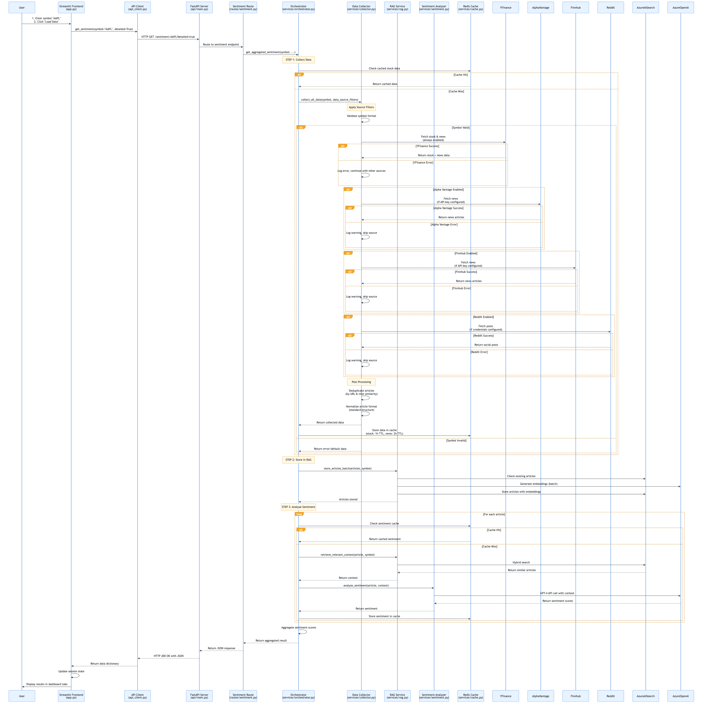
</div>

**Request Lifecycle Phases**:

1. **Request Initiation**: User enters symbol, clicks "Load Data"
2. **API Request**: Frontend sends HTTP GET to FastAPI
3. **Service Orchestration**: Orchestrator coordinates pipeline
4. **Data Collection**: Multi-source collection with caching
5. **RAG Storage**: Articles stored in vector database
6. **Sentiment Analysis**: Parallel analysis with RAG context
7. **Response Aggregation**: Results aggregated and formatted
8. **Response Delivery**: JSON response sent to frontend
9. **UI Update**: Dashboard displays results

### Data Collection Pipeline

The data collection pipeline handles multi-source aggregation with intelligent caching:

<div align="center">
  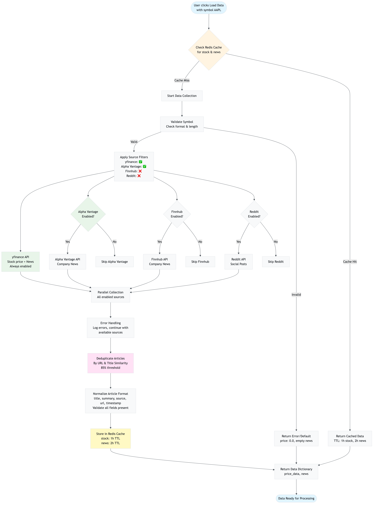
</div>

**Pipeline Stages**:

1. **Cache Check**: Check Redis for cached stock data and news
2. **Source Filtering**: Apply user-selected data source filters
3. **Parallel Collection**: Fetch from enabled sources concurrently
4. **Deduplication**: Remove duplicate articles by URL and title similarity
5. **Normalization**: Standardize article format across sources
6. **Caching**: Store collected data in Redis with TTLs
7. **Return**: Return structured data dictionary

**Architecture Pattern**: Pipeline pattern - sequential stages with clear inputs/outputs

### RAG Storage Pipeline

The RAG storage pipeline efficiently stores articles for future retrieval:

<div align="center">
  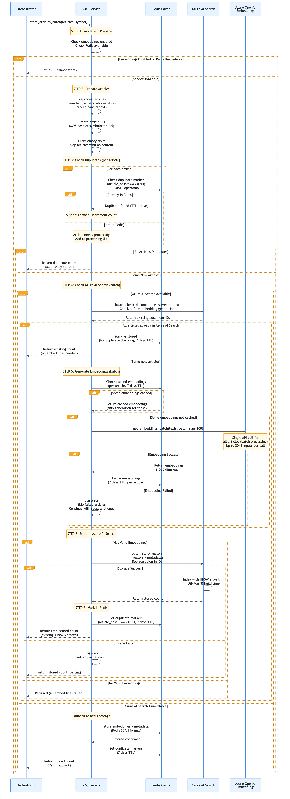
</div>

**Storage Pipeline Stages**:

1. **Duplicate Check**: Check Azure AI Search for existing articles
2. **Text Preprocessing**: Clean and normalize article text
3. **Batch Embedding**: Generate embeddings for all new articles (single API call)
4. **Vector Storage**: Store in Azure AI Search with metadata
5. **Redis Markers**: Mark articles as stored for duplicate checking

**Optimizations**:
- **Duplicate Prevention**: Checks before embedding generation (saves API calls)
- **Batch Processing**: 100 articles = 1 API call (100× reduction)
- **Embedding Caching**: Caches embeddings in Redis (7 days TTL)

### Sentiment Analysis Pipeline

The sentiment analysis pipeline processes articles with RAG context:

<div align="center">
  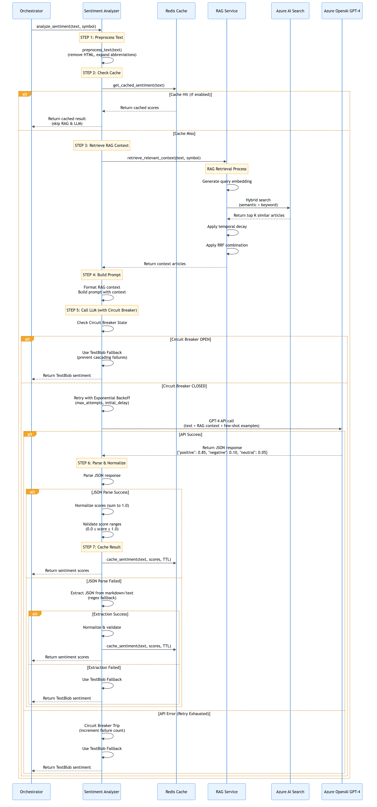
</div>

**Analysis Pipeline Stages**:

1. **Text Preprocessing**: Clean and normalize text
2. **Cache Check**: Check Redis for cached sentiment (if enabled)
3. **RAG Retrieval**: Retrieve relevant context articles (if cache miss)
4. **Prompt Building**: Build LLM prompt with RAG context
5. **LLM Analysis**: Call Azure OpenAI GPT-4
6. **Response Parsing**: Parse JSON response and validate
7. **Score Normalization**: Ensure scores sum to 1.0
8. **Caching**: Store result in Redis (if enabled)

**Parallel Processing**: Multiple articles analyzed concurrently using ThreadPoolExecutor

### Caching Flow

The caching flow optimizes performance by reducing external API calls:

<div align="center">
  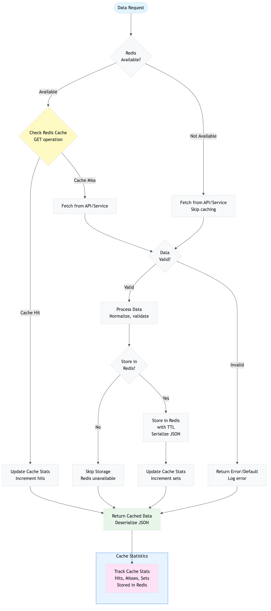
</div>

**Cache Flow Pattern**:

1. **Check Cache**: Always check cache before external calls
2. **Cache Hit**: Return cached data immediately (1-5ms latency)
3. **Cache Miss**: Fetch from external source
4. **Store in Cache**: Store fetched data with appropriate TTL
5. **Return Data**: Return to caller

**Cache Strategy**: Write-through pattern - data written to cache immediately after fetching

---

## RAG Architecture Deep Dive

This section provides a comprehensive deep dive into the RAG (Retrieval Augmented Generation) architecture, including storage, retrieval, and hybrid search implementation.

### RAG Concept Overview

**Retrieval Augmented Generation (RAG)** enhances LLM responses by retrieving relevant context from a knowledge base before generating a response. In our application:

1. **Storage Phase**: Articles are embedded and stored in a vector database
2. **Retrieval Phase**: When analyzing sentiment, relevant articles are retrieved using hybrid search
3. **Augmentation Phase**: Retrieved context is added to the LLM prompt
4. **Generation Phase**: LLM generates sentiment analysis with context

**Benefits**:
- **Context-Aware**: Sentiment analysis considers related articles
- **Consistency**: Similar articles get similar sentiment scores
- **Accuracy**: Context helps LLM understand financial terminology
- **Efficiency**: Cached embeddings reduce API calls

### RAG Storage Phase Architecture

The storage phase efficiently ingests articles into the vector database:

<div align="center">
  
</div>

**Storage Architecture Components**:

1. **Article Preprocessing**:
   - HTML tag removal
   - Whitespace normalization
   - Abbreviation expansion (Q1 → first quarter, EPS → earnings per share)

2. **Duplicate Detection**:
   - Check Azure AI Search for existing articles
   - Use article ID (MD5 hash of title+URL) as document key
   - Skip embedding generation for existing articles

3. **Batch Embedding Generation**:
   - Process 100 articles per batch
   - Single API call per batch (100× efficiency)
   - Cache embeddings in Redis (7 days TTL)

4. **Vector Storage**:
   - Store in Azure AI Search with HNSW indexing
   - Include metadata (symbol, source, timestamp, etc.)
   - Mark in Redis for duplicate checking

**Storage Performance**:
- **Without Optimization**: 100 articles = 100 API calls, ~5 seconds
- **With Batch Processing**: 100 articles = 1 API call, ~0.2 seconds
- **Efficiency Gain**: 25× faster, 99× fewer API calls

### RAG Retrieval Phase Architecture

The retrieval phase finds relevant articles using hybrid search:

<div align="center">
  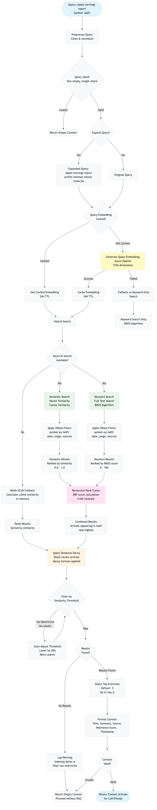
</div>

**Retrieval Architecture Components**:

1. **Query Preprocessing**:
   - Clean and normalize query text
   - Optional query expansion (synonyms, related terms)

2. **Query Embedding**:
   - Generate embedding for query (1536 dimensions)
   - Cache query embeddings (24 hours TTL)

3. **Hybrid Search**:
   - **Semantic Search**: Vector similarity search (cosine similarity)
   - **Keyword Search**: Full-text search (BM25 algorithm)
   - **RRF Combination**: Combine results using Reciprocal Rank Fusion

4. **Temporal Decay**:
   - Boost recent articles (up to 20% boost)
   - Apply decay formula: `decay = 1.0 / (1 + age_days / 7)`

5. **Filtering**:
   - OData filters (symbol, date range, sources)
   - Threshold filtering (auto-adjusts if too restrictive)

**Retrieval Performance**:
- **Azure AI Search**: <100ms for 1M articles (HNSW algorithm)
- **Redis Fallback**: O(n) complexity, slower but works
- **Hybrid Search**: Better accuracy than semantic or keyword alone

### Hybrid Search Implementation

Hybrid search combines semantic and keyword search for improved accuracy:

<div align="center">
  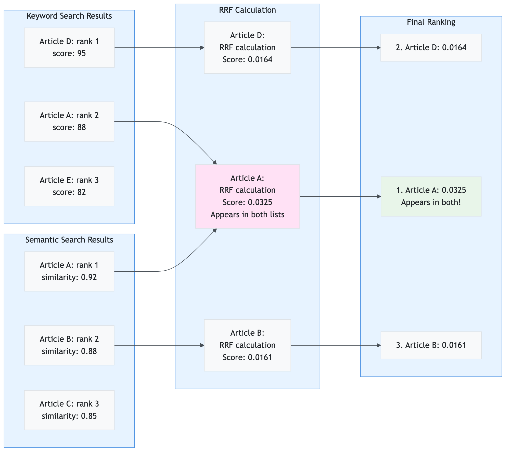
</div>

**Hybrid Search Process**:

1. **Semantic Search**: Find articles with similar meaning (vector similarity)
2. **Keyword Search**: Find articles with exact keywords (BM25 scoring)
3. **RRF Combination**: Combine rankings using Reciprocal Rank Fusion
4. **Result Ranking**: Articles appearing in both lists rank highest

**Why Hybrid Search?**:
- **Semantic Alone**: May miss exact keyword matches
- **Keyword Alone**: May miss semantic variations
- **Hybrid**: Combines strengths of both approaches

### Azure AI Search Integration

Azure AI Search provides the vector database backend for RAG:

**Index Schema**:
```json
{
  "name": "stock-articles",
  "fields": [
    {"name": "article_id", "type": "Edm.String", "key": true},
    {"name": "contentVector", "type": "Collection(Edm.Single)", "dimensions": 1536, "vectorSearchProfile": "default"},
    {"name": "title", "type": "Edm.String", "searchable": true},
    {"name": "summary", "type": "Edm.String", "searchable": true},
    {"name": "symbol", "type": "Edm.String", "filterable": true},
    {"name": "source", "type": "Edm.String", "filterable": true},
    {"name": "timestamp", "type": "Edm.DateTimeOffset", "filterable": true, "sortable": true}
  ],
  "vectorSearch": {
    "algorithms": [{"name": "default", "kind": "hnsw"}],
    "profiles": [{"name": "default", "algorithm": "default"}]
  }
}
```

**HNSW Configuration**:
- **m**: 16 (connections per node)
- **efConstruction**: 200 (build quality)
- **efSearch**: 50 (search quality)
- **metric**: COSINE (cosine similarity)

**Performance Characteristics**:
- **Build Time**: O(N log N) where N = number of vectors
- **Search Time**: O(log N) average case
- **Scalability**: Handles millions of vectors efficiently

### Redis Fallback Mechanism

If Azure AI Search is unavailable, RAG falls back to Redis SCAN:

**Fallback Process**:
1. Check if Azure AI Search is available
2. If not, use Redis SCAN to find all articles
3. Calculate cosine similarity in-memory
4. Sort by similarity and return top K

**Performance Comparison**:
- **Azure AI Search**: <100ms for 1M articles
- **Redis SCAN**: ~5-10s for 10K articles, O(n) complexity

**When to Use Fallback**:
- Azure AI Search not configured
- Azure AI Search service unavailable
- Development/testing without Azure services

---

## Vector Database Architecture

This section provides a deep dive into the vector database architecture, focusing on Azure AI Search implementation.

### Azure AI Search Index Architecture

Azure AI Search uses an HNSW (Hierarchical Navigable Small World) index for fast approximate nearest neighbor search:

<div align="center">
  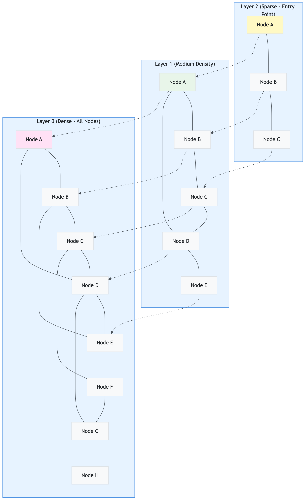
</div>

**HNSW Index Structure**:

- **Layer 0**: All nodes, dense connections (O(N) nodes, many connections)
- **Layer 1**: Subset of nodes, fewer connections (O(N/2) nodes)
- **Layer 2**: Even fewer nodes, even fewer connections (O(N/4) nodes)
- **...**: Logarithmic decrease in density

**Search Process**:
1. Start at top layer (sparse, fast navigation)
2. Find entry point closest to query
3. Navigate to nearest neighbor
4. Move down to next layer
5. Repeat until layer 0
6. Return top K nearest neighbors

**Complexity**:
- **Build**: O(N log N) where N = number of vectors
- **Search**: O(log N) average case (much faster than brute force O(N))

### Vector Search Implementation

Vector search uses cosine similarity for semantic matching:

<div align="center">
  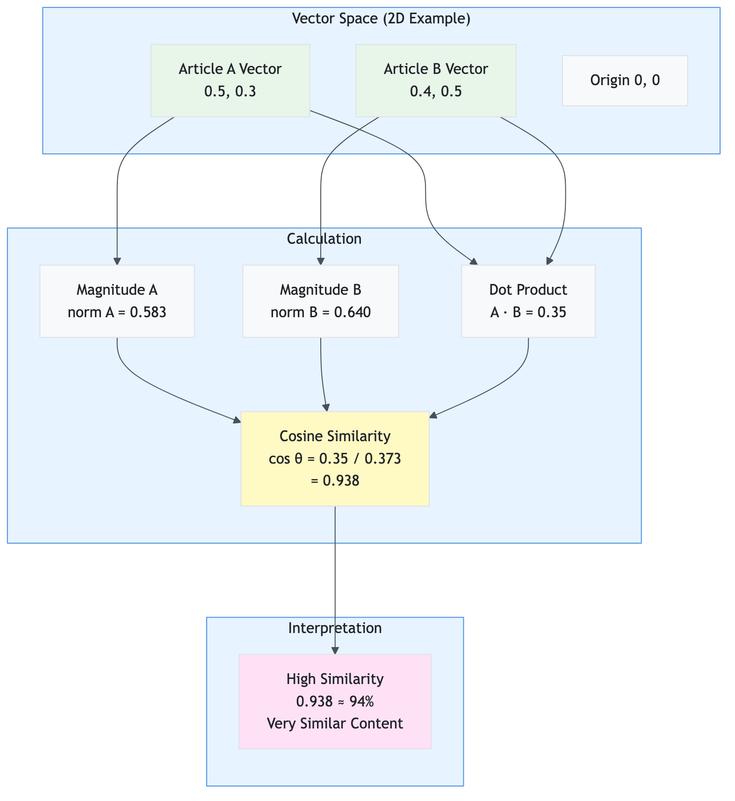
</div>

**Cosine Similarity Formula**:
```
cos(θ) = (A · B) / (||A|| × ||B||)
```

**Implementation**:
- Azure AI Search calculates cosine similarity internally
- Returns similarity scores (0.0 to 1.0)
- Higher score = more similar content

### Hybrid Search Implementation

Hybrid search combines vector and keyword search:

**Azure AI Search Hybrid Search**:
- Performs both semantic and keyword search in parallel
- Combines results using Reciprocal Rank Fusion (RRF) internally
- Returns unified ranking with RRF scores

**RRF Formula** (applied by Azure AI Search):
```
RRF_score(d) = Σ(1 / (60 + rank_i(d)))
```

**Benefits**:
- No score normalization needed
- Works with different score scales
- Boosts documents appearing in both lists

### OData Filtering

Azure AI Search supports OData filter expressions for precise filtering:

**Filter Examples**:
```
symbol eq 'AAPL'
timestamp ge 2024-12-01T00:00:00Z
source in ('yfinance', 'alpha_vantage')
days_back le 7
```

**Filter Building**:
- Built dynamically based on user filters
- Supports AND/OR logic
- Validated before sending to Azure AI Search

**Performance Impact**:
- Filters applied at index level (efficient)
- Reduces search space before ranking
- Minimal performance overhead

---

## Caching Architecture

This section documents the caching architecture, including strategy, implementation, and performance impact.

### Cache Architecture Overview

The application uses a single-tier Redis cache architecture:

<div align="center">
  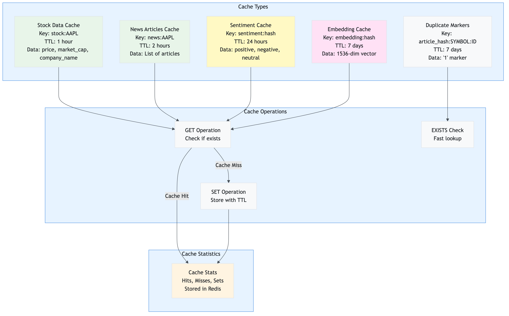
</div>

**Cache Types**:

1. **Stock Data Cache**
   - Key: `stock:{symbol}`
   - TTL: 1 hour (configurable)
   - Data: Price, market cap, company name

2. **News Articles Cache**
   - Key: `news:{symbol}`
   - TTL: 2 hours (configurable)
   - Data: List of article dictionaries

3. **Sentiment Cache**
   - Key: `sentiment:{text_hash}`
   - TTL: 24 hours (configurable, can be disabled)
   - Data: Sentiment scores (positive, negative, neutral)

4. **Embedding Cache**
   - Key: `embedding:{text_hash}`
   - TTL: 7 days
   - Data: 1536-dimensional embedding vector

5. **Duplicate Markers**
   - Key: `article_hash:{symbol}:{article_id}`
   - TTL: 7 days
   - Data: '1' marker (existence check)

### Cache Flow Architecture

The cache flow optimizes performance by reducing external API calls:

<div align="center">
  
</div>

**Cache Flow Pattern**:

1. **Read-Through**: Always check cache before external calls
2. **Write-Through**: Write to cache immediately after fetching
3. **TTL-Based Expiration**: Automatic expiration based on data freshness requirements
4. **Statistics Tracking**: Cache performance metrics stored in Redis

### Cache Key Design

**Naming Convention**: `{type}:{identifier}`

**Examples**:
- `stock:AAPL` - Stock data for AAPL
- `news:AAPL` - News articles for AAPL
- `sentiment:abc123def456` - Sentiment for text hash
- `embedding:xyz789uvw012` - Embedding for text hash
- `article_hash:AAPL:ed8c4cd1` - Duplicate marker

**Hash Generation**:
```python
import hashlib
text_hash = hashlib.md5(text.encode()).hexdigest()
cache_key = f"sentiment:{text_hash}"
```

### Cache Performance Impact

**Without Caching**:
- Every request = API call
- 30 articles = 30 sentiment API calls
- Latency: 50-100ms per call
- Cost: High (all API calls charged)

**With Caching**:
- Cache hit rate: 50-90% (depending on usage patterns)
- 30 articles: 3-15 API calls (rest from cache)
- Latency: 1-5ms per cache hit
- Cost: 50-90% reduction

**Real-World Example**:
- User analyzes AAPL (30 articles)
- First request: 30 API calls, 3 seconds
- Second request (within 2 hours): 0 API calls, 0.1 seconds (cache hit)
- **99.7% latency reduction**

---

## Mathematical Models & Algorithms

This section provides detailed technical documentation of all mathematical models and algorithms used in the system.

### Cosine Similarity

**Mathematical Formula**:
```
cos(θ) = (A · B) / (||A|| × ||B||)
```

**Implementation Details**:
- Used for semantic similarity measurement
- Azure AI Search calculates internally
- Returns scores from 0.0 to 1.0
- Higher score = more similar content

**Complexity**: O(n) where n = vector dimension (1536 for our embeddings)

**Why Used**: Captures semantic meaning, not just keywords

### Reciprocal Rank Fusion (RRF)

**Mathematical Formula**:
```
RRF_score(d) = Σ(1 / (k + rank_i(d)))
```

Where:
- `k` = 60 (standard RRF constant)
- `rank_i(d)` = Rank of document d in list i (1-indexed)

**Implementation**:
- Applied by Azure AI Search internally
- Combines semantic and keyword search results
- No score normalization needed

**Why Used**: Works with different score scales, boosts consensus documents

### Temporal Decay

**Mathematical Formula**:
```
decay = 1.0 / (1 + age_days / decay_days)
boosted_score = original_score × (1 + decay × boost_factor)
```

Where:
- `decay_days` = 7 (half-life constant)
- `boost_factor` = 0.2 (20% maximum boost)

**Implementation**:
- Applied after RRF combination
- Boosts recent articles in search results
- Smooth decay curve (not abrupt cutoff)

**Why Used**: Financial news is time-sensitive, recent news is more relevant

### Sentiment Score Normalization

**Mathematical Formula**:
```
normalized_score_i = score_i / Σ(score_j)
```

**Constraint**: `Σ(normalized_score_i) = 1.0`

**Implementation**:
- Applied after LLM response parsing
- Ensures scores form probability distribution
- Handles edge cases (all zeros, negative values)

**Why Used**: Represents likelihood of each sentiment category

### Batch Embedding Generation

**Efficiency Calculation**:
```
API_calls_saved = N - ⌈N / batch_size⌉
Latency_reduction = (N × latency_per_call) - (⌈N / batch_size⌉ × batch_latency)
```

**Example**:
- 250 articles, batch_size=100
- Individual: 250 calls, 12.5s, $0.025
- Batch: 3 calls, 0.6s, $0.0003
- **Efficiency Gain**: 98.8% reduction in calls, 95.2% faster

**Why Used**: Massive latency and cost reduction

### HNSW Algorithm

**Algorithm Complexity**:
- **Build Time**: O(N × log N)
- **Search Time**: O(log N) average case
- **Space**: O(N × M) where M = average connections per node

**Why Used**: Fast approximate nearest neighbor search, scales to millions of vectors

---

## API Architecture

This section documents the REST API architecture, including design, endpoints, and request/response patterns.

### REST API Design

The API follows RESTful principles with clear resource-based URLs:

**Base URL**: `http://localhost:8000` (development)

**API Request/Response Flow**:

<div align="center">
  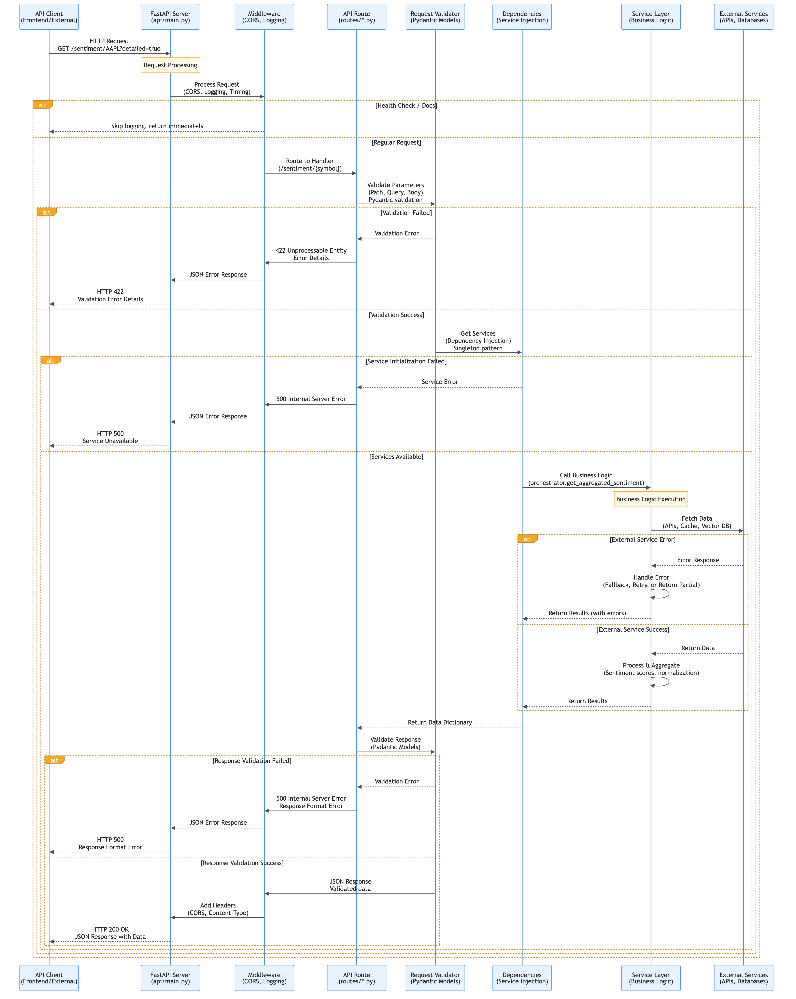
</div>

**API Design Principles**:

1. **Resource-Based URLs**: `/sentiment/{symbol}`, `/price/{symbol}/history`
2. **HTTP Methods**: GET for retrieval, POST for actions
3. **Query Parameters**: Filtering, pagination, options
4. **JSON Responses**: Consistent JSON format
5. **Error Handling**: Standard HTTP status codes with error details

### API Endpoints

**Main Endpoints**:

1. **GET `/sentiment/{symbol}`**: Get sentiment analysis
2. **POST `/sentiment/batch`**: Batch sentiment analysis
3. **GET `/price/{symbol}/history`**: Get price history
4. **POST `/comparison/insights`**: Get comparison insights
5. **GET `/system/status`**: Get system health
6. **GET `/cache/stats`**: Get cache statistics
7. **POST `/cache/clear`**: Clear cache

**Request/Response Models**: Defined using Pydantic for validation

**Error Responses**: Standardized error format with details

### Dependency Injection

Services are injected via FastAPI dependencies:

```python
@router.get("/{symbol}")
async def get_sentiment(
    symbol: str,
    services: Tuple = Depends(get_all_services)
):
    settings, redis_cache, rag_service, collector, analyzer = services
    # Use services...
```

**Benefits**:
- Services initialized once (singleton pattern)
- Easy to mock for testing
- Clear dependency graph

---

## Security Architecture

### Environment Variable Management

**Configuration Security**:
- All sensitive data in environment variables
- `.env` file excluded from version control
- Pydantic validation ensures required variables present

### API Key Security

**Azure OpenAI**:
- API keys stored in environment variables
- Never logged or exposed in responses
- Rotated via Azure portal

**Azure AI Search**:
- API keys stored in environment variables
- Used only for authenticated requests

**Data Source APIs**:
- API keys stored in environment variables
- Rate limiting prevents abuse

### Data Privacy

**No User Data Storage**: Application doesn't store user data
**Public Data Only**: Only processes publicly available news articles
**No PII**: No personally identifiable information collected

### Input Validation

**Pydantic Models**: All inputs validated via Pydantic
**Symbol Validation**: Stock symbols validated before processing
**Error Handling**: Invalid inputs return 400 Bad Request

### Error Handling Security

**No Information Leakage**: Error messages don't expose internal details
**Logging**: Errors logged server-side, user-friendly messages returned
**Circuit Breakers**: Prevent cascading failures that could expose system state

---

## Performance Architecture

### Optimization Strategies

1. **Caching**: 50-90% reduction in API calls
2. **Batch Processing**: 100× reduction in embedding API calls
3. **Parallel Processing**: 3-5× faster sentiment analysis
4. **Vector Database**: 10-100× faster semantic search

### Caching Performance

**Cache Hit Rates**:
- Stock data: 70-90% (1 hour TTL)
- News data: 60-80% (2 hours TTL)
- Sentiment: 50-90% (24 hours TTL, configurable)

**Performance Impact**:
- Cache hit: 1-5ms latency
- Cache miss: 50-100ms latency (external API call)
- **10-100× faster** for cached data

### Parallel Processing Performance

**Sentiment Analysis**:
- Sequential: 30 articles × 2s = 60s
- Parallel (5 workers): 30 articles ÷ 5 × 2s = 12s
- **5× faster** with parallel processing

### Batch Processing Performance

**Embedding Generation**:
- Individual: 100 articles = 100 calls, 5s, $0.01
- Batch: 100 articles = 1 call, 0.2s, $0.0001
- **25× faster, 100× cheaper**

### Scalability Considerations

**Horizontal Scaling**:
- API layer can be scaled independently
- Stateless design enables load balancing
- Redis shared across instances

**Vertical Scaling**:
- Increase parallel workers for faster processing
- Increase batch size for embedding generation
- Increase cache size for higher hit rates

---

## Deployment Architecture

### Containerization

**Docker Support**:
- Frontend and API can be containerized separately
- Environment variables passed via `.env` file
- Health checks for service monitoring

### Service Dependencies

**Required Services**:
- Azure OpenAI (GPT-4 + embeddings)
- Redis (caching)

**Optional Services**:
- Azure AI Search (vector database, with Redis fallback)

**External APIs**:
- yfinance (always available)
- Alpha Vantage, Finnhub, Reddit (optional)

### Configuration Management

**Environment Variables**: All configuration via `.env` file
**Settings Validation**: Pydantic validates on startup
**Feature Flags**: Enable/disable features via settings

### Monitoring and Logging

**Logging**:
- Comprehensive logging at all levels
- Operation summaries for demo visibility
- Error logging with context

**Health Checks**:
- `/health` endpoint for service status
- `/system/status` for detailed health

**Metrics** (Future):
- Cache hit/miss rates
- API response times
- Error rates

---


