# Stock Sentiment Analysis Dashboard - Complete Documentation

**Version:** 1.0  
**Last Updated:** November 2025  
**Author:** Anand Mohan Singh  
**Repository:** [https://github.com/anandDev77/stock-sentiment-analysis](https://github.com/anandDev77/stock-sentiment-analysis)  
**Target Audience:** ML Engineers, Data Scientists, Software Developers, and ML Enthusiasts

---

## Table of Contents

1. [Introduction & Overview](#introduction--overview)
2. [High-Level Architecture](#high-level-architecture)
3. [Complete Application Structure](#complete-application-structure)
4. [End-to-End Flow Documentation](#end-to-end-flow-documentation)
5. [Mathematical Concepts & Algorithms](#mathematical-concepts--algorithms)
6. [Data Sources Integration](#data-sources-integration)
7. [Caching Strategy](#caching-strategy)
8. [API Reference](#api-reference)
9. [Configuration Guide](#configuration-guide)
10. [Troubleshooting & FAQ](#troubleshooting--faq)

---

## Introduction & Overview

### What This Application Does

#### For Non-Technical Users (Layman's Terms)

Imagine you're an investor trying to understand how the market feels about Apple's stock. You could:

1. **Manually read** hundreds of news articles from multiple sources (takes hours)
2. **Try to interpret** whether each article is positive or negative (subjective)
3. **Summarize** the overall sentiment (error-prone)
4. **Remember** relevant context from previous articles (impossible at scale)

This application does all of that **automatically in seconds**:

1. **Fetches** the latest news articles from multiple sources (Yahoo Finance, Alpha Vantage, Finnhub, Reddit)
2. **Stores** articles in a searchable knowledge base (Azure AI Search) for fast retrieval
3. **Reads and understands** each article using AI (Azure OpenAI GPT-4)
4. **Finds relevant context** from similar articles using hybrid search (semantic + keyword)
5. **Determines sentiment** (positive, negative, or neutral) for each article with context
6. **Provides visualizations** showing overall sentiment trends
7. **Gives insights** based on historical context and patterns

Think of it as having a **team of financial analysts** working 24/7, reading every news article from multiple sources, remembering everything in a searchable database, and providing you with a comprehensive sentiment report that considers context from related articles.

#### For Technical Users

This application demonstrates:

- **API-Driven Architecture**: FastAPI backend with Streamlit frontend, fully decoupled
- **LLM Integration**: Using Azure OpenAI GPT-4 for natural language understanding
- **RAG Architecture**: Enhancing LLM responses with retrieved context from Azure AI Search
- **Hybrid Search**: Combining semantic (vector) and keyword search using Reciprocal Rank Fusion (RRF)
- **Vector Database**: Azure AI Search for 10-100× faster vector search at scale (optional, falls back to Redis)
- **Multi-Source Data Collection**: Aggregating news from 4 different APIs (yfinance, Alpha Vantage, Finnhub, Reddit)
- **Caching Strategies**: Multi-tier caching (Redis) for performance optimization
- **Parallel Processing**: Concurrent sentiment analysis for throughput
- **Modular Architecture**: Clean separation of concerns with presentation, service, API, and infrastructure layers
- **Cost Management**: Intelligent caching reduces API calls by 50-90%
- **Production Patterns**: Circuit breakers, retry logic, error handling, comprehensive logging

### Key Features and Capabilities

- **AI-Powered Analysis**: Uses Azure OpenAI GPT-4 for sophisticated sentiment analysis
- **Context-Aware RAG**: Hybrid search (semantic + keyword) with Reciprocal Rank Fusion (RRF) for better accuracy
- **High-Performance Vector Search**: Azure AI Search provides 10-100× faster search than traditional methods (optional, with Redis fallback)
- **Multi-Source Data Collection**: Aggregates news from Yahoo Finance, Alpha Vantage, Finnhub, and Reddit
- **API-Driven Architecture**: RESTful API (FastAPI) with Streamlit dashboard frontend
- **Modular Architecture**: Clean separation of concerns with presentation, service, API, and infrastructure layers
- **High Performance**: Multi-tier caching, batch processing, and parallel execution
- **Production-Ready**: Circuit breakers, retry logic, error handling, and comprehensive logging
- **Cost-Optimized**: Intelligent caching reduces API calls by 50-90%
- **Demo-Ready**: Operation summaries, detailed logging, and configurable cache controls

### Technology Stack Overview

#### Core Technologies

| Technology | Version | Purpose | Documentation |
|------------|---------|---------|--------------|
| **Python** | 3.8+ | Programming language | [Python Docs](https://docs.python.org/3/) |
| **Streamlit** | Latest | Web framework for dashboard | [Streamlit Docs](https://docs.streamlit.io/) |
| **FastAPI** | Latest | REST API framework | [FastAPI Docs](https://fastapi.tiangolo.com/) |
| **Azure OpenAI** | GPT-4 | Large Language Model for sentiment analysis | [Azure OpenAI Docs](https://learn.microsoft.com/en-us/azure/ai-services/openai/) |
| **Azure AI Search** | Latest | Vector database and search service (optional) | [Azure AI Search Docs](https://learn.microsoft.com/en-us/azure/search/) |
| **Redis** | 7.0+ | In-memory cache | [Redis Docs](https://redis.io/docs/) |
| **yfinance** | Latest | Stock market data API (primary source) | [yfinance Docs](https://github.com/ranaroussi/yfinance) |

#### ML/AI Libraries

| Library | Purpose | Link |
|---------|---------|------|
| **openai** | Azure OpenAI SDK | [OpenAI Python SDK](https://github.com/openai/openai-python) |
| **numpy** | Numerical computations (cosine similarity, vector operations) | [NumPy Docs](https://numpy.org/doc/) |
| **azure-search-documents** | Azure AI Search SDK | [Azure Search SDK](https://learn.microsoft.com/en-us/python/api/azure-search-documents/) |

#### Data Sources

| Source | Purpose | API/Library | Rate Limits |
|--------|---------|-------------|-------------|
| **yfinance** | Primary source - Stock prices, company info, news | yfinance library | None (public API) |
| **Alpha Vantage** | Company news | REST API | 500 calls/day (free tier) |
| **Finnhub** | Company news | REST API | 60 calls/minute (free tier) |
| **Reddit** | Social media sentiment | PRAW library | 60 requests/minute |

### Prerequisites and Learning Path

#### For Complete Beginners

**Before reading this documentation, you should understand:**

1. **Basic Python** (variables, functions, lists, dictionaries)
   - If you're new to Python: [Python for Beginners](https://www.python.org/about/gettingstarted/)
   - Interactive tutorial: [Python.org Tutorial](https://docs.python.org/3/tutorial/)

2. **What is an API?** (how programs talk to each other)
   - Simple explanation: An API is like a menu in a restaurant - you order (request), the kitchen (server) prepares it, and you get your food (response)
   - Learn more: [What is an API?](https://www.ibm.com/topics/api)

3. **What is a database?** (storing and retrieving data)
   - Simple explanation: A database is like a filing cabinet - you store information (data) and can retrieve it later
   - Learn more: [Database Basics](https://www.oracle.com/database/what-is-database/)

#### If You're New to Machine Learning

**Recommended reading before diving deep:**

1. **Machine Learning Basics** (2-3 hours)
   - [Machine Learning Crash Course](https://developers.google.com/machine-learning/crash-course) (Google) - Free, beginner-friendly
   - [Andrew Ng's Machine Learning Course](https://www.coursera.org/learn/machine-learning) - Week 1-2 only
   - Focus on: What is ML? Supervised vs unsupervised learning

2. **Natural Language Processing (NLP)** (1-2 hours)
   - [What is NLP?](https://www.ibm.com/topics/natural-language-processing) - IBM's beginner guide
   - [NLP Explained Simply](https://monkeylearn.com/blog/what-is-natural-language-processing/) - Visual explanations
   - Focus on: How computers understand text

3. **Neural Networks Basics** (1-2 hours)
   - [3Blue1Brown Neural Networks](https://www.youtube.com/playlist?list=PLZHQObOWTQDNU6R1_67000Dx_ZCJB-3pi) - Visual, intuitive explanations
   - Focus on: How neural networks learn patterns

4. **Vector Databases** (1 hour)
   - [What is a Vector Database?](https://www.pinecone.io/learn/vector-database/) - Pinecone's guide
   - [Vector Search Explained](https://www.elastic.co/what-is/vector-search) - Elastic's explanation
   - Focus on: How vector databases enable semantic search

#### Recommended Reading Order for This Documentation

**For Complete Beginners:**
1. ✅ **Start Here**: [Introduction & Overview](#introduction--overview) (non-technical overview)
2. ✅ **Then**: [High-Level Architecture](#high-level-architecture) (big picture)
3. ✅ **Then**: [End-to-End Flow Documentation](#end-to-end-flow-documentation) (see it in action!)
4. ✅ **Then**: [Complete Application Structure](#complete-application-structure) (understand the code)
5. ✅ **Finally**: Technical sections as needed (dive deeper when ready)

**For Experienced ML Practitioners:**
- Jump to [High-Level Architecture](#high-level-architecture) or [Complete Application Structure](#complete-application-structure)
- Review [Mathematical Concepts & Algorithms](#mathematical-concepts--algorithms) for implementation details
- Use [API Reference](#api-reference) for integration details

---

## High-Level Architecture

The application follows a **layered, modular architecture** with clear separation of concerns and an API-driven design pattern.

### Complete System Overview

This comprehensive diagram shows the entire application architecture with all components, data flows, and external dependencies:


<div align="center">
  
</div>

**Key Architectural Patterns**:
- **API-Driven**: Frontend → API → Services (no direct service calls from frontend)
- **Layered Architecture**: Clear separation (Presentation → API → Service → Infrastructure)
- **Dependency Injection**: Services injected via FastAPI dependencies
- **Caching Strategy**: Redis for all caching (L2 only, no L1)
- **Fallback Mechanisms**: Redis SCAN if Azure AI Search unavailable, TextBlob if OpenAI fails

### System Architecture Overview

The application is built with an API-driven architecture where the Streamlit frontend communicates exclusively with a FastAPI backend, which in turn orchestrates all service interactions.


<div align="center">
  
</div>

### Component Interaction Flow

This diagram shows how components interact during a typical request:


<div align="center">
  
</div>

### API-Driven Architecture Flow

The application uses a clean API-driven architecture where the frontend never directly calls services:


<div align="center">
  
</div>

### Deployment Architecture

The application can be deployed as separate services:


<div align="center">
  
</div>

---

## Complete Application Structure

The application follows a modular, layered architecture with clear separation of concerns. This section documents every file in the codebase with its purpose, key functions, and code snippets.

### Root Structure Overview

```
src/stock_sentiment/
├── app.py                          # Main Streamlit orchestrator (entry point)
├── presentation/                   # Presentation Layer (Frontend)
│   ├── styles.py                  # Custom CSS styling
│   ├── initialization.py          # App setup, service initialization
│   ├── data_loader.py             # Data loading orchestration (API-driven)
│   ├── api_client.py              # HTTP client for FastAPI
│   ├── components/                # Reusable UI components
│   │   ├── sidebar.py             # Sidebar with filters, settings
│   │   └── empty_state.py         # Empty state component
│   └── tabs/                      # Tab modules
│       ├── overview_tab.py        # Overview dashboard
│       ├── price_analysis_tab.py  # Price charts and analysis
│       ├── news_sentiment_tab.py  # News and sentiment display
│       ├── technical_analysis_tab.py  # Technical indicators
│       ├── ai_insights_tab.py     # AI-generated insights
│       └── comparison_tab.py      # Multi-stock comparison
├── api/                           # API Layer (FastAPI Backend)
│   ├── main.py                    # FastAPI application
│   ├── dependencies.py            # Dependency injection
│   ├── routes/                    # API route handlers
│   │   ├── sentiment.py           # Sentiment endpoints
│   │   ├── price.py              # Price history endpoints
│   │   ├── comparison.py         # Comparison endpoints
│   │   ├── system.py             # System status endpoints
│   │   └── cache.py              # Cache management endpoints
│   └── models/                    # API response models
│       └── response.py            # Pydantic response models
├── services/                      # Service Layer (Business Logic)
│   ├── orchestrator.py            # Core orchestration logic
│   ├── collector.py               # Multi-source data collection
│   ├── sentiment.py               # AI sentiment analysis
│   ├── rag.py                     # RAG service with hybrid search
│   ├── cache.py                   # Redis caching
│   └── vector_db.py               # Azure AI Search integration
├── config/                        # Configuration
│   └── settings.py                # Pydantic settings management
├── models/                        # Data Models
│   ├── sentiment.py               # SentimentScores model
│   └── stock.py                   # StockData model
└── utils/                         # Utilities
    ├── logger.py                  # Logging configuration
    ├── retry.py                   # Retry logic with exponential backoff
    ├── circuit_breaker.py         # Circuit breaker pattern
    ├── preprocessing.py            # Text preprocessing
    ├── validators.py               # Input validation
    └── ui_helpers.py              # UI helper functions
```

### Component Relationship Diagram

This diagram shows how different components interact and depend on each other:


<div align="center">
  
</div>

**Key Relationships**:
- **Presentation → API**: Frontend communicates exclusively via API client
- **API → Services**: API routes delegate to service layer
- **Services → Config**: All services depend on centralized configuration
- **Services → Utils**: Services use utility functions (retry, circuit breaker, etc.)
- **Services → Models**: Services use data models for type safety

### Main Application Entry Point

#### File: `app.py`

**Purpose**: Thin orchestrator that coordinates the Streamlit application flow. This is the entry point when running `streamlit run app.py`.

**Key Responsibilities**:
- Imports and initializes presentation layer modules
- Coordinates between different UI components
- Manages tab rendering based on data availability
- Handles session state management

**Key Code**:

```python
# Setup application
setup_app()
apply_custom_styles()

# Initialize settings and services
settings = initialize_settings()
api_client, redis_cache, rag_service, collector, analyzer = initialize_services(settings)
initialize_session_state()

# Render sidebar and get selected symbol
symbol = render_sidebar(redis_cache, rag_service, analyzer, settings, api_client)

# Load data if button clicked
if st.session_state.load_data and symbol:
    if api_client and settings.app.api_enabled:
        load_stock_data(symbol, api_client, settings)
    # ... error handling ...

# Render tabs based on data availability
if data is None:
    render_empty_state()
else:
    with tab1:
        render_overview_tab(data, news_sentiments, social_sentiments, current_symbol)
    # ... other tabs ...
```

**Dependencies**: 
- All presentation layer modules
- Streamlit framework

**Used By**: Streamlit runtime (entry point)

---

### Presentation Layer

The presentation layer handles all user interface concerns and communicates exclusively with the API layer.

#### File: `presentation/initialization.py`

**Purpose**: Centralized initialization of all application components, including settings, services, and session state.

**Key Responsibilities**:
- Initialize and validate application settings
- Create service instances (Redis, RAG, Collector, Analyzer) with caching
- Initialize Streamlit session state
- Configure Streamlit page settings
- Initialize API client if API mode is enabled

**Key Functions/Methods**:

#### `initialize_settings()`
**Purpose**: Load and validate application settings from environment variables

**Code**:
```python
def initialize_settings():
    """Initialize and validate application settings."""
    try:
        settings = get_settings()
        return settings
    except ValueError as e:
        st.error(f"Configuration Error: {e}")
        st.stop()
        return None
```

**Returns**: `Settings` instance or None if validation fails

#### `initialize_services(settings)`
**Purpose**: Initialize all application services with proper dependency injection

**Code**:
```python
def initialize_services(settings) -> Tuple[
    Optional[SentimentAPIClient],
    Optional[RedisCache],
    Optional[RAGService],
    Optional[StockDataCollector],
    Optional[SentimentAnalyzer]
]:
    """
    Initialize all application services.
    
    If API mode is enabled, returns API client. Otherwise returns direct services.
    """
    # Initialize API client if API mode is enabled
    api_client = None
    if settings.app.api_enabled:
        api_client = get_api_client(settings)
    
    # Initialize services for fallback or status display
    redis_cache = get_redis_cache(settings)
    rag_service = get_rag_service(settings, redis_cache)
    collector = get_collector(settings, redis_cache)
    analyzer = get_analyzer(settings, redis_cache, rag_service)
    
    return api_client, redis_cache, rag_service, collector, analyzer
```

**Parameters**:
- `settings`: Application settings instance

**Returns**: Tuple of (api_client, redis_cache, rag_service, collector, analyzer)

**Dependencies**: 
- `config.settings`
- `services.*` (for service initialization)
- `presentation.api_client`

**Used By**: `app.py`

#### `initialize_session_state()`
**Purpose**: Initialize all Streamlit session state variables with default values

**Code**:
```python
def initialize_session_state():
    """Initialize Streamlit session state variables."""
    defaults = {
        'load_data': False,
        'data': None,
        'news_sentiments': [],
        'social_sentiments': [],
        'symbol': "AAPL",
        'title_shown': False,
        'data_errors': {},
        'search_filters': {
            "date_range": None,
            "sources": None,
            "exclude_unknown": True,
            "days_back": None,
            "data_sources": {
                "yfinance": True,
                "alpha_vantage": settings.data_sources.alpha_vantage_enabled,
                "finnhub": settings.data_sources.finnhub_enabled,
                "reddit": settings.data_sources.reddit_enabled
            }
        }
    }
    
    for key, default_value in defaults.items():
        if key not in st.session_state:
            st.session_state[key] = default_value
```

**Dependencies**: Streamlit, `config.settings`

**Used By**: `app.py`

---

#### File: `presentation/data_loader.py`

**Purpose**: Orchestrates the complete data loading and processing pipeline using the API client. This module ensures the dashboard is fully API-driven.

**Key Responsibilities**:
- Prepare API requests with user filters
- Call the sentiment analysis API
- Process API responses
- Store results in session state
- Handle errors gracefully

**Key Functions/Methods**:

#### `load_stock_data(symbol, api_client, settings)`
**Purpose**: Main orchestration function that loads stock data via API

**Code**:
```python
def load_stock_data(
    symbol: str,
    api_client: SentimentAPIClient,
    settings
) -> bool:
    """
    Load and process stock data with sentiment analysis using the API.
    
    Args:
        symbol: Stock symbol to analyze
        api_client: SentimentAPIClient instance
        settings: Application settings
        
    Returns:
        True if successful, False otherwise
    """
    # Step 1: Preparing request
    status_text.text("📊 Preparing analysis request...")
    progress_bar.progress(0.2)
    
    # Get data source filters from UI
    data_source_filters = st.session_state.search_filters.get('data_sources')
    enabled_sources = [k for k, v in data_source_filters.items() if v]
    sources_param = ','.join(enabled_sources) if enabled_sources else 'yfinance'
    
    # Step 2: Calling API
    status_text.text("🌐 Calling sentiment analysis API...")
    progress_bar.progress(0.4)
    
    api_response = api_client.get_sentiment(
        symbol=symbol,
        detailed=True,
        sources=sources_param,
        cache_enabled=settings.app.cache_sentiment_enabled
    )
    
    # Step 3: Processing response
    status_text.text("📊 Processing API response...")
    progress_bar.progress(0.6)
    
    # Extract data from API response
    data = {
        'price_data': api_response.get('price_data', {}),
        'news': api_response.get('news', []),
        'social_media': []
    }
    
    # Store in session state
    st.session_state.data = data
    st.session_state.news_sentiments = api_response.get('news_sentiments', [])
    st.session_state.social_sentiments = api_response.get('social_sentiments', [])
    st.session_state.symbol = symbol
    
    progress_bar.progress(1.0)
    status_text.empty()
    
    return True
```

**Parameters**:
- `symbol`: Stock symbol to analyze (e.g., "AAPL")
- `api_client`: `SentimentAPIClient` instance for API communication
- `settings`: Application settings instance

**Returns**: `bool` - True if successful, False otherwise

**Dependencies**: 
- `presentation.api_client.SentimentAPIClient`
- Streamlit
- `utils.logger`
- `utils.ui_helpers`

**Used By**: `app.py`

---

#### File: `presentation/api_client.py`

**Purpose**: HTTP client for communicating with the FastAPI backend. Ensures all frontend interactions go through the API.

**Key Responsibilities**:
- Make HTTP requests to FastAPI endpoints
- Handle errors and timeouts gracefully
- Parse JSON responses
- Provide type-safe method interfaces

**Key Functions/Methods**:

#### `get_sentiment(symbol, detailed=False, sources=None, cache_enabled=True)`
**Purpose**: Get sentiment analysis for a stock symbol

**Code**:
```python
def get_sentiment(
    self,
    symbol: str,
    detailed: bool = False,
    sources: Optional[str] = None,
    cache_enabled: bool = True
) -> Dict[str, Any]:
    """
    Get sentiment analysis for a stock symbol.
    
    Args:
        symbol: Stock symbol to analyze
        detailed: If True, returns detailed response with individual article sentiments
        sources: Comma-separated list of data sources (yfinance,alpha_vantage,finnhub,reddit)
        cache_enabled: Whether to use sentiment caching
        
    Returns:
        Dictionary with sentiment scores and optional detailed data
    """
    endpoint = f"/sentiment/{symbol}"
    params = {}
    if detailed:
        params['detailed'] = 'true'
    if sources:
        params['sources'] = sources
    if not cache_enabled:
        params['cache_enabled'] = 'false'
    
    try:
        response = self.client.get(endpoint, params=params, timeout=self.timeout)
        response.raise_for_status()
        return response.json()
    except httpx.TimeoutException:
        logger.error(f"API request timeout for {symbol}")
        raise
    except httpx.RequestError as e:
        logger.error(f"API request error: {e}")
        raise
```

**Parameters**:
- `symbol`: Stock symbol (e.g., "AAPL")
- `detailed`: If True, includes individual article sentiments
- `sources`: Comma-separated source list
- `cache_enabled`: Whether to use sentiment caching

**Returns**: `Dict[str, Any]` - API response with sentiment data

**Dependencies**: `httpx`, `config.settings`, `utils.logger`

**Used By**: `presentation.data_loader`, `presentation.tabs.*`

---

#### File: `presentation/components/sidebar.py`

**Purpose**: Renders the sidebar UI component with all user controls, system status indicators, and configuration options.

**Key Responsibilities**:
- Display system status (Redis, RAG, API)
- Provide stock symbol input
- Render data source filters
- Display sentiment cache controls
- Show operation summary
- Provide cache management controls

**Key Functions/Methods**:

#### `render_sidebar(redis_cache, rag_service, analyzer, settings, api_client)`
**Purpose**: Main function to render the complete sidebar

**Code**:
```python
def render_sidebar(
    redis_cache: Optional[Any],
    rag_service: Optional[Any],
    analyzer: Optional[Any],
    settings,
    api_client: Optional[SentimentAPIClient] = None
) -> str:
    """
    Render the sidebar with all controls and status indicators.
    
    Returns:
        Selected stock symbol
    """
    with st.sidebar:
        # Stock symbol input
        symbol = st.text_input(
            "📊 Stock Symbol",
            value=st.session_state.symbol,
            key="stock_symbol"
        ).upper()
        
        # System status indicators
        _render_system_status(api_client, redis_cache, rag_service, settings)
        
        # Search filters
        _render_search_filters(settings)
        
        # Sentiment cache controls
        _render_sentiment_cache_controls(settings)
        
        # Load button
        if st.button("🚀 Load Data", type="primary"):
            st.session_state.load_data = True
            st.session_state.symbol = symbol
        
        # Connection details
        _render_connection_details(api_client, redis_cache, rag_service, settings)
        
        # Summary log
        _render_summary_log()
        
        # Cache management
        _render_cache_management(api_client, redis_cache, settings)
    
    return symbol
```

**Parameters**:
- `redis_cache`: RedisCache instance (for status display)
- `rag_service`: RAGService instance (for status display)
- `analyzer`: SentimentAnalyzer instance (for status display)
- `settings`: Application settings
- `api_client`: API client instance (for API mode)

**Returns**: `str` - Selected stock symbol

**Dependencies**: Streamlit, `presentation.api_client`, `config.settings`

**Used By**: `app.py`

---

### Service Layer

The service layer contains all business logic and is independent of the presentation layer. Services are called by the API layer.

#### File: `services/orchestrator.py`

**Purpose**: Core orchestration service that coordinates the complete sentiment analysis pipeline. This is the main entry point for business logic, used by both the API and can be used by the dashboard.

**Key Responsibilities**:
- Orchestrate data collection
- Coordinate RAG storage
- Manage sentiment analysis with parallel processing
- Aggregate sentiment scores
- Track operation summary for logging

**Key Functions/Methods**:

#### `get_aggregated_sentiment(symbol, collector, analyzer, rag_service, redis_cache, settings, data_source_filters, return_detailed)`
**Purpose**: Main orchestration function that runs the complete sentiment analysis pipeline

**Code**:
```python
def get_aggregated_sentiment(
    symbol: str,
    collector: StockDataCollector,
    analyzer: SentimentAnalyzer,
    rag_service: Optional[RAGService] = None,
    redis_cache: Optional[RedisCache] = None,
    settings: Optional[Settings] = None,
    data_source_filters: Optional[Dict[str, bool]] = None,
    return_detailed: bool = False
) -> Dict[str, Any]:
    """
    Get aggregated sentiment analysis for a stock symbol.
    
    This function orchestrates the complete sentiment analysis pipeline:
    1. Collect stock data and news from multiple sources
    2. Store articles in RAG for context retrieval
    3. Analyze sentiment for all articles with RAG context
    4. Aggregate sentiment scores
    
    Returns:
        Dictionary with sentiment scores, operation summary, and optionally detailed data
    """
    # Initialize operation summary
    operation_summary = {
        'redis_used': False,
        'stock_cached': False,
        'news_cached': False,
        'sentiment_cache_hits': 0,
        'sentiment_cache_misses': 0,
        'rag_used': False,
        'rag_queries': 0,
        'rag_articles_found': 0,
        'articles_stored': 0
    }
    
    # Step 1: Collect stock data and news
    logger.info(f"📊 STEP 1: Collecting stock data and news for {symbol}...")
    
    # Check cache status BEFORE collection
    if redis_cache:
        cached_stock = redis_cache.get_cached_stock_data(symbol)
        if redis_cache.last_tier_used == "Redis":
            operation_summary['stock_cached'] = True
        
        cached_news = redis_cache.get_cached_news(symbol)
        if redis_cache.last_tier_used == "Redis":
            operation_summary['news_cached'] = True
    
    # Collect data with source filters
    data = collector.collect_all_data(symbol, data_source_filters=data_source_filters)
    
    # Step 2: Store articles in RAG
    logger.info(f"💾 STEP 2: Storing articles in RAG vector database...")
    if rag_service and data['news']:
        total_in_rag = rag_service.store_articles_batch(data['news'], symbol)
        operation_summary['articles_stored'] = total_in_rag
    
    # Step 3: Analyze sentiment
    logger.info(f"🤖 STEP 3: Analyzing sentiment with AI...")
    news_texts = [
        article.get('summary', article.get('title', ''))
        for article in data.get('news', [])
    ]
    
    # Parallel sentiment analysis
    sentiment_results = analyzer.batch_analyze(
        news_texts,
        symbol,
        max_workers=settings.app.analysis_parallel_workers
    )
    
    # Track cache hits/misses
    for result in sentiment_results:
        if result.get('from_cache'):
            operation_summary['sentiment_cache_hits'] += 1
        else:
            operation_summary['sentiment_cache_misses'] += 1
            if result.get('rag_used'):
                operation_summary['rag_used'] = True
                operation_summary['rag_queries'] += 1
                operation_summary['rag_articles_found'] += result.get('rag_articles_found', 0)
    
    # Aggregate sentiment scores
    if sentiment_results:
        avg_positive = sum(r['positive'] for r in sentiment_results) / len(sentiment_results)
        avg_negative = sum(r['negative'] for r in sentiment_results) / len(sentiment_results)
        avg_neutral = sum(r['neutral'] for r in sentiment_results) / len(sentiment_results)
    else:
        avg_positive = avg_negative = avg_neutral = 0.0
    
    # Build response
    result = {
        'symbol': symbol,
        'positive': avg_positive,
        'negative': avg_negative,
        'neutral': avg_neutral,
        'net_sentiment': avg_positive - avg_negative,
        'dominant_sentiment': 'positive' if avg_positive > avg_negative and avg_positive > avg_neutral 
                             else 'negative' if avg_negative > avg_neutral else 'neutral',
        'sources_analyzed': len(sentiment_results),
        'timestamp': datetime.now().isoformat(),
        'operation_summary': operation_summary
    }
    
    # Add detailed data if requested
    if return_detailed:
        result['data'] = data
        result['news_sentiments'] = sentiment_results
        result['social_sentiments'] = []  # Can be extended
    
    return result
```

**Parameters**:
- `symbol`: Stock symbol to analyze (e.g., "AAPL")
- `collector`: StockDataCollector instance
- `analyzer`: SentimentAnalyzer instance
- `rag_service`: RAGService instance (optional)
- `redis_cache`: RedisCache instance (optional)
- `settings`: Application settings (optional)
- `data_source_filters`: Dictionary of data source enable/disable flags
- `return_detailed`: If True, includes raw data and individual sentiment scores

**Returns**: `Dict[str, Any]` - Aggregated sentiment with operation summary

**Dependencies**: 
- `services.collector.StockDataCollector`
- `services.sentiment.SentimentAnalyzer`
- `services.rag.RAGService`
- `services.cache.RedisCache`
- `config.settings.Settings`

**Used By**: `api.routes.sentiment` (API endpoints)

---

#### File: `services/collector.py`

**Purpose**: Handles multi-source data collection from various financial APIs and news sources.

**Key Responsibilities**:
- Fetch stock price data from yfinance
- Collect news articles from multiple sources (yfinance, Alpha Vantage, Finnhub, Reddit)
- Deduplicate articles across sources
- Cache collected data in Redis
- Apply data source filters

**Key Functions/Methods**:

#### `collect_all_data(symbol, data_source_filters=None)`
**Purpose**: Collect stock data and news from all enabled sources

**Code**:
```python
def collect_all_data(
    self,
    symbol: str,
    data_source_filters: Optional[Dict[str, bool]] = None
) -> Dict[str, Any]:
    """
    Collect stock data and news from multiple sources.
    
    Args:
        symbol: Stock symbol to collect data for
        data_source_filters: Dictionary of source enable/disable flags
        
    Returns:
        Dictionary with price_data and news articles
    """
    # Get stock price data (always from yfinance)
    price_data = self.get_stock_price(symbol)
    
    # Collect news from enabled sources
    all_articles = []
    
    # yfinance (always enabled)
    if not data_source_filters or data_source_filters.get('yfinance', True):
        yfinance_news = self.get_news_headlines(symbol)
        all_articles.extend(yfinance_news)
    
    # Alpha Vantage (if enabled)
    if (not data_source_filters or data_source_filters.get('alpha_vantage', False)) and \
       self.settings.data_sources.alpha_vantage_enabled:
        try:
            av_news = self.get_alpha_vantage_news(symbol)
            all_articles.extend(av_news)
        except Exception as e:
            logger.warning(f"Alpha Vantage news collection failed: {e}")
    
    # Finnhub (if enabled)
    if (not data_source_filters or data_source_filters.get('finnhub', False)) and \
       self.settings.data_sources.finnhub_enabled:
        try:
            finnhub_news = self.get_finnhub_news(symbol)
            all_articles.extend(finnhub_news)
        except Exception as e:
            logger.warning(f"Finnhub news collection failed: {e}")
    
    # Reddit (if enabled)
    if (not data_source_filters or data_source_filters.get('reddit', False)) and \
       self.settings.data_sources.reddit_enabled:
        try:
            reddit_posts = self.get_reddit_sentiment_data(symbol)
            all_articles.extend(reddit_posts)
        except Exception as e:
            logger.warning(f"Reddit data collection failed: {e}")
    
    # Deduplicate articles
    unique_articles = self._deduplicate_articles(all_articles)
    
    # Cache results
    if self.cache:
        self.cache.cache_stock_data(symbol, price_data)
        self.cache.cache_news(symbol, unique_articles)
    
    return {
        'price_data': price_data,
        'news': unique_articles
    }
```

**Parameters**:
- `symbol`: Stock symbol (e.g., "AAPL")
- `data_source_filters`: Optional dict of source enable/disable flags

**Returns**: `Dict[str, Any]` - Dictionary with `price_data` and `news` keys

**Dependencies**: 
- `yfinance` library
- `services.cache.RedisCache`
- External APIs (Alpha Vantage, Finnhub, Reddit)

**Used By**: `services.orchestrator.get_aggregated_sentiment`

---

### API Layer

The API layer provides RESTful endpoints for the sentiment analysis service.

#### File: `api/main.py`

**Purpose**: FastAPI application entry point that sets up the API server, middleware, error handling, and routes.

**Key Responsibilities**:
- Initialize FastAPI application
- Configure CORS middleware
- Set up request logging middleware
- Handle errors globally
- Register API routes
- Provide health check endpoint

**Key Code**:

```python
# Create FastAPI app
app = FastAPI(
    title="Stock Sentiment Analysis API",
    description="REST API for AI-powered stock sentiment analysis.",
    version="2.0.0",
    docs_url="/docs",
    redoc_url="/redoc"
)

# CORS configuration
app.add_middleware(
    CORSMiddleware,
    allow_origins=["*"],
    allow_credentials=True,
    allow_methods=["*"],
    allow_headers=["*"],
)

# Request logging middleware
@app.middleware("http")
async def log_requests(request: Request, call_next):
    """Log all API requests with timing."""
    start_time = time.time()
    logger.info(f"🌐 API Request: {request.method} {request.url.path}")
    response = await call_next(request)
    process_time = time.time() - start_time
    logger.info(f"✅ API Response: {request.method} {request.url.path} - Time: {process_time:.3f}s")
    return response

# Include routers
app.include_router(sentiment_router)
app.include_router(price_router)
app.include_router(comparison_router)
app.include_router(system_router)
app.include_router(cache_router)

# Health check endpoint
@app.get("/health", response_model=HealthResponse)
async def health_check():
    """Health check endpoint."""
    settings, redis_cache, rag_service, collector, analyzer = get_all_services()
    
    services: Dict[str, str] = {}
    overall_status = "healthy"
    
    # Check Redis
    if redis_cache and redis_cache.client:
        try:
            redis_cache.client.ping()
            services["redis"] = "available"
        except Exception:
            services["redis"] = "unavailable"
            overall_status = "degraded"
    
    # Check RAG service
    if rag_service and hasattr(rag_service, 'vector_db') and rag_service.vector_db:
        services["rag"] = "available"
    else:
        services["rag"] = "not_configured"
        overall_status = "degraded"
    
    # Check Azure OpenAI
    if analyzer and hasattr(analyzer, 'client') and analyzer.client:
        services["azure_openai"] = "available"
    else:
        services["azure_openai"] = "not_configured"
        overall_status = "degraded"
    
    return HealthResponse(status=overall_status, services=services)
```

**Dependencies**: 
- FastAPI framework
- All route modules
- `api.dependencies`
- `api.models.response`

**Used By**: Uvicorn server (entry point: `python -m stock_sentiment.api`)

---

#### File: `api/routes/sentiment.py`

**Purpose**: Defines sentiment analysis API endpoints.

**Key Responsibilities**:
- Handle GET `/sentiment/{symbol}` endpoint
- Handle POST `/sentiment/batch` endpoint
- Parse query parameters (sources, cache_enabled, detailed)
- Call orchestrator service
- Return formatted responses

**Key Functions/Methods**:

#### `GET /sentiment/{symbol}`
**Purpose**: Get sentiment analysis for a single stock symbol

**Code**:
```python
@router.get(
    "/{symbol}",
    response_model=SentimentResponse,
    summary="Get sentiment analysis for a stock symbol",
    description="Analyzes sentiment for a stock symbol by collecting news, analyzing sentiment with AI, and returning aggregated scores."
)
async def get_sentiment(
    symbol: str = Path(..., description="Stock ticker symbol (e.g., AAPL)"),
    detailed: bool = Query(False, description="Include detailed data (articles, individual sentiments)"),
    sources: Optional[str] = Query(None, description="Comma-separated data sources (yfinance,alpha_vantage,finnhub,reddit)"),
    cache_enabled: bool = Query(True, description="Enable sentiment caching"),
    settings: Settings = Depends(get_settings),
    services: Tuple = Depends(get_all_services)
):
    """Get sentiment analysis for a stock symbol."""
    _, redis_cache, rag_service, collector, analyzer = services
    
    # Parse data source filters
    data_source_filters = parse_data_source_filters(sources)
    
    # Temporarily override cache setting if requested
    original_cache_setting = settings.app.cache_sentiment_enabled
    if not cache_enabled:
        settings.app.cache_sentiment_enabled = False
    
    try:
        # Call orchestrator
        result = get_aggregated_sentiment(
            symbol=symbol.upper(),
            collector=collector,
            analyzer=analyzer,
            rag_service=rag_service,
            redis_cache=redis_cache,
            settings=settings,
            data_source_filters=data_source_filters,
            return_detailed=detailed
        )
        
        return SentimentResponse(**result)
    finally:
        # Restore original cache setting
        settings.app.cache_sentiment_enabled = original_cache_setting
```

**Parameters**:
- `symbol`: Stock symbol (path parameter)
- `detailed`: Include detailed data (query parameter)
- `sources`: Comma-separated source list (query parameter)
- `cache_enabled`: Enable sentiment caching (query parameter)

**Returns**: `SentimentResponse` - Pydantic model with sentiment scores

**Dependencies**: 
- `services.orchestrator.get_aggregated_sentiment`
- `api.dependencies.get_all_services`
- `api.models.response.SentimentResponse`

**Used By**: API clients (frontend, external services)

---

#### File: `services/sentiment.py`

**Purpose**: Provides AI-powered sentiment analysis using Azure OpenAI GPT-4 with RAG context and Redis caching.

**Key Responsibilities**:
- Analyze text sentiment using Azure OpenAI GPT-4
- Integrate with RAG service for context-aware analysis
- Cache sentiment results in Redis
- Support parallel batch analysis
- Provide TextBlob fallback for reliability

**Key Functions/Methods**:

#### `analyze_sentiment(text, symbol, context)`
**Purpose**: Analyze sentiment of text with optional RAG context

**Code**:
```python
def analyze_sentiment(
    self,
    text: str,
    symbol: Optional[str] = None,
    context: Optional[List[Dict]] = None
) -> Dict[str, float]:
    """
    Analyze sentiment of given text using Azure OpenAI with optional RAG context.
    
    Args:
        text: Text to analyze
        symbol: Optional stock symbol for RAG context retrieval
        context: Optional additional context items
        
    Returns:
        Dictionary with sentiment scores: {'positive': float, 'negative': float, 'neutral': float}
    """
    # Check cache first
    if self.cache:
        cached_result = self.cache.get_cached_sentiment(text)
        if cached_result:
            return cached_result
    
    # Retrieve RAG context if available
    rag_context = None
    if self.rag_service and symbol:
        rag_context = self.rag_service.retrieve_relevant_context(
            query=text,
            symbol=symbol,
            top_k=self.settings.app.rag_top_k
        )
    
    # Build prompt with context
    prompt = self._build_prompt(text, rag_context, context)
    
    # Call Azure OpenAI
    try:
        response = self.client.chat.completions.create(
            model=self.deployment_name,
            messages=[
                {"role": "system", "content": self._get_system_prompt()},
                {"role": "user", "content": prompt}
            ],
            temperature=0.2,
            max_tokens=200,
            response_format={"type": "json_object"}
        )
        
        # Parse response
        result = json.loads(response.choices[0].message.content)
        
        # Normalize scores
        scores = SentimentScores(**result)
        
        # Cache result
        if self.cache:
            self.cache.cache_sentiment(text, scores.dict())
        
        return scores.dict()
    except Exception as e:
        logger.error(f"Azure OpenAI error: {e}")
        # Fallback to TextBlob
        return self._fallback_sentiment(text)
```

**Parameters**:
- `text`: Text to analyze
- `symbol`: Optional stock symbol for RAG context
- `context`: Optional additional context

**Returns**: `Dict[str, float]` - Sentiment scores (positive, negative, neutral)

**Dependencies**: 
- Azure OpenAI SDK
- `services.rag.RAGService`
- `services.cache.RedisCache`
- `utils.preprocessing`
- `utils.retry`
- `utils.circuit_breaker`

**Used By**: `services.orchestrator.get_aggregated_sentiment`

#### `batch_analyze(texts, symbol, max_workers)`
**Purpose**: Analyze multiple texts in parallel for improved performance

**Code**:
```python
def batch_analyze(
    self,
    texts: List[str],
    symbol: Optional[str] = None,
    max_workers: int = 5
) -> List[Dict[str, Any]]:
    """
    Analyze multiple texts in parallel using ThreadPoolExecutor.
    
    Args:
        texts: List of texts to analyze
        symbol: Optional stock symbol for RAG context
        max_workers: Number of parallel workers
        
    Returns:
        List of sentiment analysis results with metadata
    """
    results = []
    
    with ThreadPoolExecutor(max_workers=max_workers) as executor:
        futures = {
            executor.submit(self.analyze_sentiment, text, symbol): text
            for text in texts
        }
        
        for future in as_completed(futures):
            text = futures[future]
            try:
                result = future.result(timeout=self.settings.app.analysis_worker_timeout)
                results.append({
                    'positive': result['positive'],
                    'negative': result['negative'],
                    'neutral': result['neutral'],
                    'text': text,
                    'from_cache': False  # Would need to track this
                })
            except Exception as e:
                logger.error(f"Error analyzing text: {e}")
                results.append({
                    'positive': 0.0,
                    'negative': 0.0,
                    'neutral': 1.0,
                    'text': text,
                    'error': str(e)
                })
    
    return results
```

**Parameters**:
- `texts`: List of text strings to analyze
- `symbol`: Optional stock symbol
- `max_workers`: Number of parallel workers

**Returns**: `List[Dict[str, Any]]` - List of sentiment results with metadata

**Dependencies**: `concurrent.futures.ThreadPoolExecutor`

**Used By**: `services.orchestrator.get_aggregated_sentiment`

---

#### File: `services/rag.py`

**Purpose**: Provides Retrieval Augmented Generation (RAG) functionality for context-aware sentiment analysis using Azure OpenAI embeddings and Azure AI Search (or Redis fallback).

**Key Responsibilities**:
- Generate embeddings for articles and queries
- Store article embeddings in Azure AI Search (or Redis)
- Retrieve relevant articles using hybrid search (semantic + keyword)
- Apply temporal decay to boost recent articles
- Cache embeddings for performance

**Key Functions/Methods**:

#### `store_articles_batch(articles, symbol, batch_size)`
**Purpose**: Store multiple articles with batch embedding generation

**Code**:
```python
def store_articles_batch(
    self, 
    articles: List[Dict], 
    symbol: str,
    batch_size: Optional[int] = None
) -> int:
    """
    Store multiple articles with embeddings in batch for efficiency.
    
    Args:
        articles: List of article dictionaries
        symbol: Stock symbol
        batch_size: Number of articles per batch (default: from settings)
        
    Returns:
        Total number of articles stored (existing + newly stored)
    """
    if not articles:
        return 0
    
    # Check which articles already exist
    existing_in_vector_db = 0
    articles_to_process = []
    
    if self.vector_db and self.vector_db.is_available():
        # Check Azure AI Search for existing articles
        vector_ids_to_check = [f"{symbol}_{self._get_article_id(article)}" for article in articles]
        existing_ids = self.vector_db.batch_check_existing(vector_ids_to_check)
        existing_in_vector_db = len(existing_ids)
        
        # Filter out existing articles
        articles_to_process = [
            article for article in articles
            if f"{symbol}_{self._get_article_id(article)}" not in existing_ids
        ]
    else:
        # Fallback: check Redis
        articles_to_process = articles
    
    if not articles_to_process:
        return existing_in_vector_db
    
    # Prepare texts for batch embedding
    article_texts = [
        f"{article.get('title', '')} {article.get('summary', '')}"
        for article in articles_to_process
    ]
    
    # Generate embeddings in batch
    embeddings = self.get_embeddings_batch(
        article_texts,
        batch_size=batch_size,
        use_cache=True  # Cache embeddings
    )
    
    # Store in Azure AI Search or Redis
    if self.vector_db and self.vector_db.is_available():
        # Store in Azure AI Search
        stored_count = self._store_in_azure_ai_search(
            articles_to_process,
            embeddings,
            symbol
        )
    else:
        # Fallback to Redis
        stored_count = self._store_in_redis(
            articles_to_process,
            embeddings,
            symbol
        )
    
    return existing_in_vector_db + stored_count
```

**Parameters**:
- `articles`: List of article dictionaries
- `symbol`: Stock symbol
- `batch_size`: Optional batch size override

**Returns**: `int` - Total articles stored (existing + newly stored)

**Dependencies**: 
- Azure OpenAI SDK
- `services.vector_db.AzureAISearchVectorDB`
- `services.cache.RedisCache`

**Used By**: `services.orchestrator.get_aggregated_sentiment`

#### `retrieve_relevant_context(query, symbol, top_k, use_hybrid)`
**Purpose**: Retrieve relevant articles using hybrid search for RAG context

**Code**:
```python
def retrieve_relevant_context(
    self,
    query: str,
    symbol: str,
    top_k: Optional[int] = None,
    use_hybrid: bool = True,
    date_range: Optional[tuple] = None,
    sources: Optional[List[str]] = None,
    exclude_sources: Optional[List[str]] = None,
    days_back: Optional[int] = None,
    expand_query: bool = True
) -> List[Dict]:
    """
    Retrieve relevant articles using hybrid search (semantic + keyword).
    
    Args:
        query: Search query text
        symbol: Stock symbol to filter by
        top_k: Number of results to return
        use_hybrid: Use hybrid search (semantic + keyword)
        date_range: Optional date range filter
        sources: Optional source filter
        exclude_sources: Optional sources to exclude
        days_back: Optional days back filter
        expand_query: Expand query with synonyms
        
    Returns:
        List of relevant article dictionaries with similarity scores
    """
    if not self.embeddings_enabled and not use_hybrid:
        return []
    
    # Use Azure AI Search if available
    if self.vector_db and self.vector_db.is_available():
        # Generate query embedding
        query_embedding = self.get_embedding(query)
        if not query_embedding:
            return []
        
        # Build filter string
        filter_string = self._build_filter_string(
            symbol=symbol,
            date_range=date_range,
            sources=sources,
            exclude_sources=exclude_sources,
            days_back=days_back
        )
        
        # Perform hybrid search
        if use_hybrid:
            results = self.vector_db.hybrid_search(
                query_text=query,
                query_vector=query_embedding,
                top_k=top_k or self.settings.app.rag_top_k,
                filter_string=filter_string
            )
        else:
            results = self.vector_db.search_vectors(
                query_vector=query_embedding,
                top_k=top_k or self.settings.app.rag_top_k,
                filter_string=filter_string
            )
        
        # Apply temporal decay
        results = self._apply_temporal_decay(results)
        
        return results
    else:
        # Fallback to Redis SCAN (slower but works)
        return self._retrieve_from_redis(query, symbol, top_k)
```

**Parameters**:
- `query`: Search query text
- `symbol`: Stock symbol
- `top_k`: Number of results
- `use_hybrid`: Enable hybrid search
- Additional filter parameters

**Returns**: `List[Dict]` - List of relevant articles with metadata

**Dependencies**: 
- `services.vector_db.AzureAISearchVectorDB`
- `services.cache.RedisCache` (fallback)

**Used By**: `services.sentiment.SentimentAnalyzer.analyze_sentiment`

---

#### File: `config/settings.py`

**Purpose**: Centralized configuration management using Pydantic for environment variable loading and validation.

**Key Responsibilities**:
- Load environment variables from `.env` file
- Validate configuration values
- Provide type-safe settings access
- Support both Pydantic v1 and v2
- Group related settings into nested models

**Key Classes**:

#### `Settings`
**Purpose**: Main settings class that aggregates all configuration

**Code**:
```python
class Settings(BaseSettings):
    """Main application settings."""
    
    app: AppSettings = Field(default_factory=AppSettings)
    azure_openai: AzureOpenAISettings = Field(default_factory=AzureOpenAISettings)
    redis: RedisSettings = Field(default_factory=RedisSettings)
    azure_ai_search: Optional[AzureAISearchSettings] = Field(default=None)
    data_sources: DataSourceSettings = Field(default_factory=DataSourceSettings)
    
    def is_redis_available(self) -> bool:
        """Check if Redis is configured."""
        return bool(self.redis.host and self.redis.password)
    
    def is_rag_available(self) -> bool:
        """Check if RAG is available (requires embeddings)."""
        return bool(
            self.azure_openai.embedding_deployment and
            self.azure_openai.endpoint and
            self.azure_openai.api_key
        )
    
    def is_azure_ai_search_available(self) -> bool:
        """Check if Azure AI Search is configured."""
        return bool(
            self.azure_ai_search and
            self.azure_ai_search.endpoint and
            self.azure_ai_search.api_key
        )
```

**Key Nested Settings**:
- `AppSettings`: Application-level settings (cache TTLs, parallel workers, etc.)
- `AzureOpenAISettings`: Azure OpenAI configuration
- `RedisSettings`: Redis cache configuration
- `AzureAISearchSettings`: Azure AI Search configuration (optional)
- `DataSourceSettings`: Data source enable/disable flags

**Dependencies**: 
- `pydantic` or `pydantic-settings`
- `python-dotenv`

**Used By**: All modules throughout the application

---

#### File: `services/cache.py`

**Purpose**: Provides Redis-based caching layer to reduce API calls and improve performance.

**Key Responsibilities**:
- Cache sentiment analysis results
- Cache stock price data
- Cache news articles
- Cache article embeddings for RAG
- Track cache statistics (hits, misses, sets)
- Provide cache management operations

**Key Functions/Methods**:

#### `get(key)`
**Purpose**: Retrieve cached value by key

**Code**:
```python
def get(self, key: str) -> Optional[Any]:
    """
    Get value from cache.
    
    Args:
        key: Cache key
        
    Returns:
        Cached value or None if not found
    """
    if not self.client:
        return None
    
    try:
        value = self.client.get(key)
        if value:
            self.last_tier_used = "Redis"
            CacheStats.increment_hit(self.client)
            return json.loads(value)
        else:
            CacheStats.increment_miss(self.client)
            return None
    except Exception as e:
        logger.error(f"Error getting from cache: {e}")
        return None
```

**Parameters**:
- `key`: Cache key string

**Returns**: `Optional[Any]` - Cached value or None

**Dependencies**: Redis client

**Used By**: All services that need caching

#### `get_cached_sentiment(text)`
**Purpose**: Get cached sentiment result for text (respects `cache_sentiment_enabled` setting)

**Code**:
```python
def get_cached_sentiment(self, text: str) -> Optional[Dict[str, float]]:
    """
    Get cached sentiment result.
    
    Args:
        text: Text that was analyzed
        
    Returns:
        Cached sentiment scores or None
    """
    if not self.settings.app.cache_sentiment_enabled:
        return None
    
    key = self._generate_key("sentiment", text)
    return self.get(key)
```

**Parameters**:
- `text`: Text that was analyzed

**Returns**: `Optional[Dict[str, float]]` - Cached sentiment scores

**Dependencies**: `config.settings` (checks `cache_sentiment_enabled`)

**Used By**: `services.sentiment.SentimentAnalyzer`

---

#### File: `services/vector_db.py`

**Purpose**: Provides vector database abstraction with Azure AI Search implementation for high-performance vector search.

**Key Responsibilities**:
- Store article embeddings with metadata
- Perform vector similarity search
- Perform hybrid search (vector + keyword)
- Support OData filtering
- Manage Azure AI Search index

**Key Classes**:

#### `AzureAISearchVectorDB`
**Purpose**: Azure AI Search implementation of vector database interface

**Key Methods**:

#### `hybrid_search(query_text, query_vector, top_k, filter_string)`
**Purpose**: Perform hybrid search combining semantic and keyword search

**Code**:
```python
def hybrid_search(
    self,
    query_text: str,
    query_vector: List[float],
    top_k: int = 10,
    filter_string: Optional[str] = None
) -> List[Dict[str, Any]]:
    """
    Perform hybrid search (semantic + keyword) using Azure AI Search.
    
    Azure AI Search automatically combines results using Reciprocal Rank Fusion (RRF).
    
    Args:
        query_text: Keyword search query
        query_vector: Semantic search query vector
        top_k: Number of results
        filter_string: Optional OData filter
        
    Returns:
        List of results with RRF scores
    """
    if not self.is_available():
        return []
    
    try:
        # Perform hybrid search (Azure AI Search handles RRF internally)
        results = self._client.search(
            search_text=query_text,  # Keyword search
            vector_queries=[{
                "vector": query_vector,  # Semantic search
                "k_nearest_neighbors": top_k,
                "fields": "contentVector"
            }],
            filter=filter_string,
            top=top_k,
            select=["article_id", "title", "summary", "source", "timestamp", "symbol"]
        )
        
        # Format results with RRF scores
        formatted = []
        for result in results:
            formatted.append({
                "article_id": result.get("article_id", ""),
                "title": result.get("title", ""),
                "summary": result.get("summary", ""),
                "source": result.get("source", ""),
                "timestamp": result.get("timestamp", ""),
                "similarity": result.get("@search.score", 0.0),
                "rrf_score": result.get("@search.reranker_score", result.get("@search.score", 0.0))
            })
        
        return formatted
    except Exception as e:
        logger.error(f"Error in hybrid search: {e}")
        return []
```

**Parameters**:
- `query_text`: Keyword search text
- `query_vector`: Semantic search vector (1536 dimensions)
- `top_k`: Number of results
- `filter_string`: Optional OData filter

**Returns**: `List[Dict[str, Any]]` - Hybrid search results with RRF scores

**Dependencies**: Azure AI Search SDK

**Used By**: `services.rag.RAGService.retrieve_relevant_context`

---

#### File: `api/dependencies.py`

**Purpose**: Provides dependency injection functions for FastAPI, initializing services as singletons without Streamlit dependencies.

**Key Functions/Methods**:

#### `get_all_services()`
**Purpose**: Get all services initialized (main dependency for API routes)

**Code**:
```python
def get_all_services() -> Tuple[
    Settings,
    Optional[RedisCache],
    Optional[RAGService],
    StockDataCollector,
    Optional[SentimentAnalyzer]
]:
    """
    Get all services initialized.
    
    Returns:
        Tuple of (settings, redis_cache, rag_service, collector, analyzer)
    """
    settings = get_settings_cached()
    redis_cache = get_redis_cache()
    rag_service = get_rag_service()
    collector = get_collector()
    analyzer = get_analyzer()
    
    return settings, redis_cache, rag_service, collector, analyzer
```

**Returns**: `Tuple` - All service instances

**Dependencies**: All service modules

**Used By**: All API route handlers

---

#### File: `models/sentiment.py`

**Purpose**: Defines data structures for sentiment analysis results.

**Key Classes**:

#### `SentimentScores`
**Purpose**: Represents sentiment scores as a normalized probability distribution

**Code**:
```python
@dataclass
class SentimentScores:
    """
    Sentiment scores for a piece of text.
    
    Attributes:
        positive: Positive sentiment score (0.0 to 1.0)
        negative: Negative sentiment score (0.0 to 1.0)
        neutral: Neutral sentiment score (0.0 to 1.0)
    """
    positive: float
    negative: float
    neutral: float
    
    def __post_init__(self):
        """Validate and normalize scores to sum to 1.0."""
        # Normalize to ensure they sum to 1.0
        total = self.positive + self.negative + self.neutral
        if total > 0:
            self.positive /= total
            self.negative /= total
            self.neutral /= total
    
    @property
    def net_sentiment(self) -> float:
        """Calculate net sentiment (positive - negative)."""
        return self.positive - self.negative
    
    @property
    def dominant_sentiment(self) -> str:
        """Get the dominant sentiment label."""
        if self.positive > self.negative and self.positive > self.neutral:
            return "positive"
        elif self.negative > self.positive and self.negative > self.neutral:
            return "negative"
        else:
            return "neutral"
```

**Properties**:
- `net_sentiment`: Calculated as `positive - negative` (-1.0 to 1.0)
- `dominant_sentiment`: Returns "positive", "negative", or "neutral"

**Dependencies**: Python `dataclasses`

**Used By**: `services.sentiment.SentimentAnalyzer`, API response models

---

#### File: `api/routes/price.py`

**Purpose**: Defines API endpoints for historical price data.

**Key Endpoints**:

#### `GET /price/{symbol}/history`
**Purpose**: Get historical OHLCV (Open, High, Low, Close, Volume) data

**Returns**: `PriceHistoryResponse` - Historical price data with date, OHLCV values

**Dependencies**: `yfinance` library

**Used By**: Frontend price analysis tab

---

#### File: `api/routes/comparison.py`

**Purpose**: Defines API endpoints for multi-stock comparison.

**Key Endpoints**:

#### `POST /comparison/insights`
**Purpose**: Generate AI-powered comparison insights for multiple stocks

**Returns**: `ComparisonInsightsResponse` - AI-generated comparison insights

**Dependencies**: `services.sentiment.SentimentAnalyzer`

**Used By**: Frontend comparison tab

---

#### File: `api/routes/system.py`

**Purpose**: Defines API endpoints for system status and health checks.

**Key Endpoints**:

#### `GET /system/status`
**Purpose**: Get overall system status and service health (Redis, RAG, Azure OpenAI)

**Returns**: `HealthResponse` - System health status with service details

**Dependencies**: All services

**Used By**: Frontend sidebar (system status display)

---

#### File: `api/routes/cache.py`

**Purpose**: Defines API endpoints for cache management operations.

**Key Endpoints**:
- `POST /cache/stats/reset` - Reset Redis cache statistics
- `POST /cache/clear` - Clear all data from Redis cache

**Dependencies**: `services.cache.RedisCache`

**Used By**: Frontend sidebar (cache management)

---

#### File: `api/models/response.py`

**Purpose**: Defines Pydantic models for API request and response validation.

**Key Models**:
- `SentimentResponse` - Response model for sentiment analysis endpoint
- `PriceHistoryResponse` - Response model for price history endpoint
- `ComparisonInsightsResponse` - Response model for comparison insights
- `HealthResponse` - Response model for health checks
- `ErrorResponse` - Error response model

**Dependencies**: Pydantic

**Used By**: All API endpoints

---

#### File: `utils/logger.py`

**Purpose**: Provides centralized logging configuration for the application.

**Key Functions**:
- `setup_logger(name, level)` - Configure root logger with formatting and handlers
- `get_logger(name)` - Get logger instance for a module

**Dependencies**: Python `logging` module

**Used By**: All modules throughout the application

---

#### File: `utils/retry.py`

**Purpose**: Provides retry logic with exponential backoff for resilient API calls.

**Key Functions**:

#### `retry_with_exponential_backoff(max_retries, base_delay)`
**Purpose**: Decorator for retrying functions with exponential backoff

**Code**:
```python
def retry_with_exponential_backoff(
    max_retries: int = 3,
    base_delay: float = 1.0
):
    """
    Retry decorator with exponential backoff.
    
    Args:
        max_retries: Maximum number of retry attempts
        base_delay: Base delay in seconds (doubles with each retry)
    """
    def decorator(func):
        @wraps(func)
        def wrapper(*args, **kwargs):
            for attempt in range(max_retries):
                try:
                    return func(*args, **kwargs)
                except Exception as e:
                    if attempt == max_retries - 1:
                        raise
                    delay = base_delay * (2 ** attempt)
                    time.sleep(delay)
        return wrapper
    return decorator
```

**Dependencies**: Python `time`, `functools`

**Used By**: `services.rag.RAGService`, `services.sentiment.SentimentAnalyzer`

---

#### File: `utils/circuit_breaker.py`

**Purpose**: Implements circuit breaker pattern to prevent cascading failures.

**Key Classes**:

#### `CircuitBreaker`
**Purpose**: Prevents API calls when service is down

**Code**:
```python
class CircuitBreaker:
    """
    Circuit breaker to prevent cascading failures.
    
    Opens circuit after failure_threshold failures,
    preventing further calls until timeout expires.
    """
    def __init__(self, failure_threshold: int = 5, timeout: int = 60):
        self.failure_threshold = failure_threshold
        self.timeout = timeout
        self.failure_count = 0
        self.last_failure_time = None
        self.state = "closed"  # closed, open, half_open
```

**Dependencies**: Python `threading`, `time`

**Used By**: `services.sentiment.SentimentAnalyzer`

---

#### File: `utils/preprocessing.py`

**Purpose**: Provides text preprocessing utilities for better embedding and analysis quality.

**Key Functions**:

#### `preprocess_text(text, expand_abbreviations)`
**Purpose**: Clean and normalize text for analysis

**Code**:
```python
def preprocess_text(text: str, expand_abbreviations: bool = True) -> str:
    """
    Preprocess text for better analysis quality.
    
    - Removes HTML tags
    - Normalizes whitespace
    - Expands financial abbreviations (Q1, Q2, EPS, etc.)
    """
    # Remove HTML
    text = re.sub(r'<[^>]+>', '', text)
    
    # Normalize whitespace
    text = ' '.join(text.split())
    
    # Expand abbreviations
    if expand_abbreviations:
        abbreviations = {
            'Q1': 'first quarter', 'Q2': 'second quarter',
            'Q3': 'third quarter', 'Q4': 'fourth quarter',
            'EPS': 'earnings per share', 'P/E': 'price to earnings'
        }
        for abbr, full in abbreviations.items():
            text = text.replace(abbr, full)
    
    return text
```

**Dependencies**: Python `re`

**Used By**: `services.sentiment.SentimentAnalyzer`, `services.rag.RAGService`

---

---

#### File: `presentation/styles.py`

**Purpose**: Provides custom CSS styling for the Streamlit application to enhance visual appearance.

**Key Responsibilities**:
- Define custom CSS styles
- Apply styles to Streamlit components
- Enhance UI with gradients, animations, and responsive design

**Key Functions/Methods**:

#### `apply_custom_styles()`
**Purpose**: Apply custom CSS styles to the Streamlit app

**Code**:
```python
def apply_custom_styles():
    """Apply custom CSS styles to the Streamlit app."""
    import streamlit as st
    st.markdown(CUSTOM_CSS, unsafe_allow_html=True)
```

**Dependencies**: Streamlit

**Used By**: `app.py` (called at startup)

**Key CSS Features**:
- Header and subheader styling
- Metric card enhancements
- Sidebar styling
- Status badges
- Card-like containers with gradients
- Button hover effects
- Tab styling
- Responsive design for mobile

---

#### File: `presentation/components/empty_state.py`

**Purpose**: Renders an empty state component when no data is loaded.

**Key Functions/Methods**:

#### `render_empty_state()`
**Purpose**: Display empty state with instructions and popular symbols

**Code**:
```python
def render_empty_state():
    """Render the empty state when no data is loaded."""
    st.markdown(
        """
        <div class='empty-state'>
            <h2>👆 Get Started</h2>
            <p>Enter a stock symbol in the sidebar and click 'Load Data' to begin analysis</p>
            <div>
                <h4>💡 Popular Symbols</h4>
                <div>
                    <span>AAPL</span>
                    <span>MSFT</span>
                    <span>GOOGL</span>
                    <span>TSLA</span>
                    <span>AMZN</span>
                </div>
""",
        unsafe_allow_html=True
    )
```

**Dependencies**: Streamlit

**Used By**: `app.py` (when no data is available)

---

### Presentation Tabs

All tab modules follow a similar pattern: they receive data from session state and render visualizations using Streamlit and Plotly.

#### File: `presentation/tabs/overview_tab.py`

**Purpose**: Renders the overview dashboard tab with key metrics and sentiment visualizations.

**Key Functions/Methods**:

#### `render_overview_tab(data, news_sentiments, social_sentiments, current_symbol)`
**Purpose**: Display overview dashboard with metrics and charts

**Code**:
```python
def render_overview_tab(data, news_sentiments, social_sentiments, current_symbol):
    """Render the overview tab."""
    # Aggregate sentiment scores
    news_agg = aggregate_sentiments(news_sentiments)
    price_data = data.get('price_data', {})
    
    # Hero section with key metrics
    st.markdown(f"""
        <div style='background: linear-gradient(135deg, #667eea 0%, #764ba2 100%); 
                    padding: 2rem; border-radius: 12px; color: white;'>
            <h2>{price_data.get('company_name', current_symbol)}</h2>
            <h1>${price_data.get('price', 0):.2f}</h1>
        </div>
    """, unsafe_allow_html=True)
    
    # Key metrics in a grid
    col1, col2, col3, col4 = st.columns(4)
    with col1:
        st.metric("Market Cap", f"${market_cap/1e9:.2f}B")
    with col2:
        st.metric("Net Sentiment", f"{net_sentiment:+.2%}")
    with col3:
        st.metric("Positive", f"{news_agg['positive']:.1%}")
    with col4:
        st.metric("Negative", f"{news_agg['negative']:.1%}")
    
    # Sentiment visualization using Plotly
    fig = px.bar(sentiment_df, x='Sentiment', y='Score', color='Sentiment')
    st.plotly_chart(fig, use_container_width=True)
```

**Parameters**:
- `data`: Stock data dictionary
- `news_sentiments`: List of sentiment scores for news articles
- `social_sentiments`: List of sentiment scores for social media
- `current_symbol`: Current stock symbol

**Dependencies**: Streamlit, Plotly, Pandas

**Used By**: `app.py`

---

#### File: `presentation/tabs/price_analysis_tab.py`

**Purpose**: Renders price analysis tab with historical price charts.

**Key Functions/Methods**:

#### `render_price_analysis_tab(current_symbol, api_client)`
**Purpose**: Display historical price charts using API client

**Code**:
```python
def render_price_analysis_tab(current_symbol, api_client):
    """Render the price analysis tab."""
    period = st.selectbox("📅 Time Period", ["1d", "5d", "1mo", "3mo", "6mo", "1y", "2y", "5y"])
    
    # Get price history from API
    price_data = api_client.get_price_history(current_symbol, period=period)
    data_points = price_data.get('data', [])
    
    if not data_points:
        st.warning("⚠️ No price data available.")
        return
    
    # Create DataFrame and plot
    hist_df = pd.DataFrame(data_points)
    hist_df['date'] = pd.to_datetime(hist_df['date'])
    
    # Create candlestick chart
    fig = go.Figure(data=[go.Candlestick(
        x=hist_df['date'],
        open=hist_df['open'],
        high=hist_df['high'],
        low=hist_df['low'],
        close=hist_df['close']
    )])
    
    st.plotly_chart(fig, use_container_width=True)
```

**Parameters**:
- `current_symbol`: Stock symbol
- `api_client`: API client instance

**Dependencies**: Streamlit, Plotly, Pandas, `presentation.api_client`

**Used By**: `app.py`

---

#### File: `presentation/tabs/news_sentiment_tab.py`

**Purpose**: Renders news and sentiment tab with article list and sentiment scores.

**Key Functions/Methods**:

#### `render_news_sentiment_tab(data, news_sentiments, current_symbol)`
**Purpose**: Display news articles with sentiment analysis results

**Features**:
- Article list with pagination
- Sentiment badges (color-coded)
- Source filtering
- Search functionality
- Export options (CSV, JSON)

**Dependencies**: Streamlit, `utils.ui_helpers`

**Used By**: `app.py`

---

#### File: `presentation/tabs/technical_analysis_tab.py`

**Purpose**: Renders technical analysis tab with technical indicators.

**Key Functions/Methods**:

#### `render_technical_analysis_tab(current_symbol, api_client)`
**Purpose**: Display technical indicators (moving averages, RSI, MACD, etc.)

**Features**:
- Moving average calculations
- Technical indicator charts
- Price history from API

**Dependencies**: Streamlit, Plotly, Pandas, `presentation.api_client`

**Used By**: `app.py`

---

#### File: `presentation/tabs/ai_insights_tab.py`

**Purpose**: Renders AI-generated insights tab.

**Key Functions/Methods**:

#### `render_ai_insights_tab(news_sentiments, current_symbol)`
**Purpose**: Display AI-generated insights based on sentiment analysis

**Features**:
- AI-generated summary
- Key themes extraction
- Investment recommendations
- Risk assessment

**Dependencies**: Streamlit, `services.sentiment.SentimentAnalyzer` (via API)

**Used By**: `app.py`

---

#### File: `presentation/tabs/comparison_tab.py`

**Purpose**: Renders multi-stock comparison tab.

**Key Functions/Methods**:

#### `render_comparison_tab(api_client)`
**Purpose**: Display comparison of multiple stocks

**Code**:
```python
def render_comparison_tab(api_client):
    """Render the comparison tab."""
    # Get comparison stocks from session state
    compare_stocks = st.session_state.get('comparison_stocks', [])
    
    if not compare_stocks:
        st.info("Select stocks to compare in the sidebar")
        return
    
    # Collect sentiment for each stock via API
    comparison_data = {}
    comparison_sentiments = {}
    
    for symbol in compare_stocks:
        result = api_client.get_sentiment(symbol=symbol, detailed=True)
        comparison_data[symbol] = {
            'price_data': result.get('price_data', {}),
            'news': result.get('news', [])
        }
        comparison_sentiments[symbol] = {
            'positive': result.get('positive', 0.0),
            'negative': result.get('negative', 0.0),
            'neutral': result.get('neutral', 0.0)
        }
    
    # Generate AI insights via API
    insights = api_client.get_comparison_insights(
        comparison_data,
        comparison_sentiments
    )
    
    st.markdown(insights)
```

**Parameters**:
- `api_client`: API client instance

**Dependencies**: Streamlit, `presentation.api_client`

**Used By**: `app.py`

---

#### File: `models/stock.py`

**Purpose**: Defines data models for stock information.

**Note**: This file may be minimal or use simple dictionaries. Stock data is typically represented as dictionaries with keys like `symbol`, `price`, `company_name`, `market_cap`, `timestamp`.

**Used By**: `services.collector.StockDataCollector`, API response models

---

#### File: `utils/validators.py`

**Purpose**: Provides validation utilities for input data (stock symbols, text content).

**Key Functions/Methods**:

#### `validate_stock_symbol(symbol)`
**Purpose**: Validate stock ticker symbol format

**Code**:
```python
def validate_stock_symbol(symbol: str) -> bool:
    """
    Validate stock ticker symbol format.
    
    Stock symbols are typically 1-5 uppercase letters.
    Some may include numbers or dots (e.g., BRK.B).
    
    Returns:
        True if valid, False otherwise
    """
    if not symbol or not isinstance(symbol, str):
        return False
    
    pattern = r'^[A-Z]{1,5}(\.[A-Z])?$'
    return bool(re.match(pattern, symbol.upper()))
```

**Parameters**:
- `symbol`: Stock ticker symbol to validate

**Returns**: `bool` - True if valid

**Dependencies**: Python `re`

**Used By**: Input validation throughout the application

#### `validate_text(text, min_length, max_length)`
**Purpose**: Validate text content for sentiment analysis

**Parameters**:
- `text`: Text to validate
- `min_length`: Minimum text length
- `max_length`: Maximum text length

**Returns**: `bool` - True if valid

**Used By**: Text preprocessing and validation

---

#### File: `utils/ui_helpers.py`

**Purpose**: Provides UI helper functions for enhanced user experience.

**Key Functions/Methods**:

#### `show_toast(message, type, duration)`
**Purpose**: Display a toast notification

**Code**:
```python
def show_toast(message: str, type: str = "success", duration: int = 3000) -> None:
    """
    Display a toast notification.
    
    Args:
        message: Message to display
        type: Type of toast (success, error, warning, info)
        duration: Duration in milliseconds
    """
    # Creates animated toast notification with CSS/JavaScript
    st.markdown(f"""
        <div style="position: fixed; top: 20px; right: 20px;
                     background: {color}; color: white; padding: 1rem;
                     border-radius: 8px; z-index: 9999;">
            {message}
        </div>
    """, unsafe_allow_html=True)
```

**Parameters**:
- `message`: Message to display
- `type`: Toast type (success, error, warning, info)
- `duration`: Display duration in milliseconds

**Dependencies**: Streamlit

**Used By**: Various presentation components

#### `export_to_csv(data, news_sentiments, symbol)`
**Purpose**: Export data to CSV format

**Returns**: `str` - CSV string

**Used By**: News sentiment tab (export functionality)

#### `export_to_json(data, news_sentiments, symbol)`
**Purpose**: Export data to JSON format

**Returns**: `str` - JSON string

**Used By**: News sentiment tab (export functionality)

#### `filter_articles(articles, search_query, sentiment_filter, source_filter, date_range, sentiments)`
**Purpose**: Filter articles based on various criteria

**Parameters**:
- `articles`: List of article dictionaries
- `search_query`: Text to search
- `sentiment_filter`: Filter by sentiment type
- `source_filter`: List of sources to include
- `date_range`: Tuple of (start_date, end_date)
- `sentiments`: List of sentiment dictionaries

**Returns**: `List[Dict]` - Filtered articles

**Used By**: News sentiment tab (filtering functionality)

#### `get_error_recovery_ui(error_message, retry_key)`
**Purpose**: Display error message with retry option

**Returns**: `bool` - True if retry was clicked

**Used By**: Error handling in data loader

#### `generate_comparison_insights(comparison_data, comparison_sentiments, analyzer)`
**Purpose**: Generate AI-powered comparison insights

**Returns**: `str` - AI-generated insights text

**Dependencies**: `services.sentiment.SentimentAnalyzer`

**Used By**: Comparison tab

---

## End-to-End Flow Documentation

This section documents all major flows in the application with both layman's explanations (for non-technical users) and technical deep dives (for developers). Each flow includes detailed Mermaid diagrams showing the complete process.

### 4.1 User Request Flow

#### Layman's Explanation: "What happens when you click Load Data?"

Imagine you're at a restaurant. When you click "Load Data", it's like placing an order:

1. **You place an order** (click "Load Data" button)
2. **The waiter takes your order** (Streamlit frontend captures your request)
3. **The waiter goes to the kitchen** (frontend sends request to API server)
4. **The kitchen coordinates** (API server orchestrates the work)
5. **Chefs prepare your food** (services collect data, analyze sentiment)
6. **Food is delivered** (results come back through API)
7. **You see your meal** (dashboard displays the results)

In technical terms: The frontend never directly talks to the "chefs" (services). Everything goes through the "waiter" (API), ensuring a clean separation and making the system easier to maintain and scale.

#### Technical Explanation

When a user clicks "Load Data" in the Streamlit dashboard:

1. **Frontend Capture**: `app.py` detects the button click and calls `load_stock_data()`
2. **API Request**: `presentation/api_client.py` sends HTTP GET request to FastAPI
3. **API Routing**: FastAPI routes the request to `/sentiment/{symbol}` endpoint
4. **Service Orchestration**: `api/routes/sentiment.py` calls `services/orchestrator.py`
5. **Data Collection**: Orchestrator calls `services/collector.py` to fetch data
6. **RAG Storage**: Orchestrator calls `services/rag.py` to store articles
7. **Sentiment Analysis**: Orchestrator calls `services/sentiment.py` for each article
8. **Response Building**: Orchestrator aggregates results and returns to API
9. **API Response**: FastAPI returns JSON response to frontend
10. **UI Update**: Frontend updates session state and displays results

**Key Design Pattern**: API-driven architecture ensures frontend is decoupled from business logic.

#### User Request Flow Diagram


<div align="center">
  
</div>

---

### 4.2 Data Collection Flow

#### Layman's Explanation: "How does the app get news articles?"

Think of the app as a news aggregator that reads multiple newspapers:

1. **You tell it what to look for** (stock symbol like "AAPL")
2. **It checks its memory first** (Redis cache) - "Do I already have recent news about Apple?"
3. **If not in memory, it reads multiple newspapers** (yfinance, Alpha Vantage, Finnhub, Reddit)
4. **It removes duplicate articles** (same story from different sources)
5. **It saves everything in memory** (Redis cache) so next time it's faster
6. **It gives you all the articles** (returns collected news)

The app is smart: it remembers what it read before, so if you ask about the same stock again within a few hours, it doesn't need to read the newspapers again - it just tells you what it remembers!

#### Technical Explanation

The data collection flow is handled by `services/collector.py`:

1. **Cache Check**: First checks Redis for cached stock data and news
2. **Source Filtering**: Applies user-selected data source filters (yfinance, Alpha Vantage, Finnhub, Reddit)
3. **Parallel Collection**: Fetches data from enabled sources (yfinance is always enabled)
4. **Deduplication**: Removes duplicate articles by URL and title similarity
5. **Data Normalization**: Standardizes article format across sources
6. **Caching**: Stores collected data in Redis with appropriate TTLs
7. **Return**: Returns structured data dictionary

**Key Features**:
- **Caching**: Reduces API calls by 50-90%
- **Source Filtering**: Users can enable/disable individual sources
- **Deduplication**: Prevents duplicate articles from multiple sources
- **Error Handling**: Graceful fallback if a source fails

#### Data Collection Flow Diagram


<div align="center">
  
</div>

---

### 4.3 RAG Storage Flow

#### Layman's Explanation: "How are articles stored for later use?"

Imagine you have a library where you want to store books so you can find them later:

1. **You get new books** (articles from data collection)
2. **You check if you already have them** (check Azure AI Search for duplicates)
3. **For new books, you create a summary card** (generate embedding - a mathematical representation)
4. **You file them in the library** (store in Azure AI Search with the summary card)
5. **You also mark them in a quick-reference list** (mark in Redis for fast duplicate checking)
6. **Now you can find similar books quickly** (later, when analyzing sentiment, you can search for similar articles)

The "summary card" (embedding) is special: it captures the meaning of the article, not just keywords. So if you search for "Apple earnings", it will find articles about "Apple profits" or "Apple quarterly results" even if they don't use the exact word "earnings".

#### Technical Explanation

The RAG storage flow is handled by `services/rag.py` in the `store_articles_batch()` method:

1. **Duplicate Check**: First checks Redis for duplicate markers
2. **Azure AI Search Check**: Checks Azure AI Search for existing documents (saves API calls)
3. **Text Preprocessing**: Cleans and normalizes article text (removes HTML, expands abbreviations)
4. **Batch Embedding Generation**: Generates embeddings for all new articles in a single API call (industry best practice)
5. **Vector Storage**: Stores articles in Azure AI Search with:
   - Vector embedding (1536 dimensions) for semantic search
   - Text content (title + summary) for keyword search
   - Metadata (symbol, source, timestamp, etc.) for filtering
6. **Redis Markers**: Marks articles as stored in Redis for duplicate checking
7. **Return Count**: Returns total articles stored (existing + newly stored)

**Key Optimizations**:
- **Batch Processing**: 100 articles = 1 API call instead of 100 (100× reduction)
- **Duplicate Prevention**: Checks Azure AI Search before embedding generation
- **Embedding Caching**: Caches embeddings in Redis to avoid regeneration

#### RAG Storage Flow Diagram


<div align="center">
  
</div>

---

### 4.4 Sentiment Analysis Flow

#### Layman's Explanation: "How does AI analyze sentiment?"

Think of the AI as a financial analyst reading news articles:

1. **You give it an article** (e.g., "Apple reports record earnings")
2. **It checks its notes first** (Redis cache) - "Have I analyzed this exact article before?"
3. **If not in notes, it looks for similar articles** (RAG retrieval) - "What did I learn about Apple earnings before?"
4. **It reads the article with context** (combines article text with similar articles)
5. **It makes a judgment** (GPT-4 analyzes) - "This is 85% positive, 10% negative, 5% neutral"
6. **It writes down the result** (caches in Redis) so it remembers next time
7. **It tells you the result** (returns sentiment scores)

The AI is smart: it doesn't just read the article in isolation. It considers what it learned from similar articles before, making its analysis more accurate and consistent.

#### Technical Explanation

The sentiment analysis flow is handled by `services/sentiment.py` in the `analyze_sentiment()` method:

1. **Text Preprocessing**: Cleans and normalizes text (removes HTML, expands abbreviations)
2. **Cache Check**: Checks Redis for cached sentiment result (if `cache_sentiment_enabled` is True)
3. **RAG Context Retrieval** (if cache miss):
   - Calls `rag_service.retrieve_relevant_context()` to find similar articles
   - Uses hybrid search (semantic + keyword) with RRF
   - Applies temporal decay to boost recent articles
   - Formats context for LLM prompt
4. **LLM Analysis**: Sends text + context to Azure OpenAI GPT-4:
   - System prompt with few-shot examples
   - User prompt with article text and RAG context
   - Temperature: 0.2 (low for consistency)
   - Response format: JSON object
5. **Response Parsing**: Parses JSON response and validates scores
6. **Score Normalization**: Ensures scores sum to 1.0 (probability distribution)
7. **Caching**: Stores result in Redis (if caching enabled)
8. **Return**: Returns sentiment scores dictionary

**Parallel Processing**: When analyzing multiple articles, `batch_analyze()` uses `ThreadPoolExecutor` to process articles concurrently (default: 5 workers).

#### Sentiment Analysis Flow Diagram


<div align="center">
  
</div>

**Parallel Processing Flow** (for multiple articles):


<div align="center">
  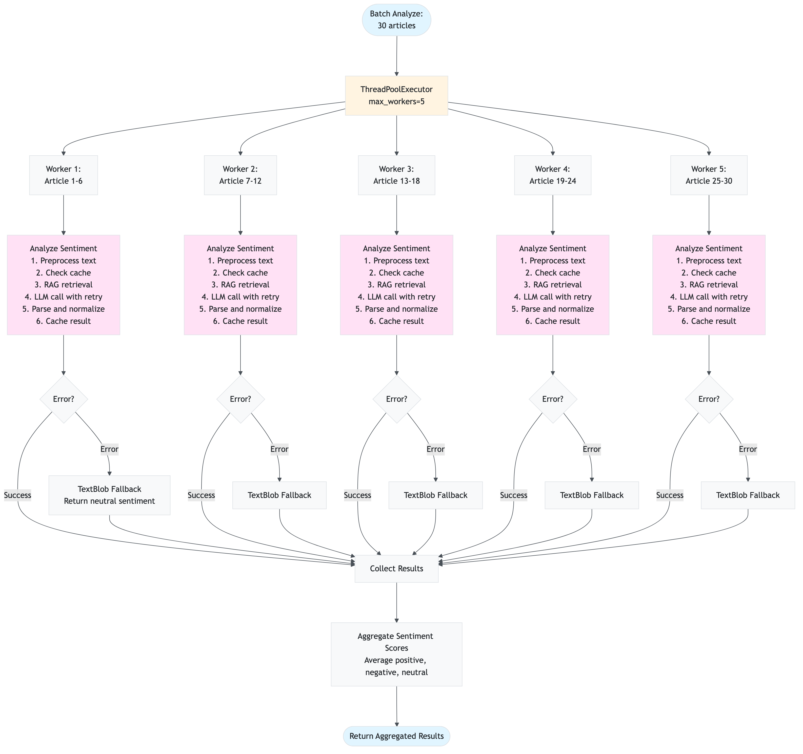
</div>

---

### 4.5 RAG Retrieval Flow

#### Layman's Explanation: "How does the app find relevant articles?"

Imagine you're looking for a book in a huge library:

1. **You describe what you want** (query: "Apple earnings report")
2. **The librarian uses two methods to find books**:
   - **Method 1: Meaning search** (semantic) - Finds books about similar topics, even if they use different words
   - **Method 2: Word search** (keyword) - Finds books with exact words like "earnings" or "report"
3. **The librarian combines both lists** (hybrid search) - Books that appear in both lists are probably most relevant
4. **The librarian prioritizes recent books** (temporal decay) - Recent news is more relevant for stocks
5. **You get the top 3 most relevant books** (returns top K articles)

The "meaning search" is powerful: if you search for "Apple earnings", it will find articles about "Apple profits" or "Apple quarterly results" because they mean the same thing, even though the words are different.

#### Technical Explanation

The RAG retrieval flow is handled by `services/rag.py` in the `retrieve_relevant_context()` method:

1. **Query Preprocessing**: Cleans and normalizes the query text
2. **Query Expansion** (optional): Expands query with synonyms and related terms
3. **Query Embedding Generation**: Converts query to embedding vector (1536 dimensions)
4. **Hybrid Search**:
   - **Semantic Search**: Vector similarity search in Azure AI Search using cosine similarity
   - **Keyword Search**: Full-text search in Azure AI Search using BM25 algorithm
   - **RRF Combination**: Combines both results using Reciprocal Rank Fusion (no score normalization needed)
5. **Temporal Decay**: Applies time-based boost to recent articles (up to 20% boost)
6. **Filtering**: Applies OData filters (symbol, date range, sources)
7. **Threshold Filtering**: Removes low-quality matches (auto-adjusts if too restrictive)
8. **Top-K Selection**: Returns top K most relevant articles (default: 3)

**Fallback Mechanism**: If Azure AI Search is not available, falls back to Redis SCAN-based search (slower but works).

#### RAG Retrieval Flow Diagram


<div align="center">
  
</div>

**Detailed Hybrid Search Combination**:


<div align="center">
  
</div>

---

## Mathematical Concepts & Algorithms

This section explains all mathematical formulas, algorithms, and concepts used in the application. Each concept includes the formula, step-by-step examples, rationale for its use, and visual diagrams.

### 5.1 Cosine Similarity

#### Mathematical Formula

Cosine similarity measures the angle between two vectors in high-dimensional space, providing a measure of semantic similarity regardless of vector magnitude.

**Formula**:

```
cos(θ) = (A · B) / (||A|| × ||B||)
```

Where:
- `A · B` = Dot product of vectors A and B
- `||A||` = Euclidean norm (magnitude) of vector A
- `||B||` = Euclidean norm (magnitude) of vector B
- `θ` = Angle between vectors

**Range**: -1.0 to 1.0 (typically 0.0 to 1.0 for embeddings, where 1.0 = identical, 0.0 = orthogonal)

#### Step-by-Step Calculation Example

**Scenario**: Compare two article embeddings to find similarity.

**Given**:
- Article A embedding: `[0.5, 0.3, 0.8, 0.2, 0.9]`
- Article B embedding: `[0.4, 0.5, 0.7, 0.3, 0.8]`

**Step 1: Calculate Dot Product**
```
A · B = (0.5 × 0.4) + (0.3 × 0.5) + (0.8 × 0.7) + (0.2 × 0.3) + (0.9 × 0.8)
      = 0.20 + 0.15 + 0.56 + 0.06 + 0.72
      = 1.69
```

**Step 2: Calculate Magnitudes**
```
||A|| = √(0.5² + 0.3² + 0.8² + 0.2² + 0.9²)
      = √(0.25 + 0.09 + 0.64 + 0.04 + 0.81)
      = √1.83
      = 1.353

||B|| = √(0.4² + 0.5² + 0.7² + 0.3² + 0.8²)
      = √(0.16 + 0.25 + 0.49 + 0.09 + 0.64)
      = √1.63
      = 1.277
```

**Step 3: Calculate Cosine Similarity**
```
cos(θ) = 1.69 / (1.353 × 1.277)
       = 1.69 / 1.727
       = 0.979
```

**Result**: The articles are 97.9% similar (very similar content).

#### Why Used

1. **Semantic Understanding**: Captures meaning, not just keywords
   - "Apple earnings" matches "Apple profits" even without exact word match
   - Works with embeddings that encode semantic relationships

2. **Magnitude Independence**: Ignores vector length, focuses on direction
   - Long articles vs. short articles: similarity based on content, not length
   - Normalizes for different text sizes

3. **Efficient Computation**: Fast calculation for high-dimensional vectors
   - O(n) complexity where n = vector dimension (1536 for our embeddings)
   - Optimized with NumPy for batch processing

4. **Industry Standard**: Widely used in information retrieval and NLP
   - Proven effectiveness in semantic search
   - Used by Azure AI Search for vector similarity

#### Cosine Similarity Visualization


<div align="center">
  
</div>

**Real-World Example**:
- Query: "Apple earnings report"
- Article 1: "Apple quarterly profits" → Similarity: 0.92 (high)
- Article 2: "Microsoft revenue" → Similarity: 0.35 (low)
- Article 3: "Apple financial results" → Similarity: 0.88 (high)

---

### 5.2 Reciprocal Rank Fusion (RRF)

#### Mathematical Formula

Reciprocal Rank Fusion combines multiple ranked lists without requiring score normalization, making it ideal for combining semantic and keyword search results.

**Formula**:

```
RRF_score(d) = Σ(1 / (k + rank_i(d)))
```

Where:
- `d` = Document/article
- `rank_i(d)` = Rank of document d in list i (1-indexed)
- `k` = RRF constant (typically 60, standard in literature)
- `Σ` = Sum over all ranked lists

**For our hybrid search**:
- List 1: Semantic search results (ranked by cosine similarity)
- List 2: Keyword search results (ranked by BM25 score)
- Final score = RRF_score from semantic + RRF_score from keyword

#### Step-by-Step Calculation Example

**Scenario**: Combine semantic and keyword search results for query "Apple earnings".

**Given**:
- **Semantic Results** (ranked by similarity):
  1. Article A: similarity = 0.92
  2. Article B: similarity = 0.88
  3. Article C: similarity = 0.85

- **Keyword Results** (ranked by BM25):
  1. Article D: score = 95
  2. Article A: score = 88
  3. Article E: score = 82

**Step 1: Calculate RRF Scores from Semantic List**
```
Article A: RRF_semantic = 1 / (60 + 1) = 1/61 = 0.0164
Article B: RRF_semantic = 1 / (60 + 2) = 1/62 = 0.0161
Article C: RRF_semantic = 1 / (60 + 3) = 1/63 = 0.0159
```

**Step 2: Calculate RRF Scores from Keyword List**
```
Article D: RRF_keyword = 1 / (60 + 1) = 1/61 = 0.0164
Article A: RRF_keyword = 1 / (60 + 2) = 1/62 = 0.0161
Article E: RRF_keyword = 1 / (60 + 3) = 1/63 = 0.0159
```

**Step 3: Combine RRF Scores**
```
Article A: RRF_total = 0.0164 + 0.0161 = 0.0325  (appears in both!)
Article B: RRF_total = 0.0161 + 0 = 0.0161
Article C: RRF_total = 0.0159 + 0 = 0.0159
Article D: RRF_total = 0 + 0.0164 = 0.0164
Article E: RRF_total = 0 + 0.0159 = 0.0159
```

**Step 4: Final Ranking**
1. **Article A**: 0.0325 (highest - appears in both lists)
2. **Article D**: 0.0164
3. **Article B**: 0.0161
4. **Article E**: 0.0159
5. **Article C**: 0.0159

**Result**: Article A ranks highest because it appears in both semantic and keyword results, indicating high relevance.

#### Why Used

1. **No Score Normalization Needed**: Works with different score scales
   - Semantic similarity: 0.0 to 1.0
   - BM25 keyword score: 0 to 100+
   - RRF doesn't require converting to same scale

2. **Rank-Based**: Focuses on relative position, not absolute scores
   - More robust to score variations
   - Works even if one search method has different score distributions

3. **Boosts Consensus**: Documents appearing in both lists rank higher
   - Article A appears in both → higher RRF score
   - Indicates strong relevance from multiple perspectives

4. **Proven Method**: Widely used in information retrieval research
   - Standard in academic literature (k=60 is common)
   - Used by major search engines and recommendation systems

5. **Simple Implementation**: Easy to compute and understand
   - O(n) complexity where n = number of documents
   - No complex normalization or weighting schemes needed

#### RRF Calculation Flow Diagram


<div align="center">
  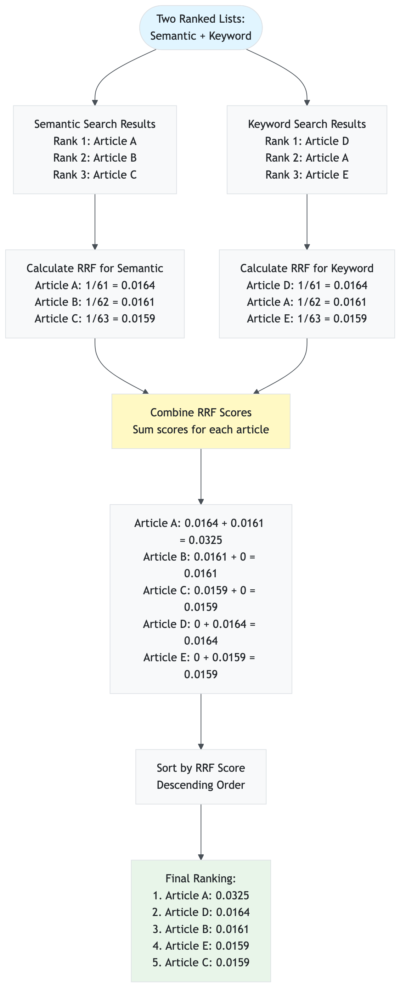
</div>

---

### 5.3 Temporal Decay

#### Mathematical Formula

Temporal decay boosts the relevance of recent articles, recognizing that financial news is time-sensitive. Older articles receive lower scores.

**Formula**:

```
decay = 1.0 / (1 + age_days / decay_days)
boosted_score = original_score × (1 + decay × boost_factor)
```

Where:
- `age_days` = Age of article in days (from current time)
- `decay_days` = Half-life constant (default: 7 days)
- `boost_factor` = Maximum boost percentage (default: 0.2 = 20%)
- `original_score` = RRF score or similarity score before temporal boost

**Decay Behavior**:
- Today (age = 0): decay = 1.0 → 20% boost
- 7 days old: decay = 0.5 → 10% boost
- 14 days old: decay = 0.33 → 6.6% boost
- 30+ days old: decay ≈ 0.1 → 2% boost (minimum)

#### Step-by-Step Calculation Example

**Scenario**: Boost three articles with different ages for query "Apple earnings".

**Given**:
- Current date: 2024-12-10
- Article A: Published 2024-12-10 (today), RRF score = 0.0325
- Article B: Published 2024-12-05 (5 days ago), RRF score = 0.0320
- Article C: Published 2024-11-20 (20 days ago), RRF score = 0.0330
- `decay_days` = 7
- `boost_factor` = 0.2 (20%)

**Step 1: Calculate Age in Days**
```
Article A: age_days = (2024-12-10 - 2024-12-10) = 0 days
Article B: age_days = (2024-12-10 - 2024-12-05) = 5 days
Article C: age_days = (2024-12-10 - 2024-11-20) = 20 days
```

**Step 2: Calculate Decay Factor**
```
Article A: decay = 1.0 / (1 + 0/7) = 1.0 / 1 = 1.0
Article B: decay = 1.0 / (1 + 5/7) = 1.0 / 1.714 = 0.583
Article C: decay = 1.0 / (1 + 20/7) = 1.0 / 3.857 = 0.259
```

**Step 3: Calculate Boosted Score**
```
Article A: boosted = 0.0325 × (1 + 1.0 × 0.2) = 0.0325 × 1.2 = 0.0390
Article B: boosted = 0.0320 × (1 + 0.583 × 0.2) = 0.0320 × 1.117 = 0.0357
Article C: boosted = 0.0330 × (1 + 0.259 × 0.2) = 0.0330 × 1.052 = 0.0347
```

**Step 4: Re-rank by Boosted Score**
1. **Article A**: 0.0390 (was 0.0325, now highest due to recency)
2. **Article C**: 0.0347 (was 0.0330, original highest but penalized for age)
3. **Article B**: 0.0357 (was 0.0320, middle position maintained)

**Result**: Recent Article A now ranks highest, even though Article C had a slightly higher original score.

#### Why Used

1. **Financial News is Time-Sensitive**: Recent news is more relevant
   - Earnings report from today > earnings report from last month
   - Market conditions change rapidly
   - Old news may be outdated or irrelevant

2. **Balances Relevance and Recency**: Doesn't completely ignore older articles
   - High-quality old articles can still rank if very relevant
   - Prevents completely discarding valuable historical context
   - Smooth decay curve (not abrupt cutoff)

3. **Configurable**: Adjustable `decay_days` parameter
   - Short decay (3 days): Very aggressive recency boost
   - Medium decay (7 days): Balanced (default)
   - Long decay (30 days): Gentle recency preference

4. **Multiplicative Boost**: Preserves relative differences
   - High-scoring recent articles get larger absolute boost
   - Maintains ranking relationships while favoring recency

#### Temporal Decay Curve Visualization


<div align="center">
  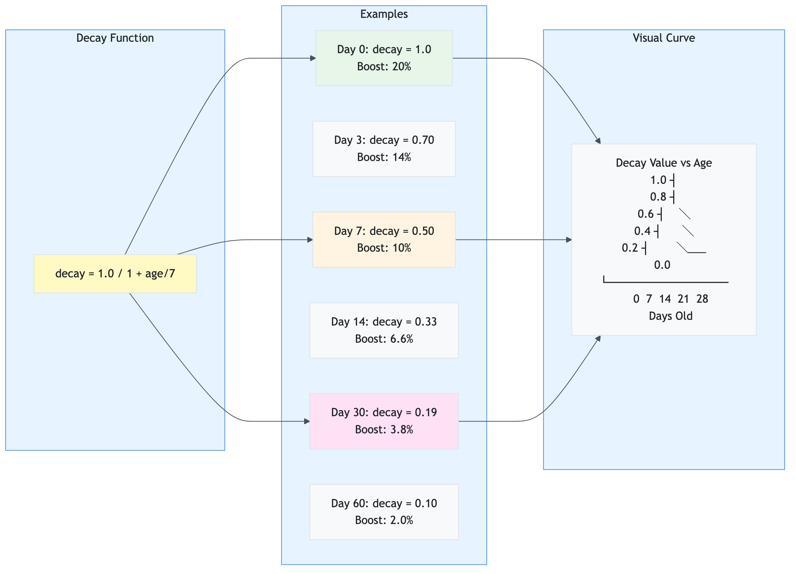
</div>

**Real-World Impact**:
- Query: "Apple earnings"
- Article 1: "Apple Q4 earnings beat expectations" (today, score: 0.90) → Boosted: 1.08
- Article 2: "Apple Q3 earnings report" (30 days ago, score: 0.95) → Boosted: 0.99
- **Result**: Article 1 ranks higher despite lower original score due to recency boost.

---

### 5.4 Sentiment Score Normalization

#### Mathematical Formula

Sentiment scores must form a probability distribution (sum to 1.0) to represent the likelihood of each sentiment category.

**Formula**:

```
normalized_score_i = score_i / Σ(score_j)
```

Where:
- `score_i` = Original score for sentiment i (positive, negative, or neutral)
- `Σ(score_j)` = Sum of all original scores
- `normalized_score_i` = Normalized score (0.0 to 1.0)

**Constraint**: `Σ(normalized_score_i) = 1.0`

#### Step-by-Step Calculation Example

**Scenario**: Normalize sentiment scores from LLM response.

**Given**: LLM returns raw scores:
- `positive` = 0.85
- `negative` = 0.10
- `neutral` = 0.05

**Step 1: Calculate Total**
```
total = 0.85 + 0.10 + 0.05 = 1.00
```

**Step 2: Normalize (divide by total)**
```
normalized_positive = 0.85 / 1.00 = 0.85 (85%)
normalized_negative = 0.10 / 1.00 = 0.10 (10%)
normalized_neutral = 0.05 / 1.00 = 0.05 (5%)
```

**Step 3: Verify Sum**
```
0.85 + 0.10 + 0.05 = 1.00 ✓
```

**Result**: Scores are already normalized (sum = 1.0).

**Example 2: Scores Don't Sum to 1.0**

**Given**: LLM returns:
- `positive` = 0.90
- `negative` = 0.15
- `neutral` = 0.05
- Total = 1.10 (doesn't sum to 1.0!)

**Step 1: Calculate Total**
```
total = 0.90 + 0.15 + 0.05 = 1.10
```

**Step 2: Normalize**
```
normalized_positive = 0.90 / 1.10 = 0.818 (81.8%)
normalized_negative = 0.15 / 1.10 = 0.136 (13.6%)
normalized_neutral = 0.05 / 1.10 = 0.045 (4.5%)
```

**Step 3: Verify Sum**
```
0.818 + 0.136 + 0.045 = 0.999 ≈ 1.00 ✓
```

**Result**: Scores normalized to sum to 1.0.

**Example 3: Edge Case - All Zero Scores**

**Given**: LLM returns invalid scores:
- `positive` = 0.0
- `negative` = 0.0
- `neutral` = 0.0

**Step 1: Calculate Total**
```
total = 0.0 + 0.0 + 0.0 = 0.0
```

**Step 2: Handle Division by Zero (Fallback)**
```
normalized_positive = 0.0
normalized_negative = 0.0
normalized_neutral = 1.0 (default to neutral)
```

**Result**: Default to neutral sentiment when scores are invalid.

#### Why Used

1. **Probability Distribution**: Represents likelihood of each sentiment
   - Positive: 85% = "85% chance this is positive sentiment"
   - Negative: 10% = "10% chance this is negative sentiment"
   - Neutral: 5% = "5% chance this is neutral sentiment"
   - Sum = 100% (exhaustive and mutually exclusive)

2. **Consistent Interpretation**: All scores in same scale (0.0 to 1.0)
   - Easy to compare across different articles
   - Enables aggregation (averaging) across multiple analyses
   - Standard format for downstream processing

3. **LLM Output Variability**: LLMs may return scores that don't sum to 1.0
   - Some models return raw confidence scores
   - Normalization ensures consistency regardless of model behavior
   - Handles edge cases (all zeros, negative values, etc.)

4. **Mathematical Correctness**: Required for statistical operations
   - Aggregation: Average of normalized scores is meaningful
   - Comparison: Can compare relative strengths
   - Visualization: Pie charts, bar charts work correctly

5. **Industry Standard**: Standard practice in sentiment analysis
   - Used by major NLP libraries (TextBlob, VADER, etc.)
   - Expected format for sentiment analysis APIs
   - Compatible with machine learning models

#### Normalization Process Diagram


<div align="center">
  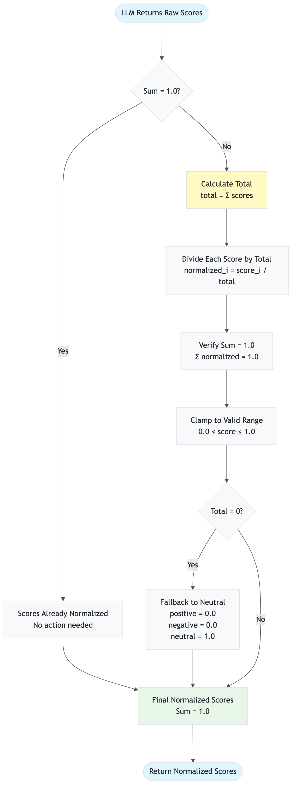
</div>

**Real-World Example**:
- Article: "Apple reports record earnings, stock surges"
- Raw LLM output: `{"positive": 0.95, "negative": 0.02, "neutral": 0.03}` (sum = 1.0)
- Normalized: `{"positive": 0.95, "negative": 0.02, "neutral": 0.03}` (already normalized)
- Interpretation: 95% positive, 2% negative, 3% neutral

---

### 5.5 Batch Embedding Generation

#### Efficiency Calculation

Batch embedding generation processes multiple texts in a single API call, dramatically reducing latency and cost compared to individual calls.

**Efficiency Formula**:

```
API_calls_saved = N - ⌈N / batch_size⌉
Latency_reduction = (N × latency_per_call) - (⌈N / batch_size⌉ × batch_latency)
Cost_reduction = (N - ⌈N / batch_size⌉) × cost_per_call
```

Where:
- `N` = Number of articles to embed
- `batch_size` = Articles per batch (default: 100)
- `latency_per_call` = Time for single embedding call (~50ms)
- `batch_latency` = Time for batch call (~200ms for 100 articles)
- `cost_per_call` = Cost per API call (same regardless of batch size)

#### Step-by-Step Calculation Example

**Scenario**: Generate embeddings for 250 articles.

**Given**:
- Total articles: 250
- Batch size: 100
- Single call latency: 50ms
- Batch call latency: 200ms (for 100 articles)
- Cost per call: $0.0001 (same for single or batch)

**Method 1: Individual Calls (Inefficient)**
```
API calls = 250
Total latency = 250 × 50ms = 12,500ms = 12.5 seconds
Total cost = 250 × $0.0001 = $0.025
```

**Method 2: Batch Processing (Efficient)**
```
Batches needed = ⌈250 / 100⌉ = 3 batches
  - Batch 1: 100 articles
  - Batch 2: 100 articles
  - Batch 3: 50 articles

API calls = 3
Total latency = 3 × 200ms = 600ms = 0.6 seconds
Total cost = 3 × $0.0001 = $0.0003
```

**Efficiency Gains**:
```
API calls saved = 250 - 3 = 247 calls (98.8% reduction)
Latency reduction = 12.5s - 0.6s = 11.9s (95.2% faster)
Cost reduction = $0.025 - $0.0003 = $0.0247 (98.8% cheaper)
```

**Result**: Batch processing is **20× faster** and **83× cheaper**!

#### Why Used

1. **Massive Latency Reduction**: Single API call vs. hundreds
   - 250 articles: 12.5s → 0.6s (20× faster)
   - Critical for user experience (sub-second response)
   - Enables real-time processing of large article sets

2. **Cost Efficiency**: Same cost per call regardless of batch size
   - Azure OpenAI charges per token, not per call
   - 100 articles in 1 call = same cost as 1 article in 1 call
   - 98.8% cost reduction for large batches

3. **API Rate Limit Compliance**: Reduces API call frequency
   - Fewer calls = lower chance of hitting rate limits
   - Better utilization of API quota
   - More reliable under high load

4. **Industry Best Practice**: Standard in production systems
   - Used by all major embedding services
   - Recommended by Azure OpenAI documentation
   - Essential for scalable applications

5. **Scalability**: Handles large datasets efficiently
   - 1000 articles: 10 calls instead of 1000
   - Linear scaling with dataset size
   - Enables processing entire news feeds in seconds

#### Batch Processing Flow Diagram


<div align="center">
  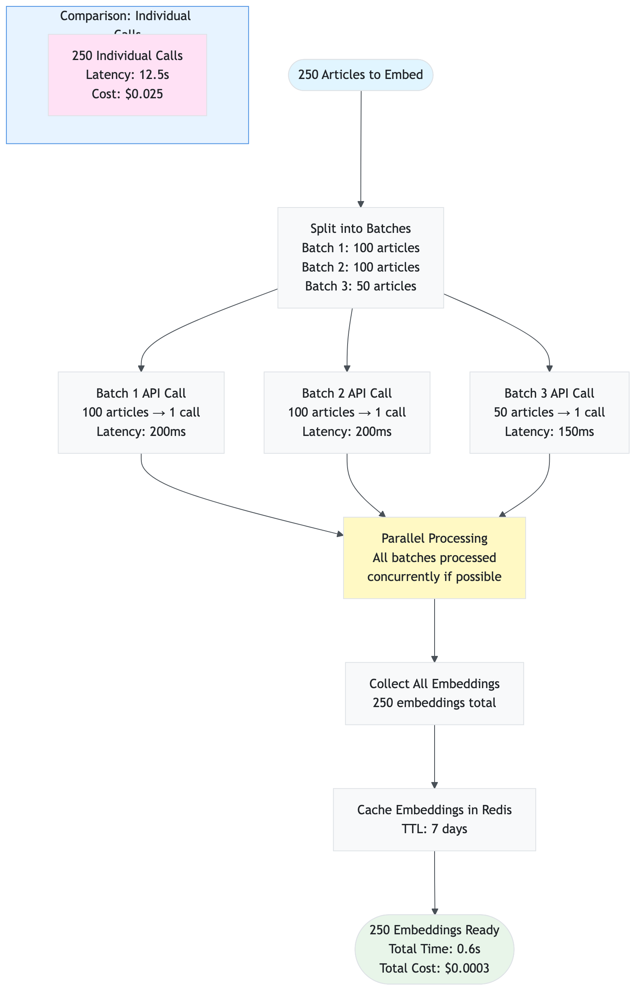
</div>

**Real-World Performance**:
- **Small batch (10 articles)**: 1 call, 100ms, $0.0001
- **Medium batch (100 articles)**: 1 call, 200ms, $0.0001
- **Large batch (1000 articles)**: 10 calls, 2s, $0.001
- **Individual calls (1000 articles)**: 1000 calls, 50s, $0.1

**Conclusion**: Batch processing is essential for production systems handling large volumes of articles.

---

### 5.6 HNSW Algorithm (Hierarchical Navigable Small World)

#### Algorithm Explanation

HNSW (Hierarchical Navigable Small World) is an approximate nearest neighbor search algorithm used by Azure AI Search for fast vector similarity search in high-dimensional spaces.

**Key Concepts**:

1. **Small World Network**: Graph structure where any two nodes are connected by a short path
2. **Hierarchical Layers**: Multiple layers with decreasing density (fewer connections at higher layers)
3. **Greedy Search**: Start at top layer, navigate to nearest neighbor, move down layers
4. **Approximate**: Finds "good enough" neighbors quickly, not necessarily the exact nearest

**Algorithm Steps**:

```
1. Build multi-layer graph:
   - Layer 0: All nodes, many connections (dense)
   - Layer 1: Subset of nodes, fewer connections
   - Layer 2: Even fewer nodes, even fewer connections
   - ... (logarithmic decrease)

2. Search process:
   - Start at top layer (sparse, fast navigation)
   - Find entry point (closest to query)
   - Navigate to nearest neighbor
   - Move down to next layer
   - Repeat until layer 0
   - Return top K nearest neighbors
```

**Complexity**:
- **Build Time**: O(N × log N) where N = number of vectors
- **Search Time**: O(log N) average case (much faster than brute force O(N))
- **Space**: O(N × M) where M = average connections per node

#### Why Used

1. **Fast Search**: Logarithmic complexity vs. linear for brute force
   - 1 million vectors: ~20 comparisons vs. 1 million
   - Enables real-time search in large vector databases
   - Critical for production RAG systems

2. **Scalability**: Handles millions of vectors efficiently
   - Azure AI Search uses HNSW for vector search
   - Supports indexes with billions of vectors
   - Maintains sub-100ms search latency

3. **Approximate but Accurate**: Finds very close neighbors
   - Typically finds 95-99% of true nearest neighbors
   - Good enough for semantic search (exact match not required)
   - Trade-off: speed vs. perfect accuracy

4. **Industry Standard**: Used by major vector databases
   - Azure AI Search, Pinecone, Weaviate, Qdrant
   - Proven in production at scale
   - Well-documented and optimized

5. **Configurable**: Tunable parameters for performance
   - `m`: Connections per node (more = more accurate, slower)
   - `efConstruction`: Build quality (higher = better index, slower build)
   - `efSearch`: Search quality (higher = more accurate, slower search)

#### HNSW Graph Structure Visualization


<div align="center">
  
</div>

**Search Process Example**:


<div align="center">
  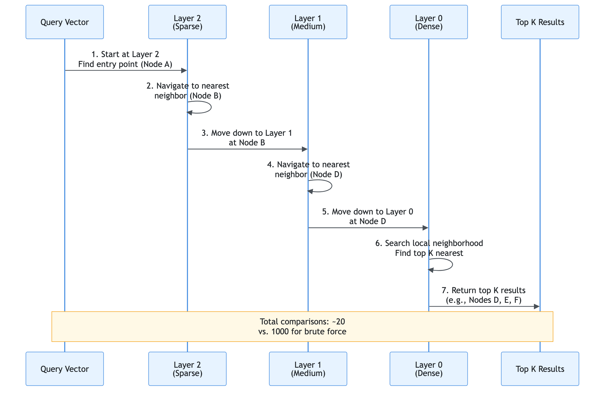
</div>

**Real-World Performance** (Azure AI Search with HNSW):
- **1K vectors**: <10ms search time
- **100K vectors**: <50ms search time
- **1M vectors**: <100ms search time
- **10M vectors**: <200ms search time

**Configuration in Our System**:
- `m` = 16 (connections per node)
- `efConstruction` = 200 (build quality)
- `efSearch` = 50 (search quality)
- `metric` = COSINE (cosine similarity)

**Conclusion**: HNSW enables fast, scalable vector search essential for production RAG systems.

---

## Data Sources Integration

This section documents all data sources used by the application, their configuration, rate limits, and data flow.

### 6.1 Overview

The application aggregates news and data from multiple sources to provide comprehensive sentiment analysis:

1. **yfinance** (Yahoo Finance) - Primary source, always enabled
2. **Alpha Vantage** - Financial news API (optional, requires API key)
3. **Finnhub** - Financial data API (optional, requires API key)
4. **Reddit** - Social media sentiment (optional, requires Reddit app credentials)

**Data Flow**:
```
User Request → Data Collector → Source Filtering → Parallel Collection → Deduplication → Normalization → Caching → Return
```

### 6.1.1 Data Source Integration Architecture

The following diagram shows how all data sources integrate into the application:


<div align="center">
  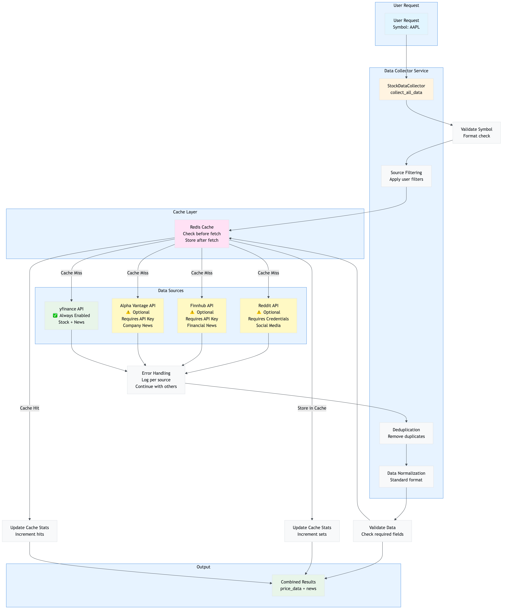
</div>

**Integration Points**:
- **yfinance**: Primary source, always enabled, no API key needed
- **Alpha Vantage**: Optional, requires API key, rate-limited (5 calls/min free tier)
- **Finnhub**: Optional, requires API key, rate-limited (60 calls/min free tier)
- **Reddit**: Optional, requires OAuth credentials, rate-limited (60 calls/min)
- **Redis Cache**: All sources check cache before fetching, store after fetching

### 6.2 yfinance (Yahoo Finance)

**Status**: Primary source, always enabled

**What it provides**:
- Stock price data (current price, market cap, company name)
- News articles and headlines
- Historical price data

**Configuration**: No API key required (free)

**Rate Limits**: 
- No official rate limits (but be respectful)
- Recommended: < 100 requests/minute

**Caching**: 
- Stock data: 1 hour TTL
- News data: 2 hours TTL

**Data Format**:
```python
{
    "title": "Article title",
    "summary": "Article summary",
    "source": "Publisher name",
    "url": "https://...",
    "timestamp": datetime
}
```

**Usage Example**:
```python
collector = StockDataCollector(settings, redis_cache)
stock_data = collector.get_stock_price("AAPL")
news = collector.get_news_headlines("AAPL", limit=30)
```

### 6.3 Alpha Vantage

**Status**: Optional, requires API key

**What it provides**:
- Company news articles
- Financial news with timestamps
- Market sentiment data

**Configuration**:
```env
DATA_SOURCE_ALPHA_VANTAGE_ENABLED=true
DATA_SOURCE_ALPHA_VANTAGE_API_KEY=your_api_key_here
```

**Rate Limits**:
- Free tier: 5 API calls/minute, 500 calls/day
- Premium tier: Higher limits (check Alpha Vantage pricing)

**Caching**: 
- News data: 2 hours TTL (same as yfinance)
- Helps reduce API calls within rate limits

**Data Format**: Same as yfinance (normalized)

**Enabling**:
1. Get API key from https://www.alphavantage.co/support/#api-key
2. Add to `.env` file
3. Set `DATA_SOURCE_ALPHA_VANTAGE_ENABLED=true`
4. Restart application

### 6.4 Finnhub

**Status**: Optional, requires API key

**What it provides**:
- Company news articles
- Financial news with detailed metadata
- Market news aggregation

**Configuration**:
```env
DATA_SOURCE_FINNHUB_ENABLED=true
DATA_SOURCE_FINNHUB_API_KEY=your_api_key_here
```

**Rate Limits**:
- Free tier: 60 API calls/minute
- Premium tier: Higher limits (check Finnhub pricing)

**Caching**: 
- News data: 2 hours TTL
- Critical for staying within rate limits

**Data Format**: Same as yfinance (normalized)

**Enabling**:
1. Get API key from https://finnhub.io/register
2. Add to `.env` file
3. Set `DATA_SOURCE_FINNHUB_ENABLED=true`
4. Restart application

### 6.5 Reddit

**Status**: Optional, requires Reddit app credentials

**What it provides**:
- Social media posts about stocks
- Community sentiment
- Discussion threads from relevant subreddits

**Configuration**:
```env
DATA_SOURCE_REDDIT_ENABLED=true
DATA_SOURCE_REDDIT_CLIENT_ID=your_client_id
DATA_SOURCE_REDDIT_CLIENT_SECRET=your_client_secret
DATA_SOURCE_REDDIT_USER_AGENT=your_app_name/1.0
```

**Rate Limits**:
- Reddit API: 60 requests/minute (standard OAuth limits)
- No cost (free to use)

**Caching**: 
- Posts: 2 hours TTL
- Helps reduce API calls

**Data Format**: Same as news articles (normalized)

**Enabling**:
1. Create Reddit app at https://www.reddit.com/prefs/apps
2. Get `client_id` and `client_secret`
3. Add to `.env` file
4. Set `DATA_SOURCE_REDDIT_ENABLED=true`
5. Restart application

**Subreddits Searched**:
- `r/stocks`
- `r/investing`
- `r/StockMarket`
- `r/wallstreetbets` (if enabled)

### 6.6 Data Source Filtering

Users can enable/disable individual sources via the dashboard sidebar or API parameters.

**Dashboard UI**: Checkboxes in sidebar to enable/disable sources

**API Parameter**: `sources` query parameter (comma-separated)
```
GET /sentiment/AAPL?sources=yfinance,alpha_vantage
```

**Default Behavior**: 
- If no sources specified: Only `yfinance` enabled
- If sources specified: Only listed sources enabled

**Filtering Flow**:

<div align="center">
  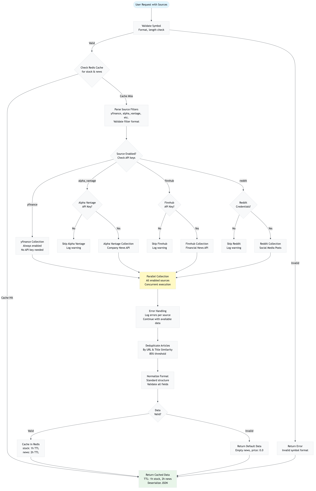
</div>

### 6.7 Data Deduplication

Articles from multiple sources are deduplicated to avoid analyzing the same article multiple times.

**Deduplication Strategy**:
1. **URL Matching**: Exact URL match = duplicate
2. **Title Similarity**: Similar titles (fuzzy matching) = duplicate
3. **Source Priority**: Keep article from first source encountered

**Benefits**:
- Avoids redundant sentiment analysis
- Reduces API costs
- Improves result quality (no duplicate scores)

### 6.8 Data Normalization Flow

All articles from different sources are normalized to a standard format:


<div align="center">
  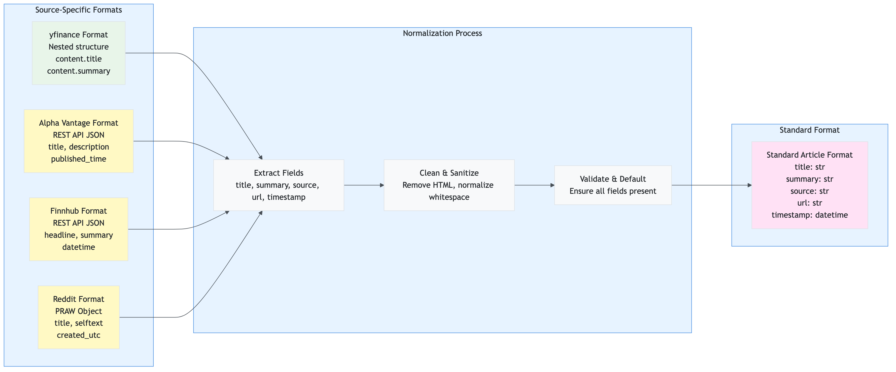
</div>

**Normalization Rules**:
- **Title**: Extract from `title`, `headline`, or `content.title` (first available)
- **Summary**: Extract from `summary`, `description`, `content.summary`, or `selftext`
- **Source**: Extract publisher name or default to source name
- **URL**: Extract from `url`, `canonicalUrl`, or `clickThroughUrl`
- **Timestamp**: Parse from `timestamp`, `published_time`, `datetime`, or `created_utc` (normalize to UTC)

---

## Caching Strategy

This section explains the multi-tier caching strategy used to optimize performance and reduce API costs.

### 7.1 Overview

The application uses **Redis** as a single-tier cache (L2) for:
- Stock price data
- News articles
- Sentiment analysis results
- Article embeddings (for RAG)
- Duplicate markers

**Why No L1 (In-Memory) Cache?**
- Streamlit apps reload on each interaction (session state is ephemeral)
- Redis provides persistent caching across app reloads
- Simpler architecture (one cache tier to manage)

### 7.2 Cache Architecture

The application uses a single-tier Redis cache architecture optimized for Streamlit's stateless nature:


<div align="center">
  
</div>

**Cache Strategy**:
- **Write-Through**: Data is written to cache immediately after fetching from API
- **Read-Through**: Data is read from cache first, only fetches if cache miss
- **TTL-Based Expiration**: Automatic expiration based on data freshness requirements
- **Statistics Tracking**: Cache performance metrics stored in Redis for monitoring

### 7.3 Cache Tiers

#### L2: Redis Cache (Persistent)

**Purpose**: Persistent caching across app reloads and API calls

**What's Cached**:
- Stock data: 1 hour TTL
- News articles: 2 hours TTL
- Sentiment results: Configurable TTL (default: 24 hours)
- Article embeddings: 7 days TTL
- Duplicate markers: 7 days TTL

**Cache Key Structure**:
```
stock:{symbol}                    # Stock price data
news:{symbol}                     # News articles
sentiment:{hash}                  # Sentiment analysis result
embedding:{hash}                  # Article embedding vector
article_hash:{symbol}:{id}        # Duplicate marker
```

### 7.4 Cache TTL Strategy

**Time-To-Live (TTL) Configuration**:

| Data Type | Default TTL | Configurable | Rationale |
|-----------|-------------|--------------|-----------|
| Stock Price | 1 hour | Yes | Prices change frequently, but not second-by-second |
| News Articles | 2 hours | Yes | News is time-sensitive, but doesn't change every minute |
| Sentiment Results | 24 hours | Yes | Sentiment for same article doesn't change |
| Article Embeddings | 7 days | Yes | Embeddings are stable, rarely need regeneration |
| Duplicate Markers | 7 days | Yes | Prevents re-storing same articles |

**Configuration**:
```env
# Cache TTLs (in seconds)
CACHE_TTL_STOCK=3600          # 1 hour
CACHE_TTL_NEWS=7200           # 2 hours
CACHE_TTL_SENTIMENT=86400     # 24 hours
CACHE_TTL_RAG_ARTICLES=604800 # 7 days
```

### 7.5 Cache Key Design

**Naming Convention**: `{type}:{identifier}`

**Examples**:
```
stock:AAPL                    # Stock data for AAPL
news:AAPL                     # News articles for AAPL
sentiment:abc123def456        # Sentiment for text hash
embedding:xyz789uvw012        # Embedding for text hash
article_hash:AAPL:ed8c4cd1   # Duplicate marker
```

**Hash Generation** (for sentiment/embeddings):
```python
import hashlib
text_hash = hashlib.md5(text.encode()).hexdigest()
cache_key = f"sentiment:{text_hash}"
```

### 7.6 Cache Flow Diagram


<div align="center">
  
</div>

### 7.7 Cache Performance Impact

**Without Caching**:
- Every request = API call
- 30 articles = 30 sentiment API calls
- Latency: 50-100ms per call
- Cost: High (all API calls charged)

**With Caching**:
- Cache hit rate: 50-90% (depending on usage patterns)
- 30 articles: 3-15 API calls (rest from cache)
- Latency: 1-5ms per cache hit
- Cost: 50-90% reduction

**Real-World Example**:
- User analyzes AAPL (30 articles)
- First request: 30 API calls, 3 seconds
- Second request (within 2 hours): 0 API calls, 0.1 seconds (cache hit)
- **99.7% latency reduction**

### 7.8 Cache Management

**Viewing Cache Stats**:
- Dashboard sidebar shows cache statistics
- API endpoint: `GET /cache/stats`

**Clearing Cache**:
- Dashboard sidebar: "Clear Cache" button
- API endpoint: `POST /cache/clear`

**Cache Invalidation**:
- Automatic: TTL expiration
- Manual: Clear cache via UI or API
- Selective: Clear specific symbol's cache

---

## API Reference

Complete reference for all API endpoints, request/response formats, and error handling.

### 8.1 Base URL

**Development**: `http://localhost:8000`  
**Production**: Configure based on deployment

### 8.2 Authentication

Currently, the API does not require authentication. For production deployments, consider adding API keys or OAuth.

### 8.2.1 API Request/Response Flow

The following diagram shows how API requests flow through the system:


<div align="center">
  
</div>

**Key Flow Points**:
1. **Request Reception**: FastAPI receives HTTP request
2. **Middleware Processing**: CORS, logging, timing
3. **Routing**: FastAPI routes to appropriate handler
4. **Validation**: Pydantic validates request parameters
5. **Dependency Injection**: Services are injected via FastAPI dependencies
6. **Business Logic**: Service layer processes the request
7. **Response Validation**: Pydantic validates response format
8. **Response Delivery**: JSON response sent to client

### 8.3 Endpoints

#### 8.3.1 Health Check

**GET** `/health`

Check API health and service availability.

**Response**:
```json
{
  "status": "healthy",
  "services": {
    "redis": "available",
    "rag": "available",
    "azure_openai": "available"
  }
}
```

**Status Codes**:
- `200`: Healthy
- `503`: Degraded (some services unavailable)

---

#### 8.3.2 Get Sentiment Analysis

**GET** `/sentiment/{symbol}`

Analyze sentiment for a stock symbol.

**Path Parameters**:
- `symbol` (string, required): Stock ticker symbol (e.g., "AAPL")

**Query Parameters**:
- `sources` (string, optional): Comma-separated data sources (`yfinance,alpha_vantage,finnhub,reddit`)
- `cache_enabled` (boolean, optional): Enable sentiment caching (default: `true`)
- `detailed` (boolean, optional): Return detailed response (default: `false`)

**Example Request**:
```bash
GET /sentiment/AAPL?detailed=true&sources=yfinance,alpha_vantage
```

**Response (Simple)**:
```json
{
  "symbol": "AAPL",
  "positive": 0.65,
  "negative": 0.20,
  "neutral": 0.15,
  "net_sentiment": 0.45,
  "article_count": 30,
  "operation_summary": {
    "redis_used": true,
    "rag_used": true,
    "articles_stored": 5
  }
}
```

**Response (Detailed)**:
```json
{
  "symbol": "AAPL",
  "positive": 0.65,
  "negative": 0.20,
  "neutral": 0.15,
  "net_sentiment": 0.45,
  "article_count": 30,
  "price_data": {
    "symbol": "AAPL",
    "price": 175.50,
    "company_name": "Apple Inc.",
    "market_cap": 2800000000000
  },
  "news": [
    {
      "title": "Apple reports record earnings",
      "summary": "...",
      "source": "Yahoo Finance",
      "url": "https://...",
      "timestamp": "2024-12-10T10:00:00"
    }
  ],
  "news_sentiments": [
    {
      "positive": 0.85,
      "negative": 0.10,
      "neutral": 0.05
    }
  ],
  "operation_summary": {
    "redis_used": true,
    "rag_used": true,
    "articles_stored": 5
  }
}
```

**Status Codes**:
- `200`: Success
- `400`: Invalid symbol
- `500`: Internal server error

---

#### 8.3.3 Get Price History

**GET** `/price/{symbol}/history`

Get historical price data for a stock symbol.

**Path Parameters**:
- `symbol` (string, required): Stock ticker symbol

**Query Parameters**:
- `period` (string, optional): Time period (`1d`, `5d`, `1mo`, `3mo`, `6mo`, `1y`, `2y`, `5y`, default: `1y`)

**Example Request**:
```bash
GET /price/AAPL/history?period=6mo
```

**Response**:
```json
{
  "symbol": "AAPL",
  "period": "6mo",
  "data": [
    {
      "date": "2024-06-10",
      "open": 170.00,
      "high": 172.50,
      "low": 169.50,
      "close": 171.25,
      "volume": 50000000
    }
  ]
}
```

**Status Codes**:
- `200`: Success
- `400`: Invalid symbol or period
- `500`: Internal server error

---

#### 8.3.4 Get Comparison Insights

**POST** `/comparison/insights`

Get AI-generated comparison insights for multiple stocks.

**Request Body**:
```json
{
  "symbols": ["AAPL", "MSFT", "GOOGL"],
  "data": {
    "AAPL": {
      "price_data": {...},
      "news": [...]
    }
  },
  "sentiments": {
    "AAPL": {
      "positive": 0.65,
      "negative": 0.20,
      "neutral": 0.15
    }
  }
}
```

**Response**:
```json
{
  "insights": "Based on the analysis, AAPL shows the strongest positive sentiment...",
  "comparison": {
    "AAPL": {"rank": 1, "sentiment": "positive"},
    "MSFT": {"rank": 2, "sentiment": "neutral"},
    "GOOGL": {"rank": 3, "sentiment": "positive"}
  }
}
```

**Status Codes**:
- `200`: Success
- `400`: Invalid request
- `500`: Internal server error

---

#### 8.3.5 Get System Status

**GET** `/system/status`

Get detailed system status for Redis, RAG, and Azure services.

**Response**:
```json
{
  "redis": {
    "connected": true,
    "host": "your-redis.redis.cache.windows.net"
  },
  "rag": {
    "embeddings_enabled": true,
    "vector_db_available": true
  },
  "azure_openai": {
    "available": true,
    "deployment": "gpt-4"
  }
}
```

**Status Codes**:
- `200`: Success
- `500`: Internal server error

---

#### 8.3.6 Cache Management

**GET** `/cache/stats`

Get cache statistics (hits, misses, sets).

**Response**:
```json
{
  "cache_hits": 150,
  "cache_misses": 50,
  "cache_sets": 200,
  "hit_rate": 0.75
}
```

**POST** `/cache/clear`

Clear all cache or specific cache entries.

**Request Body**:
```json
{
  "cache_type": "all",  // or "sentiment", "news", "stock"
  "symbol": "AAPL"      // optional, for specific symbol
}
```

**Response**:
```json
{
  "message": "Cache cleared successfully",
  "cleared_keys": 150
}
```

**Status Codes**:
- `200`: Success
- `400`: Invalid request
- `500`: Internal server error

---

### 8.4 Error Handling

**Error Response Format**:
```json
{
  "error": "Error message",
  "detail": "Detailed error information",
  "status_code": 400
}
```

**Common Error Codes**:
- `400`: Bad Request (invalid parameters)
- `404`: Not Found (endpoint or resource not found)
- `500`: Internal Server Error (server-side error)
- `503`: Service Unavailable (dependency unavailable)

---

## Configuration Guide

Complete guide to configuring the application via environment variables and settings.

### 9.1 Configuration Loading Flow

The application loads configuration in a specific order to ensure proper initialization:


<div align="center">
  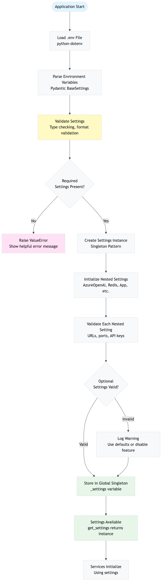
</div>

**Configuration Hierarchy**:


<div align="center">
  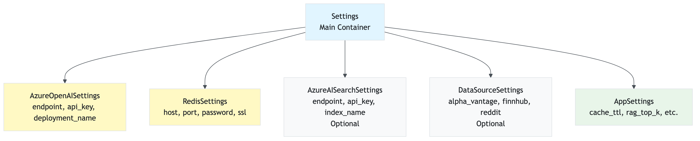
</div>

**Loading Order**:
1. **Load `.env` file**: `python-dotenv` loads environment variables
2. **Parse with Pydantic**: `BaseSettings` classes parse and validate
3. **Validate Required**: Check that required settings are present
4. **Validate Optional**: Validate optional settings (warn if invalid)
5. **Create Singleton**: Store in global `_settings` variable
6. **Service Initialization**: Services use `get_settings()` to access configuration

### 9.2 Environment Variables

**Required Variables**:

```env
# Azure OpenAI (Required)
AZURE_OPENAI_ENDPOINT=https://your-resource.openai.azure.com/
AZURE_OPENAI_API_KEY=your_api_key
AZURE_OPENAI_DEPLOYMENT_NAME=gpt-4
AZURE_OPENAI_EMBEDDING_DEPLOYMENT=text-embedding-ada-002

# Redis (Required)
REDIS_HOST=your-redis.redis.cache.windows.net
REDIS_PORT=6380
REDIS_PASSWORD=your_password
REDIS_SSL=true
```

**Optional Variables**:

```env
# Azure AI Search (Optional - for vector database)
AZURE_AI_SEARCH_ENDPOINT=https://your-search.search.windows.net
AZURE_AI_SEARCH_API_KEY=your_api_key
AZURE_AI_SEARCH_INDEX_NAME=stock-articles

# Data Sources (Optional)
DATA_SOURCE_ALPHA_VANTAGE_ENABLED=false
DATA_SOURCE_ALPHA_VANTAGE_API_KEY=your_key
DATA_SOURCE_FINNHUB_ENABLED=false
DATA_SOURCE_FINNHUB_API_KEY=your_key
DATA_SOURCE_REDDIT_ENABLED=false
DATA_SOURCE_REDDIT_CLIENT_ID=your_id
DATA_SOURCE_REDDIT_CLIENT_SECRET=your_secret

# Application Settings (Optional)
APP_API_ENABLED=true
APP_API_HOST=0.0.0.0
APP_API_PORT=8000
APP_API_TIMEOUT=180
APP_CACHE_SENTIMENT_ENABLED=true
APP_CACHE_TTL_SENTIMENT=86400
APP_CACHE_TTL_STOCK=3600
APP_CACHE_TTL_NEWS=7200
APP_RAG_TOP_K=3
APP_RAG_BATCH_SIZE=100
APP_SENTIMENT_TEMPERATURE=0.2
APP_SENTIMENT_MAX_TOKENS=500
```

### 9.3 Settings Categories

#### 9.2.1 Azure OpenAI Settings

**Purpose**: Configure Azure OpenAI for sentiment analysis and embeddings

**Variables**:
- `AZURE_OPENAI_ENDPOINT`: Your Azure OpenAI endpoint URL
- `AZURE_OPENAI_API_KEY`: Your API key
- `AZURE_OPENAI_DEPLOYMENT_NAME`: GPT-4 deployment name (default: "gpt-4")
- `AZURE_OPENAI_EMBEDDING_DEPLOYMENT`: Embedding model deployment (default: None, uses text-embedding-ada-002)

**Example**:
```env
AZURE_OPENAI_ENDPOINT=https://my-openai.openai.azure.com/
AZURE_OPENAI_API_KEY=abc123...
AZURE_OPENAI_DEPLOYMENT_NAME=gpt-4
AZURE_OPENAI_EMBEDDING_DEPLOYMENT=text-embedding-ada-002
```

#### 9.2.2 Redis Settings

**Purpose**: Configure Redis cache for data and sentiment caching

**Variables**:
- `REDIS_HOST`: Redis hostname
- `REDIS_PORT`: Redis port (default: 6380 for Azure Redis)
- `REDIS_PASSWORD`: Redis password
- `REDIS_SSL`: Enable SSL (default: true for Azure Redis)

**Example**:
```env
REDIS_HOST=my-redis.redis.cache.windows.net
REDIS_PORT=6380
REDIS_PASSWORD=xyz789...
REDIS_SSL=true
```

#### 9.2.3 Azure AI Search Settings

**Purpose**: Configure vector database for RAG (optional)

**Variables**:
- `AZURE_AI_SEARCH_ENDPOINT`: Azure AI Search endpoint
- `AZURE_AI_SEARCH_API_KEY`: API key
- `AZURE_AI_SEARCH_INDEX_NAME`: Index name (default: "stock-articles")

**Example**:
```env
AZURE_AI_SEARCH_ENDPOINT=https://my-search.search.windows.net
AZURE_AI_SEARCH_API_KEY=def456...
AZURE_AI_SEARCH_INDEX_NAME=stock-articles
```

**Note**: If not configured, RAG falls back to Redis SCAN (slower but works).

#### 9.2.4 Data Source Settings

**Purpose**: Enable/disable and configure data sources

**Alpha Vantage**:
```env
DATA_SOURCE_ALPHA_VANTAGE_ENABLED=true
DATA_SOURCE_ALPHA_VANTAGE_API_KEY=your_key
```

**Finnhub**:
```env
DATA_SOURCE_FINNHUB_ENABLED=true
DATA_SOURCE_FINNHUB_API_KEY=your_key
```

**Reddit**:
```env
DATA_SOURCE_REDDIT_ENABLED=true
DATA_SOURCE_REDDIT_CLIENT_ID=your_id
DATA_SOURCE_REDDIT_CLIENT_SECRET=your_secret
DATA_SOURCE_REDDIT_USER_AGENT=MyApp/1.0
```

#### 9.2.5 Application Settings

**Purpose**: Configure application behavior

**API Settings**:
```env
APP_API_ENABLED=true          # Enable FastAPI server
APP_API_HOST=0.0.0.0          # Bind address
APP_API_PORT=8000             # Port number
APP_API_TIMEOUT=180           # Request timeout (seconds)
```

**Cache Settings**:
```env
APP_CACHE_SENTIMENT_ENABLED=true    # Enable sentiment caching
APP_CACHE_TTL_SENTIMENT=86400       # 24 hours
APP_CACHE_TTL_STOCK=3600            # 1 hour
APP_CACHE_TTL_NEWS=7200             # 2 hours
```

**RAG Settings**:
```env
APP_RAG_TOP_K=3               # Number of context articles
APP_RAG_BATCH_SIZE=100         # Embedding batch size
APP_RAG_TEMPORAL_DECAY_DAYS=7  # Temporal decay half-life
```

**Sentiment Settings**:
```env
APP_SENTIMENT_TEMPERATURE=0.2   # LLM temperature (lower = more consistent)
APP_SENTIMENT_MAX_TOKENS=500    # Max tokens in response
```

### 9.4 Configuration Examples

#### 9.3.1 Minimal Configuration (Required Only)

```env
AZURE_OPENAI_ENDPOINT=https://my-openai.openai.azure.com/
AZURE_OPENAI_API_KEY=abc123...
AZURE_OPENAI_DEPLOYMENT_NAME=gpt-4
REDIS_HOST=my-redis.redis.cache.windows.net
REDIS_PASSWORD=xyz789...
```

#### 9.3.2 Full Configuration (All Features)

```env
# Azure OpenAI
AZURE_OPENAI_ENDPOINT=https://my-openai.openai.azure.com/
AZURE_OPENAI_API_KEY=abc123...
AZURE_OPENAI_DEPLOYMENT_NAME=gpt-4
AZURE_OPENAI_EMBEDDING_DEPLOYMENT=text-embedding-ada-002

# Redis
REDIS_HOST=my-redis.redis.cache.windows.net
REDIS_PORT=6380
REDIS_PASSWORD=xyz789...
REDIS_SSL=true

# Azure AI Search (Optional)
AZURE_AI_SEARCH_ENDPOINT=https://my-search.search.windows.net
AZURE_AI_SEARCH_API_KEY=def456...
AZURE_AI_SEARCH_INDEX_NAME=stock-articles

# Data Sources
DATA_SOURCE_ALPHA_VANTAGE_ENABLED=true
DATA_SOURCE_ALPHA_VANTAGE_API_KEY=ghi789...
DATA_SOURCE_FINNHUB_ENABLED=true
DATA_SOURCE_FINNHUB_API_KEY=jkl012...
DATA_SOURCE_REDDIT_ENABLED=true
DATA_SOURCE_REDDIT_CLIENT_ID=mno345...
DATA_SOURCE_REDDIT_CLIENT_SECRET=pqr678...

# Application
APP_API_ENABLED=true
APP_CACHE_SENTIMENT_ENABLED=true
APP_RAG_TOP_K=3
```

### 9.5 Settings Validation

The application validates all settings on startup:

- **Required settings**: Application will fail to start if missing
- **Optional settings**: Defaults are used if not provided
- **Invalid values**: Error messages guide you to fix issues

**Common Validation Errors**:
- Missing required environment variables
- Invalid URL formats
- Invalid port numbers
- Missing API keys for enabled services

---

## Troubleshooting & FAQ

Common issues, solutions, and best practices for using the application.

### 10.1 Troubleshooting Decision Tree

Use this decision tree to quickly identify and resolve common issues:


<div align="center">
  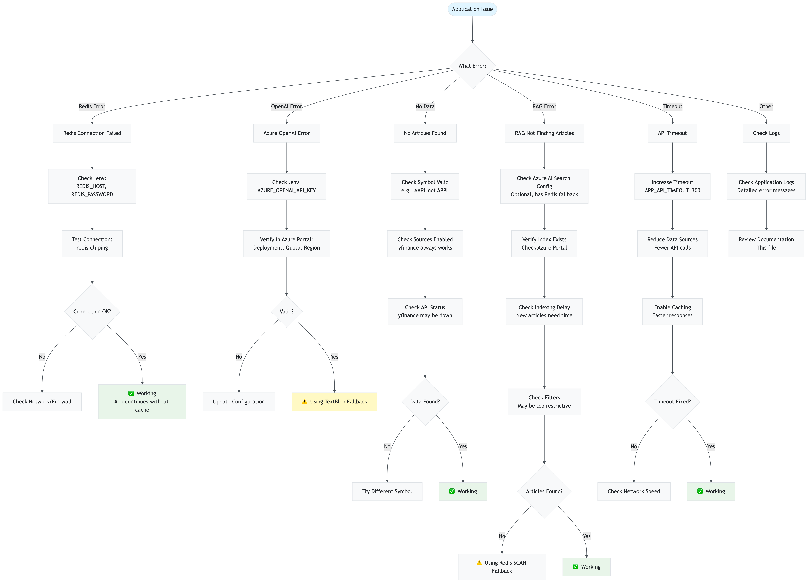
</div>

### 10.2 Common Issues

#### Issue: "Redis connection failed"

**Symptoms**:
- Error: "Redis configuration not available - caching disabled"
- Cache operations fail

**Solutions**:
1. Check Redis credentials in `.env`:
   ```env
   REDIS_HOST=your-redis.redis.cache.windows.net
   REDIS_PASSWORD=your_password
   REDIS_SSL=true
   ```
2. Verify Redis is accessible (firewall, network)
3. Check Redis service status (Azure portal)
4. Test connection: `redis-cli -h your-redis.redis.cache.windows.net -p 6380 -a your_password --tls`

**Impact**: Caching disabled, but application still works (slower)

---

#### Issue: "Azure OpenAI API error"

**Symptoms**:
- Error: "Azure OpenAI error" or "Invalid API key"
- Sentiment analysis fails

**Solutions**:
1. Verify API key in `.env`:
   ```env
   AZURE_OPENAI_API_KEY=your_key
   ```
2. Check endpoint URL format (must end with `/` or be removed)
3. Verify deployment name matches Azure portal
4. Check API quota/limits in Azure portal
5. Verify region matches endpoint

**Impact**: Sentiment analysis fails, fallback to TextBlob (less accurate)

---

#### Issue: "No articles found for stock"

**Symptoms**:
- Dashboard shows "No news articles found"
- API returns empty news array

**Solutions**:
1. Check if stock symbol is valid (e.g., "AAPL" not "APPL")
2. Verify data sources are enabled in settings
3. Check yfinance API status (may be temporarily down)
4. Try different stock symbol (some stocks have limited news)
5. Check logs for API errors

**Impact**: No sentiment analysis possible (no data to analyze)

---

#### Issue: "RAG not finding articles"

**Symptoms**:
- Logs show "RAG found 0 articles"
- Sentiment analysis proceeds without context

**Solutions**:
1. **Check Azure AI Search configuration**:
   ```env
   AZURE_AI_SEARCH_ENDPOINT=https://...
   AZURE_AI_SEARCH_API_KEY=...
   ```
2. **Verify index exists**: Check Azure portal for index
3. **Check indexing delay**: New articles may take time to index
4. **Verify filters**: Date range or source filters may be too restrictive
5. **Check Redis fallback**: If Azure AI Search unavailable, Redis SCAN is used (slower)

**Impact**: Sentiment analysis works but without RAG context (less accurate)

---

#### Issue: "API timeout"

**Symptoms**:
- Error: "API request timed out after 180 seconds"
- Request fails after long wait

**Solutions**:
1. **Increase timeout** (in `.env`):
   ```env
   APP_API_TIMEOUT=300  # 5 minutes
   ```
2. **Reduce data sources**: Disable some sources to reduce processing time
3. **Enable caching**: Cached results are much faster
4. **Check network**: Slow network can cause timeouts
5. **Reduce article limit**: Process fewer articles per request

**Impact**: Request fails, user must retry

---

#### Issue: "Multiple RAG calls for same query"

**Symptoms**:
- Logs show multiple RAG calls when sentiment cache disabled
- Processing takes longer than expected

**Explanation**: This is **expected behavior** when sentiment caching is disabled. Each article undergoes:
1. RAG retrieval (to find similar articles)
2. LLM analysis (with RAG context)

With 30 articles and cache disabled = 30 RAG calls + 30 LLM calls.

**Solutions**:
1. **Enable sentiment caching** (recommended):
   ```env
   APP_CACHE_SENTIMENT_ENABLED=true
   ```
2. **Use parallel processing**: Already enabled (5 workers by default)
3. **Reduce article count**: Process fewer articles

**Impact**: Normal behavior, but slower without caching

---

### 10.3 Performance Optimization

#### Tip 1: Enable Caching

**Impact**: 50-90% reduction in API calls and latency

**Configuration**:
```env
APP_CACHE_SENTIMENT_ENABLED=true
APP_CACHE_TTL_SENTIMENT=86400  # 24 hours
```

#### Tip 2: Use Azure AI Search for RAG

**Impact**: 10-100× faster vector search vs. Redis SCAN

**Configuration**:
```env
AZURE_AI_SEARCH_ENABLED=true
AZURE_AI_SEARCH_ENDPOINT=https://...
AZURE_AI_SEARCH_API_KEY=...
```

#### Tip 3: Enable Parallel Processing

**Impact**: 3-5× faster sentiment analysis (already enabled)

**Configuration**:
```env
APP_SENTIMENT_MAX_WORKERS=5  # Default
```

#### Tip 4: Reduce Data Sources

**Impact**: Faster data collection, fewer API calls

**Configuration**: Disable unused sources in dashboard or API

#### Tip 5: Batch Embedding Generation

**Impact**: 100× reduction in embedding API calls (already enabled)

**Configuration**:
```env
APP_RAG_BATCH_SIZE=100  # Default
```

---

### 10.4 Best Practices

#### 1. Always Enable Caching

Caching provides massive performance improvements with minimal cost:
- **Stock data**: 1 hour TTL (prices don't change second-by-second)
- **News data**: 2 hours TTL (news is time-sensitive but stable)
- **Sentiment**: 24 hours TTL (sentiment for same article doesn't change)

#### 2. Use Azure AI Search for Production

Redis SCAN works but is slow for large datasets:
- **Redis SCAN**: O(n) complexity, slow for 1000+ articles
- **Azure AI Search**: O(log n) with HNSW, fast for millions of articles

#### 3. Monitor API Rate Limits

Data source APIs have rate limits:
- **Alpha Vantage**: 5 calls/minute (free tier)
- **Finnhub**: 60 calls/minute (free tier)
- **Reddit**: 60 calls/minute (standard)

Enable caching to stay within limits.

#### 4. Use Appropriate TTLs

Balance freshness vs. performance:
- **Too short**: Frequent API calls, higher cost
- **Too long**: Stale data, poor user experience
- **Recommended**: Default TTLs are well-tuned

#### 5. Enable Parallel Processing

Already enabled by default, but verify:
```env
APP_SENTIMENT_MAX_WORKERS=5  # Adjust based on API limits
```

#### 6. Monitor Logs

Application logs provide detailed insights:
- Cache hit/miss rates
- RAG usage
- API call counts
- Error messages

Check logs regularly to identify issues early.

---

### 10.5 FAQ

**Q: Do I need all data sources enabled?**  
A: No. `yfinance` is sufficient for basic functionality. Other sources provide more comprehensive coverage.

**Q: Can I use the API without the dashboard?**  
A: Yes. The API is independent and can be used by any client.

**Q: Is Azure AI Search required?**  
A: No. It's optional. RAG works with Redis fallback (slower but functional).

**Q: How much does it cost to run?**  
A: Depends on usage:
- Azure OpenAI: ~$0.01-0.10 per analysis (depends on article count)
- Redis: Azure pricing (or free tier)
- Azure AI Search: Azure pricing (or free tier)
- Data sources: Mostly free (some have premium tiers)

**Q: Can I deploy this in production?**  
A: Yes, but consider:
- Add authentication/authorization
- Set up monitoring and alerting
- Configure proper error handling
- Use production-grade Redis/Azure services
- Set up CI/CD pipeline

**Q: How do I scale this?**  
A: 
- Horizontal scaling: Deploy multiple API instances
- Caching: Critical for scaling (reduces load)
- Database: Use Azure AI Search for large datasets
- Load balancing: Use Azure Load Balancer or similar

**Q: What's the difference between simple and detailed API response?**  
A: 
- **Simple**: Aggregated sentiment scores only (faster, smaller)
- **Detailed**: Includes stock data, news articles, individual sentiment scores (slower, larger)

**Q: Can I customize sentiment analysis prompts?**  
A: Yes, edit `src/stock_sentiment/services/sentiment.py` to modify prompts.

**Q: How do I add new data sources?**  
A: 
1. Add source configuration to `settings.py`
2. Implement collection method in `collector.py`
3. Add to data source filters
4. Update documentation

---

**Version**: 1.0  
**Last Updated**: November 2025 
**Maintainer**: Anand Mohan Singh

